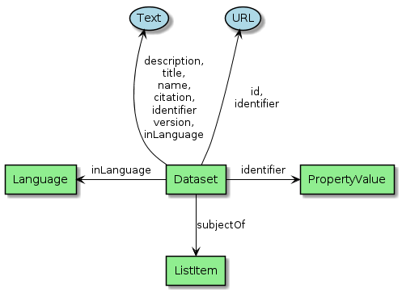

[[Chapter-3]]

== Table of contents

* <<eo-collections,2. EO Collections>>
** <<dataset,2.1 Dataset>>
* <<property-mapping,B. Property Mapping>>
* <<references,C. References>>
** <<normative-references,Normative References>>
** <<other-references,Other References>>

== 2. EO Collections

This section defines the encoding of Earth Observation collection metadata.  We use a presentation similar to the GeoJSON Encoding Specifications in https://docs.ogc.org/is/17-003r2/17-003r2.html[OGC17-003r2], https://docs.ogc.org/per/19-020r1.html[OGC19-020r1] and <<OGC17-084r1>>.  The graphical notation is borrowed from https://github.com/ESIPFed/science-on-schema.org/tree/master/assets/diagrams[science-on-schema.org]. The diagrams are prepared with PlantUML.

=== 2.1 Dataset

[#img_object_dataset,reftext='{figure-caption} {counter:figure-num}']
.Dataset Schema

The complete decription of Dataset is given in <<table_object_dataset>>.  

[#table_object_dataset,reftext='{table-caption} {counter:table-num}']
.Dataset object properties
[cols="<20m,<50,<15,<15",width="100%",options="header",align="center"]
|===
|JSON Property | Definition | Data type and values | Multiplicity and use

a| @context +
~$.@context~
| Optional context property.
| Range: String +
Fixed value: "https://schema.org"
| Zero or one (optional)

a| @type +
~$.@type~
| Type of the object. This property has the fixed value "Dataset".
| Range: String +
Fixed value: "Dataset"
| One (mandatory)

a| @id +
~$.@id~
| Unique identifier for the collection (IRI).
| Range: String
| Zero or one (optional)

a| description +
~$.description~
| A description of the collection.
| Domain: Thing +
Range: Text
| Zero or one (optional)

a| identifier +
~$.identifier~
| Identifier given to the collection.
| Domain: Thing +
Range: Text or Url or PropertyValue +
See also <<table_object_propertyvalue>>.
| Zero or one (optional)

a| name +
~$.name~
| The name of the collection.
| Domain: Thing +
Range: Text
| One (mandatory)

a| temporal +
~$.temporal~
| Date or range of dates relevant for the resource.  For example: "1999-07-01T00:00:00Z/2003-12-31T00:00:00Z"
| Domain: Dataset +
Range: DateTime or Text
| Zero or one (optional)
|===

.Dataset encoding example
[source,json]
----
{
	"@context": "http://schema.org",
	"@type": "Dataset",
	"name": "PROBA-V S1 TOA 1KM: product resolution data, best-quality daily synthesis. Maximum Value Compositing (MVC)is applied.",
	"alternateName": "urn:ogc:def:EOP:VITO:PROBAV_S1-TOA_1KM_V001",
	"description": "Level 3 data products are variables mapped on uniform space-time grid scales and are the result of combiningmultiple scenes (e.g. S1/S10) to cover the user’s region of interest.",
	"provider": {
		"@type": "Organization",
		"name": "VITO (Flemish Institute for Technological Research)",
		"address": {
			"@type": "PostalAddress",
			"addressCountry": "Belgium",
			"addressLocality": "Mol",
			"postalCode": "B-2400",
			"streetAddress": "Boeretang 200"
		},
		"telephone": "+32 14 33 68 14",
		"faxNumber": "+32 14 32 27 95",
		"email": "helpdeskticket@vgt.vito.be",
		"url": "http://proba-v.vgt.vito.be/"
	},
	"dateModified": "2018-10-23T15:52:07Z",
	"keywords": "EARTH SCIENCE>LAND SURFACE>LAND USE/LAND COVER, EARTH SCIENCE>CLIMATEINDICATORS>CRYOSPHERIC INDICATORS>SNOW COVER, Land cover, Cloud, Radiometric quality, Shadow, Snow, landuse, proba, environmental monitoring facilities, land cover, Proba-V",
	"temporal": "2013-10-16T00:00:00Z/2018-12-31T00:00:00Z",
	"spatial": {
		"@type": "Place",
		"geo": {
			"@type": "GeoShape",
			"polygon": "-56.0 -180.0 -56.0 180.0 75.0 180.0 75.0 -180.0 -56.0 -180.0"
		}
	},
	"image": "http://geo.spacebel.be/opensearch/images/vito.png",
	"thumbnailUrl": "http://geo.spacebel.be/opensearch/images/vito.png"
}
----

==== Dates

[#img_object_dates,reftext='{figure-caption} {counter:figure-num}']
.Dates Schema
image::diagrams/Dates.png[align="center"]

The complete overview of date related properties is given in <<table_object_dates>>.  

[#table_object_dates,reftext='{table-caption} {counter:table-num}']
.Dates object properties
[cols="<20m,<50,<15,<15",width="100%",options="header",align="center"]
|===
|JSON Property | Definition | Data type and values | Multiplicity and use

a| temporal +
~$.temporal~
| Date or range of dates relevant for the resource.  For example: "1999-07-01T00:00:00Z/2003-12-31T00:00:00Z"
| Domain: Dataset +
Range: DateTime or Text
| Zero or one (optional)
|===

.Dates encoding example
[source,json]
----
{

	
}
----

=== PropertyValue (identifier)

[#img_object_propertyvalue,reftext='{figure-caption} {counter:figure-num}']
.PropertyValue Schema
image::diagrams/PropertyValue.png[align="center"]

The complete decription of PropertyValue is given in <<table_object_propertyvalue>>. 
The encoding of `identifier` with a `PropertyValue` corresponds to the encoding proposed by <<ESIPFed>>.  The `propertyID` should use an URL from the registry at https://registry.identifiers.org/registry.

[#table_object_propertyvalue,reftext='{table-caption} {counter:table-num}']
.PropertyValue object properties
[cols="<20m,<50,<15,<15",width="100%",options="header",align="center"]
|===
|JSON Property | Definition | Data type and values | Multiplicity and use

a| @context +
~$.@context~
| Optional context property.
| Range: String +
Fixed value: "https://schema.org"
| Zero or one (optional)

a| @type +
~$.@type~
| Type of the object. This property has the fixed value "Dataset".
| Range: String +
Fixed value: "Dataset"
| One (mandatory)

|===

.PropertyValue encoding example
[source,json]
----
{
	"@context": {
		"@vocab": "https://schema.org/"
	},
	"@type": "Dataset",
	"name": "ESA Sea Surface Temperature Climate Change Initiative (ESA SST CCI): GHRSST Multi-Product ensemble (GMPE)",
	"identifier": {
		"@id": "https://doi.org/10.5285/7BAF7407-2F15-406C-8F09-CB9DC10392AA",
		"@type": "PropertyValue",
		"propertyID": "https://registry.identifiers.org/registry/doi",
		"value": "doi:10.5285/7BAF7407-2F15-406C-8F09-CB9DC10392AA",
		"url": "https://doi.org/10.5285/7BAF7407-2F15-406C-8F09-CB9DC10392AA"
	}
}
----

== Property Mapping

=== OGC17-084r1 Metadata

|===
| GeoJSON Property | JSON-LD Property |   schema.org | schema.org Reference | Reference

a| abstract +
~$.properties.abstract~     | dct:description |  $.description      | https://schema.org/description  |    <<table_object_dataset>>

a| created +
~$.properties.created~     | dct:created |                |  |    

a| created +
~$.properties.isPrimaryTopicOf.created~    | dct:created |                |  | 

a| date +
~$.properties.date~       | dct:date |   $.temporal            |  https://schema.org/temporal | 

a| doi +
~$.properties.doi~        | adms:identifier  |   $.identifier.value   |   https://schema.org/value   |  <<table_object_propertyvalue>>

a| id +
~$.id~                     | @id           |   $.@id                |                              |  <<table_object_dataset>>

a| identifier +
~$.properties.identifier~   | dct:identifier |   $.identifier        |  https://schema.org/identifier |  <<table_object_dataset>>

a| title +
~$.properties.title~        | dct:title |  $.name              | https://schema.org/name |    <<table_object_dataset>>

|===

=== STAC Collection Metadata

TBD.

== References

.to be moved to a separate file

=== Normative references

* [[JSON]]http://www.ietf.org/rfc/rfc7159.txt[RFC 7159, The JavaScript Object Notation (JSON) Data Interchange Format, March 2014]
* [[GeoJSON]]https://tools.ietf.org/html/rfc7946[RFC 7946, The GeoJSON Format]

* [[DCAT]]https://www.w3.org/TR/vocab-dcat/[Data Catalog Vocabulary (DCAT), W3C Recommendation 16 January 2014]
* [[LDP]]https://www.w3.org/TR/ldp/[Linked Data Platform 1.0, W3C Recommendation 26 February 2015]
* [[JSON-LD]]https://www.w3.org/TR/json-ld/[JSON-LD 1.0, A JSON-based Serialization for Linked Data, W3C Recommendation 16 January 2014]

=== Other references

[[JSON-LD-1.1]][JSON-LD-1.1]::
	JSON-LD 1.1, A JSON-based Serialization for Linked Data, W3C Working Draft 14 December 2018, https://www.w3.org/TR/json-ld11/
[[DCAT-2019]][DCAT-2019]::
	Data Catalog Vocabulary (DCAT) - Revised edition, W3C Editor's Draft 24 April 2019. 
[[JSONPath]][JSONPath]::
	JSONPath, http://goessner.net/articles/JsonPath/index.html
[[RD34]][RD34]:: 
	Shapes Constraint Language (SHACL), W3C Recommendation, 20 July 2017, https://www.w3.org/TR/shacl/
[[RD35]][RD35]::  
	SHACL Use Cases and Requirements, W3C Working Group Note, 20 July 2017, https://www.w3.org/TR/shacl-ucr/
[[ESIPFed]][ESIPFed]::
	"Schema.org Publishing Guidelines for the Geosciences", V1.1.0, https://doi.org/10.5281/zenodo.3736235, https://github.com/ESIPFed/science-onschema.org

