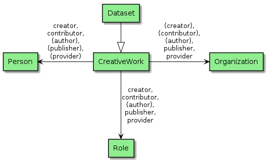
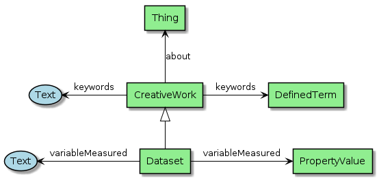
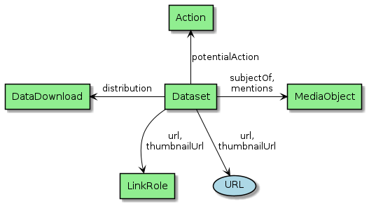

[[Chapter-3]]

ifdef::env-github[]
:tip-caption: :bulb:
:note-caption: :information_source:
:important-caption: :heavy_exclamation_mark:
:caution-caption: :fire:
:warning-caption: :warning:
endif::[]

ifdef::env-github[]
== Table of contents

* <<1-scope,1. Scope>>
* <<2-references,2. References>>
** <<21-normative-references,2.1 Normative references>>
** <<22-other-references,2.2 Other references>>

* <<3-conventions,3. Conventions>>
** <<31-glossary,3.1 Glossary>>
** <<32-abbreviated-terms,3.2 Abbreviated terms>>
** <<33-symbols,3.3 Symbols>>
* <<4-eo-collections-encoding,4. EO Collections encoding>>
** <<41-metadata-information,4.1 Metadata Information>>
** <<42-data-identification,4.2 Data Identification>>
*** <<421-resource-dates,4.2.1 Resource Dates>>
*** <<422-propertyvalue,4.2.2 PropertyValue>>
*** <<423-contact,4.2.3 Contact>>
*** <<424-organization,4.2.4 Organization>>
*** <<425-person,4.2.5 Person>>
*** <<426-role,4.2.6 Role>>
** <<43-resource-constraints,4.3 Resource Constraints>>
** <<44-descriptive-keywords,4.4 Descriptive Keywords>>
*** <<441-definedterm,4.4.1 DefinedTerm>>
** <<45-spatial-information,4.5 Spatial Information>>
*** <<451-geoshape,4.5.1 GeoShape>>
*** <<452-geocoordinates,4.5.2 GeoCoordinates>>
** <<46-related-url,4.6 Related URL>>
*** <<461-mediaobject,4.6.1 MediaObject>>
*** <<462-action,4.6.2 Action>>
** <<47-acquisition-information,4.7 Acquisition Information>>
* <<5-eo-services-and-applications-encoding,5. EO Services and Applications Encoding>>
** <<51-service-identification,5.1 Service Identification>>
** <<52-acquisition-information,5.2 Acquisition Information>>
* <<6-eo-granules-encoding,6. EO Granules Encoding>>
** <<61-granule-identification,6.1 Granule Identification>>

* <<appendix-a-media-types-for-data-encoding,Appendix A: Media Types for Data Encoding>>
* <<appendix-b-interpretation-as-w3c-json-ld,Appendix B: Interpretation as W3C JSON-LD>>
* <<appendix-c-property-mapping,Appendix C: Property Mapping>>
* <<appendix-d-design-justification,Appendix D: Design Justification>>
** <<eo-granule-encoding,D.1: EO Granule Encoding>>
** <<method-1---additionalproperty,D.1.1: Method 1 - additionalProperty>>
** <<method-2---using-multiple-types,D.1.2: Method 2 - using multiple types>>
** <<method-3---extending-schemaorg,D.1.3: Method 3 - Extending schema.org>>
* <<appendix-e-complete-examples,Appendix E: Complete Examples>>
** <<collection,E.1: Collection>>
** <<service-and-application,E.2: Service and Application>>
** <<granule,E.3: Granule>>
** <<article,E.4: Article>>
* <<appendix-f-schemaorg-extension-for-eo,Appendix F: Schema.org Extension for EO>>

endif::[]

// 1 --------------------------------------------------------------------------------------------
ifdef::env-github[]
== 1 Scope
endif::[]
ifndef::env-github[]
== Scope
endif::[]

This Engineering Report proposes a Schema.org based JSON-LD <<JSON-LD>> encoding for Earth Observation (EO) resource metadata.  Resources that can be described include collections, services and applications and datasets (i.e., products or granules).  The report provides JSON-LD document models for the exchange of information describing EO resources, both within and between different organisations.  The encoding aims to facilitate the creation of Knowledge Graphs or Linked Data representations for EO resources and their discovery through mass-market search engines.

// 2 --------------------------------------------------------------------------------------------
ifdef::env-github[]
== 2 References
endif::[]
ifndef::env-github[]
== References
endif::[]

// 2.1 --------------------------------------------------------------------------------------------
ifdef::env-github[]
=== 2.1 Normative references
endif::[]
ifndef::env-github[]
=== Normative references
endif::[]

[[DCAT]][DCAT]::
	Data Catalog Vocabulary (DCAT) - Version 2, W3C Recommendation 04 February 2020, https://www.w3.org/TR/vocab-dcat-2/
[[JSON]][JSON]::
	RFC 7159, The JavaScript Object Notation (JSON) Data Interchange Format, March 2014, http://www.ietf.org/rfc/rfc7159.txt
[[GeoJSON]][GeoJSON]::
	RFC 7946, The GeoJSON Format, https://www.w3.org/TR/json-ld11/
[[JSON-LD]][JSON-LD]::
	JSON-LD 1.1, A JSON-based Serialization for Linked Data, W3C Recommendation 16 July 2020, https://www.w3.org/TR/json-ld11/
[[LDP]][LDP]::
	Linked Data Platform 1.0, W3C Recommendation 26 February 2015, https://www.w3.org/TR/ldp/
[[OGC14-055r2]][OGC14-055r2]::
	OGC14-055r2, OGC OWS Context GeoJSON Encoding Standard, Version 1.0, https://docs.opengeospatial.org/is/14-055r2/14-055r2.html.
[[OGC17-003r2]][OGC17-003r2]::
	OGC17-003r2, OGC EO Dataset Metadata GeoJSON(-LD) Encoding Standard, Version 1.0, https://docs.opengeospatial.org/is/17-003r2/17-003r2.html.
[[OGC17-084r1]][OGC17-084r1]::
	OGC17-084r1, EO Collection GeoJSON(-LD) Encoding, Version 1.0, https://docs.ogc.org/bp/17-084r1/17-084r1.html.
[[SHACL]][SHACL]:: 
	Shapes Constraint Language (SHACL), W3C Recommendation, 20 July 2017, https://www.w3.org/TR/shacl/
[[SKOS]][SKOS]:: 
	SKOS Simple Knowledge Organization System, Reference, W3C Recommendation 18 August 2009, https://www.w3.org/TR/skos-reference/
[[SPARQL]][SPARQL]:: 
	SPARQL 1.1 Overview, W3C Recommendation 21 March 2013, https://www.w3.org/TR/sparql11-overview/

// 2.2 --------------------------------------------------------------------------------------------
ifdef::env-github[]
=== 2.2 Other references
endif::[]
ifndef::env-github[]
=== Other references
endif::[]

[[CEOS-OS-BP]][CEOS-OS-BP]::
	CEOS OpenSearch Best Practice Document, Version 1.2, http://ceos.org/document_management/Working_Groups/WGISS/Interest_Groups/OpenSearch/CEOS-OPENSEARCH-BP-V1.2.pdf
[[JSONPath]][JSONPath]::
	JSONPath, http://goessner.net/articles/JsonPath/index.html
[[SHACL-UC]][SHACL-UC]::  
	SHACL Use Cases and Requirements, W3C Working Group Note, 20 July 2017, https://www.w3.org/TR/shacl-ucr/
[[ESIPFed]][ESIPFed]::
	"Schema.org Publishing Guidelines for the Geosciences", V1.1.0, https://doi.org/10.5281/zenodo.3736235, https://github.com/ESIPFed/science-onschema.org
[[DCAT-AP-SDO]][DCAT-AP-SDO]::
	DCAT-AP to Schema.org Mapping, Unofficial Draft 13 September 2019, https://ec-jrc.github.io/dcat-ap-to-schema-org/
[[OGC19-020r1]][OGC19-020r1]::
	OGC19-020r1, OGC Testbed-15: Catalogue and Discovery Engineering Report, https://docs.ogc.org/per/19-020r1.html.
[[STAC-ITEM]][STAC-ITEM]::
	STAC Item Specification, v1.0.0-beta-2, https://github.com/radiantearth/stac-spec/blob/v1.0.0-beta.2/item-spec/item-spec.md.

// 3 --------------------------------------------------------------------------------------------
ifdef::env-github[]
== 3 Conventions
endif::[]
ifndef::env-github[]
== Conventions
endif::[]

This section provides details and examples for any conventions used in the document. Examples of conventions are symbols, abbreviations, or special notes regarding how to read the document.

// 3.1 --------------------------------------------------------------------------------------------
ifdef::env-github[]
=== 3.1 Glossary
endif::[]
ifndef::env-github[]
=== Glossary
endif::[]

&#9679; collection ::

A collection is an aggregation of granules sharing the same product specification. A collection typically corresponds to the series of products derived from data acquired by a sensor on board a satellite and having the same mode of operation.
Different agencies use different terms for "collection": collection (CNES, NASA), dataset (JAXA), dataset series (ESA), product (JAXA).

&#9679; context ::

  A set of rules for interpreting a JSON-LD document as specified in the section "The Context" of the JSON-LD specification.
  
&#9679; granule ::

A granule is the finest granularity of data that can be independently managed. A granule usually matches the individual file of EO satellite data.
Different agencies use different terms for "collection": dataset (ESA), granule (NASA), product (ESA, CNES), scene (JAXA).
  
&#9679; JSON ::

  A lightweight, text-based, language-independent data interchange format, based on the Javascript programming language.  
  
&#9679; product ::
	
Same meaning as "granule".

&#9679; structured data ::

Structured data is a standardized format for providing information about a [Web] page and classifying the page content.  Source: Google.

// 3.2 --------------------------------------------------------------------------------------------
ifdef::env-github[]
=== 3.2 Abbreviated terms
endif::[]
ifndef::env-github[]
=== Abbreviated terms
endif::[]

* API		Application Programming Interface
* CEOS		Committee on Earth Observation Satellites
* EO		Earth Observation
* HATEOAS	Hypermedia As The Engine Of Application State
* HTTP 		HyperText Transfer Protocol
* IRI		Internationalised Resource Identifier
* ISO		International Organisation for Standardisation
* JSON		JavaScript Object Notation
* JSON-LD	JavaScript Object Notation for Linked Data
* OGC		Open Geospatial Consortium
* ORCID		Open Researcher and Contributor IDentifier
* RDF		Resource Description Framework
* REST		Representational State Transfer
* ROR		Research Organization Registry
* SPARQL	SPARQL Protocol and RDF Query Language
* URI		Uniform Resource Identifier
* URL		Uniform Resource Locator
* URN		Uniform Resource Name
* W3C		World Wide Web Consortium
* WGISS		Working Group on Information Systems and Services
* WKT		Well-Known Text
* WPS  		Web Processing Service
* WPS-T   	Transactional Web Processing Service
* XML		eXtensible Markup Language
* XSD		XML Schema Definition Language

// 3.3 --------------------------------------------------------------------------------------------
ifdef::env-github[]
=== 3.3 Symbols
endif::[]
ifndef::env-github[]
=== Symbols
endif::[]

Conventions 4 (graphical notation) and 6 (namespace) of https://github.com/ESIPFed/science-on-schema.org/blob/master/CONVENTIONS.md are applied.

The graphical notation is borrowed from <<ESIPFed>>, with the exception of named literals for which a different shape is used. The diagrams are prepared with PlantUML.

The `https://schema.org/` namespace for schema.org is used. 

// 4 --------------------------------------------------------------------------------------------
ifdef::env-github[]
== 4 EO Collections Encoding
endif::[]
ifndef::env-github[]
== EO Collections Encoding
endif::[]

This section defines the encoding of Earth Observation collection metadata.  We use a presentation similar to the GeoJSON Encoding Specifications in <<OGC17-003r2>>, <<OGC19-020r1>> and <<OGC17-084r1>>.  

// 4.1 --------------------------------------------------------------------------------------------
ifdef::env-github[]
=== 4.1 Metadata Information
endif::[]
ifndef::env-github[]
=== Metadata Information
endif::[]

Metadata Information applies to EO Collections (`Dataset`), EO Granules (`Dataset`) and EO Services and Applications (`CreativeWork`).

[#img_object_listitem,reftext='{figure-caption} {counter:figure-num}']
.Metadata Information Schema
image::diagrams/ListItem.png[align="center"]

The complete list of metadata information properties is given in <<table_object_listitem>>.
The properties are grouped in a `Listitem` as proposed by <<DCAT-AP-SDO>>.  <<ESIPFed>> proposes an alternative presentation using a `DataDownload`.

[#table_object_listitem,reftext='{table-caption} {counter:table-num}']
.ListItem object properties
[cols="<20m,<50,<15,<15",width="100%",options="header",align="center"]
|===
|JSON Property | Definition | Data type and values | Multiplicity and use

a| @type +
~$.@type~
| Type of the object. This property has the fixed value "ListItem".
| Range: String +
Fixed value: "ListItem"
| One (mandatory)

a| dateCreated +
~$.dateCreated~
| Date of creation of the metadata document.
| Domain: CreativeWork +
Range: Date or Datetime
| Zero or one (optional)

a| dateModified +
~$.dateModified~
| Date of last update of the metadata document.
| Domain: CreativeWork +
Range: Date or Datetime
| One (Mandatory)

a| datePublished +
~$.datePublished~
| Date of first availability of the metadata document.
| Domain: CreativeWork +
Range: Date or Datetime
| Zero or one (optional)

a| encodingFormat +
~$.encodingFormat~
| An established standard to which the metadata conforms. Encoded with `encodingFormat` (e.g. media type such as "application/vnd.iso.19139-2+xml") as proposed by <<ESIPFed>>.
| Domain: CreativeWork or MediaObject +
Range: Text or URL
| Zero or one (optional)

a| inLanguage +
~$.inLanguage~
| Resource language code, not empty, e.g. "en" (English).
| Domain: CreativeWork +
Range: Language or Text
| Zero or one (optional)

|===

.ListItem encoding example
[source,json]
----
{
	"@context": "https://schema.org",
	"@type": "Dataset",
	"name": "LANDSAT 7 ETM+ (Enhanced Thematic Mapper Plus) Geolocated Terrain Corrected Systematic processing (LANDSAT.ETM.GTC)",
	"description": "This dataset contains all the Landsat 7 Enhanced Thematic Mapper high-quality ortho-rectified L1T dataset over Kiruna, Maspalomas and Matera visibility masks.",
	"subjectOf": {
		"@type": "ListItem",
		"temporal": "1999-07-01T00:00:00Z/2003-12-31T00:00:00Z",
		"dateCreated": "1999-07-01T00:00:00Z",
		"datePublished": "1999-07-01T00:00:00Z",
		"dateModified": "2019-07-17T00:00:00Z",
		"inLanguage": "en",
		"encodingFormat": "application/vnd.iso.19139-2+xml"
	}
}
----

// 4.2 --------------------------------------------------------------------------------------------
ifdef::env-github[]
=== 4.2 Data Identification
endif::[]
ifndef::env-github[]
=== Data Identification
endif::[]

[#img_object_dataset,reftext='{figure-caption} {counter:figure-num}']
.Data Identification Schema

The complete list of Data identification properties is given in <<table_object_dataset>>.  

[#table_object_dataset,reftext='{table-caption} {counter:table-num}']
.Data Identification properties
[cols="<20m,<50,<15,<15",width="100%",options="header",align="center"]
|===
|JSON Property | Definition | Data type and values | Multiplicity and use

a| @context +
~$.@context~
| Optional context property.
| Range: String +
Fixed value: "https://schema.org"
| Zero or one (optional)

a| @type +
~$.@type~
| Type of the object. This property has the fixed value "Dataset".
| Range: String +
Fixed value: "Dataset"
| One (mandatory)

a| description +
~$.description~
| A description of the collection.
| Domain: Thing +
Range: Text
| One (mandatory)

a| name +
~$.name~
| The name of the collection.
| Domain: Thing +
Range: Text
| One (mandatory)

a| identifier +
~$.identifier~
| Identifier given to the collection. `Text` is used for simple identifiers such as ´TropForest´.  `PropertyValue` can be used to include `DOI` information.
| Domain: Thing +
Range: Text \| Url \| PropertyValue +
See also <<table_object_propertyvalue>>.
| One or more (mandatory)

a| additionalType +
~$.additionaltype~
| Unique identifiers (URI) for the type of the resource. Is equivalent to the `dct:type` property used by https://www.w3.org/TR/vocab-dcat-2/#classifying-dataset-types[DCAT for classifying dataset types].  +
E.g. http://purl.org/dc/dcmitype/Collection, +
https://inspire.ec.europa.eu/metadata-codelist/ResourceType/series
| Domain: Thing +
Range: URL
| Zero or more (optional)

a| @id +
~$.@id~
| Unique identifier for the collection (IRI).
| Range: URL
| Zero or one (optional)

a| alternateName +
~$.alternateName~
| Alternate name of the collection. Maybe used to refer to the https://idn.ceos.org/[CEOS IDN] shortname of the collection: e.g. `C1532648157-ESA` is the IDN shortname used for the collection with `identifier TropForest`.
| Domain: Thing +
Range: Text
| Zero or more (optional)

a| citation +
~$.citation~
| A bibliographic reference for the resource.
| Domain: CreativeWork +
Range: Text
| Zero or one (optional)

a| inLanguage +
~$.inLanguage~
| Resource language code, not empty, e.g. "en" (English)..
| Domain: CreativeWork +
Range: Language \| Text
| Zero or one (optional)

a| subjectOf +
~$.subjectOf~
| Refers to metadata information about the collection.
| Domain: Thing +
Range: ListItem (<<table_object_listitem>>)
| Zero or one (optional)

a| version +
~$.version~
| Version number or other version designation of the resource.
| Domain: CreativeWork +
Range: Number \| Text
| Zero or one (optional)
|===

.Data Identification encoding example
[source,json]
----
{
	"@context": {
		"@vocab": "https://schema.org/"
	},
	"@type": "Dataset",
	"additionalType": [
		"http://purl.org/dc/dcmitype/Collection",
		"https://inspire.ec.europa.eu/metadata-codelist/ResourceType/series"
	],
	"@id": "https://fedeo.esa.int/collections/series/items/LANDSAT.ETM.GTC",
	"name": "Landsat 7 ETM+ (Enhanced Thematic Mapper Plus) Geolocated Terrain Corrected Systematic processing",
	"alternateName": "LANDSAT.ETM.GTC",
	"includedInDataCatalog": {         
		"@type":"DataCatalog",
         	"name":"FedEO Clearinghouse"
     	},
	"url": [
		"https://earth.esa.int/eogateway/catalog/landsat-7-etm-enhanced-thematic-mapper-plus-geolocated-terrain-corrected-systematic-processing",
		"https://search.earthdata.nasa.gov/portal/idn/search?q=C1532648148-ESA"
	],
	"identifier": [
		"LANDSAT.ETM.GTC",
		{
			"@type": "PropertyValue",
			"propertyID": "https://idn.ceos.org/",
			"value": "C1532648148-ESA",
			"url": "https://search.earthdata.nasa.gov/portal/idn/search?q=C1532648148-ESA"
		}
	],
	"description": "This dataset contains all the Landsat 7 Enhanced Thematic Mapper high-quality ortho-rectified L1T dataset over Kiruna, Maspalomas and Matera visibility masks.",
	"temporalCoverage": "1999-07-01T00:00:00Z/2003-12-31T00:00:00Z",
	"inLanguage": {
		"@type": "Language",
		"@id": "http://id.loc.gov/vocabulary/iso639-1/en",
		"name": "en"
	},
	"subjectOf": [
		{
			"@type": "ListItem",
			"dateCreated": "1999-07-01T00:00:00Z",
			"datePublished": "1999-07-01T00:00:00Z",
			"dateModified": "2019-07-17T00:00:00Z",
			"inLanguage": {
				"@type": "Language",
				"@id": "http://id.loc.gov/vocabulary/iso639-1/en",
				"name": "en"
			},
			"encodingFormat": "application/vnd.iso.19139-2+xml"
		},
		{
			"@type": "MediaObject",
			"contentUrl": "https://fedeo.esa.int/collections/series/items/LANDSAT.ETM.GTC?httpAccept=application/dif10%2Bxml",
			"encodingFormat": "application/dif10+xml",
			"name": "DIF-10 metadata",
			"additionalType": "http://www.iana.org/assignments/relation/alternate"
		}
	]
}
----

// 4.2.1 --------------------------------------------------------------------------------------------
ifdef::env-github[]
==== 4.2.1 Resource Dates
endif::[]
ifndef::env-github[]
==== Resource Dates
endif::[]

Resource dates apply to EO Collections (`Dataset`), EO Granules (`Dataset`) and EO Services and Applications (`CreativeWork`).

[#img_object_dates,reftext='{figure-caption} {counter:figure-num}']
.ResourceDates Schema
image::diagrams/ResourceDates.png[align="center"]

The complete overview of date related properties for resources is given in <<table_object_dates>>.  

[#table_object_dates,reftext='{table-caption} {counter:table-num}']
.Dates object properties
[cols="<20m,<50,<15,<15",width="100%",options="header",align="center"]
|===
|JSON Property | Definition | Data type and values | Multiplicity and use

a| temporalCoverage +
~$.temporalCoverage~
| Date or range of dates relevant for the resource.  For example: "1999-07-01T00:00:00Z/2003-12-31T00:00:00Z"
| Domain: Dataset +
Range: DateTime or Text
| One (Mandatory)

a| dateCreated +
~$.dateCreated~
| Date of creation of the resource.
| Domain: CreativeWork +
Range: Date or Datetime
| Zero or one (optional)

a| dateModified +
~$.dateModified~
| Date of last update of the resource.
| Domain: CreativeWork +
Range: Date or Datetime
| One (Mandatory)

a| datePublished +
~$.datePublished~
| Date of publication of the resource.
| Domain: CreativeWork +
Range: Date or Datetime
| Zero or one (optional)
|===

.ResourceDates encoding example
[source,json]
----
{
	"@context": "https://schema.org",
	"@type": "Dataset",
	"name": "LANDSAT 7 ETM+ (Enhanced Thematic Mapper Plus) Geolocated Terrain Corrected Systematic processing (LANDSAT.ETM.GTC)",
	"description": "This dataset contains all the Landsat 7 Enhanced Thematic Mapper high-quality ortho-rectified L1T dataset over Kiruna, Maspalomas and Matera visibility masks. The Landsat 7 ETM+ scenes typically covers 185 x 170 km. A standard full scene is nominally centred on the intersection between a Path and Row (the actual image centre can vary by up to 100m). Each band requires 50MB (uncompressed), and Band 8 requires 200MB (panchromatic band with resolution of 15m opposed to 30m).",
	"temporalCoverage": "1999-07-01T00:00:00Z/2003-12-31T00:00:00Z",
	"dateCreated": "1999-07-01T23:59:00Z",
	"datePublished": "1999-07-02T08:00:00Z",
	"dateModified": "2004-01-01T08:00:00Z"
}
----

// 4.2.2 --------------------------------------------------------------------------------------------
ifdef::env-github[]
==== 4.2.2 PropertyValue
endif::[]
ifndef::env-github[]
==== PropertyValue
endif::[]

Propertyvalue can be used to identify all kinds of resources including EO Collections (`Dataset`), EO Granules (`Dataset`), EO Services and Applications (`CreativeWork`) and Persons (`Person`).

[#img_object_propertyvalue,reftext='{figure-caption} {counter:figure-num}']
.PropertyValue Schema
image::diagrams/PropertyValue.png[align="center"]

The complete decription of PropertyValue is given in <<table_object_propertyvalue>>. 
The encoding of `identifier` with a `PropertyValue` corresponds to the encoding proposed by <<ESIPFed>>.  The `propertyID` should use an URL from the registry at https://registry.identifiers.org/registry.

[#table_object_propertyvalue,reftext='{table-caption} {counter:table-num}']
.PropertyValue object properties
[cols="<20m,<50,<15,<15",width="100%",options="header",align="center"]
|===
|JSON Property | Definition | Data type and values | Multiplicity and use

a| @type +
~$.identifier[*].@type~
| Type of the object. This property has the fixed value "PropertyValue".
| Range: String +
Fixed value: "PropertyValue"
| Zero or one (optional)

a| @id +
~$.identifier[*].@id~
| ID of the identifier.  E.g. `https://doi.org/10.5285/7BAF7407-2F15-406C-8F09-CB9DC10392AA`.
| Range: URL 
| Zero or one (optional)

a| value +
~$.identifier[*].value~
| Value of the identifier, including the prefix (e.g. `doi:`) identifying the type of identifier. E.g. `doi:10.5285/7BAF7407-2F15-406C-8F09-CB9DC10392AA`. +
The prefix is included as recommended by <<ESIPFed>>.
| Range: Text 
| One (mandatory)

a| propertyID +
~$.identifier[*].propertyID~
| A commonly used identifier for the characteristic represented by the property. +
<<ESIPFed>> recommends using the registry.identifiers.org URI for the identifier scheme, e.g. `https://registry.identifiers.org/registry/doi`.
| Range: URL 
| One (mandatory)

a| url +
~$.identifier[*].url~
| Resolvable URL of the item  where the resource being identified can be found.  E.g. `https://doi.org/10.5285/7BAF7407-2F15-406C-8F09-CB9DC10392AA`.
| Range: URL 
| Zero or one (optional)

|===

In the example below, PropertyValue is used to associate a https://doi.org[DOI] identifier to a Dataset.

.PropertyValue encoding example (Collection DOI)
[source,json]
----
{
	"@context": {
		"@vocab": "https://schema.org/"
	},
	"@type": "Dataset",
	"name": "ESA Sea Surface Temperature Climate Change Initiative (ESA SST CCI): GHRSST Multi-Product ensemble (GMPE)",
	"identifier": {
		"@id": "https://doi.org/10.5285/7BAF7407-2F15-406C-8F09-CB9DC10392AA",
		"@type": "PropertyValue",
		"propertyID": "https://registry.identifiers.org/registry/doi",
		"value": "doi:10.5285/7BAF7407-2F15-406C-8F09-CB9DC10392AA",
		"url": "https://doi.org/10.5285/7BAF7407-2F15-406C-8F09-CB9DC10392AA"
	}
}
----

[NOTE] 
https://idn.ceos.org/[CEOS IDN] collection identifiers are currently not registered at https://registry.identifiers.org. 

.PropertyValue encoding example (IDN)
[source,json]
----
{
	"@context": "https://schema.org/",
	"@type": "Dataset",
	"name": "Landsat 7 ETM+ (Enhanced Thematic Mapper Plus) Geolocated Terrain Corrected Systematic processing",
	"url": "https://earth.esa.int/eogateway/catalog/landsat-7-etm-enhanced-thematic-mapper-plus-geolocated-terrain-corrected-systematic-processing",
	"identifier": {
		"@type": "PropertyValue",
		"propertyID": "https://idn.ceos.org/",
		"value": "C1532648148-ESA",
		"url": "https://search.earthdata.nasa.gov/portal/idn/search?q=C1532648148-ESA"
	}
}
----

In the example below, PropertyValue is used to associate an https://orcid.org/[ORCID ID] to a Person.

.PropertyValue encoding example (ORCID)
[source,json]
----
{
	"@context": "https://schema.org/",	
	"@type": "Person",
	"name": "Christopher J. Merchant",
	"url": "https://publons.com/researcher/2543185/christopher-j-merchant/",
	"identifier": {
		"@id": "https://orcid.org/0000-0003-4687-9850",
		"@type": "PropertyValue",
		"propertyID": "https://registry.identifiers.org/registry/orcid",
		"url": "https://orcid.org/0000-0003-4687-9850",
		"value": "orcid:0000-0003-4687-9850"
	}
}
----

In the example below, PropertyValue is used to associate an https://ror.org/[ROR ID] to an Organization.

.PropertyValue encoding example (ROR)
[source,json]
----
{
	"@context": "https://schema.org/",	
	"@type": "Organization",
	"name": "European Space Agency",
	"url": "https://esa.int",
	"identifier": {
		"@id": "https://ror.org/03wd9za21",
		"@type": "PropertyValue",
		"propertyID": "https://registry.identifiers.org/registry/ror",
		"url": "https://ror.org/03wd9za21",
		"value": "ror:03wd9za21"
	}
}
----

In the example below, PropertyValue is used to identify an Article about an EO Collection via its https://doi.org[DOI] identifier.

.PropertyValue encoding example (Article DOI)
[source,json]
----
{
	"@context": "https://schema.org/",
	"@type": "Article",
	"name": "A new vegetation index derived from the pattern decomposition method applied to Landsat-7/ETM+ images in Mongolia",
	"url": [
		"https://www.tandfonline.com/action/fedSearchRedirect?doi=10.1080%2F01431160601024200",
		"https://doi.org/10.1080/01431160601024200"
	],
	"identifier": {
		"@id": "https://doi.org/10.1080/01431160601024200",
		"@type": "PropertyValue",
		"propertyID": "https://registry.identifiers.org/registry/doi",
		"value": "doi:10.1080/01431160601024200",
		"url": "https://doi.org/10.1080/01431160601024200"
	},
	"about": {
		"@type": "Dataset",
		"@id": "https://fedeo.esa.int/collections/series/items/LANDSAT.ETM.GTC"
	},
	"isPartOf": "International Journal of Remote Sensing"
}
----

// 4.2.3 --------------------------------------------------------------------------------------------
ifdef::env-github[]
==== 4.2.3 Contact
endif::[]
ifndef::env-github[]
==== Contact
endif::[]

Contact information applies to EO Collections (`Dataset`), EO Granules (`Dataset`) and EO Services and Applications (`CreativeWork`).

[#img_object_contact,reftext='{figure-caption} {counter:figure-num}']
.Contact Schema

The list of contact related properties is given in <<table_object_contact>>.  

[#table_object_contact,reftext='{table-caption} {counter:table-num}']
.Contact object properties
[cols="<20m,<50,<15,<15",width="100%",options="header",align="center"]
|===
|JSON Property | Definition | Data type and values | Multiplicity and use

a| author +
~$.author~
| Responsible party primarily responsible for authoring the collection (role is "Author").  <<ESIPFed>> recommends using `creator` instead.
| Range: Organization \| Person \| Role
| Zero or more (optional)

a| creator +
~$.creator~
| Responsible party responsible for creating the collection.  Is synonym of `author`.
| Range: Organization \| Person \| Role
| Zero or more (optional)

a| contributor +
~$.contributor~
| A secondary contributor to the collection.
| Range: Organization \| Person \| Role
| Zero or more (optional)

a| provider +
~$.provider~
| Responsible party responsible for providing the collection.
| Range: Organization (Preferred) \| Person
| Zero or more (optional)

a| publisher +
~$.publisher~
| Responsible party responsible for publishing the collection.
| Range: Organization (Preferred) \| Person
| Zero or more (optional)

|===

[WARNING]
https://github.com/ESIPFed/science-on-schema.org/blob/master/guides/Dataset.md#roles-of-people[ESIPFed] uses `Role` as object type for `creator` or `contributor` to be able to associate additional https://schema.org/roleName[roleName]s.  This approach is documented http://blog.schema.org/2014/06/introducing-role.html[here].  However, this does not validate with the Google Rich Results Test tool.

.Contact encoding example
[source,json]
----
{
	"@context": "https://schema.org",
	"@type": "Dataset",
	"name": "LANDSAT 7 ETM+ (Enhanced Thematic Mapper Plus) Geolocated Terrain Corrected Systematic processing (LANDSAT.ETM.GTC)",
	"description": "This dataset contains all the Landsat 7 Enhanced Thematic Mapper high-quality ortho-rectified L1T dataset over Kiruna, Maspalomas and Matera visibility masks. The Landsat 7 ETM+ scenes typically covers 185 x 170 km.",
	"author": [
		{
			"@type": "Organization",
			"@id": "https://www.linkedin.com/company/european-space-agency",
			"email": "eohelp@eo.esa.int",
			"name": "ESA/ESRIN",
			"telephone": "+39 06 94180777",
			"url": "https://earth.esa.int",
			"address": {
				"addressCountry": "Italy",
				"postalCode": "00044",
				"addressLocality": "Frascati",
				"streetAddress": "Via Galileo Galilei CP. 64"
			}
		}
	],
	"creator": {
		"@type": "Role",
		"creator": {
			"@type": "Organization",
			"@id": "https://www.linkedin.com/company/european-space-agency/"
		},
		"roleName": "originator"
	}
}
----

// 4.2.4 --------------------------------------------------------------------------------------------
ifdef::env-github[]
==== 4.2.4 Organization
endif::[]
ifndef::env-github[]
==== Organization
endif::[]

[#img_object_organization,reftext='{figure-caption} {counter:figure-num}']
.Organization Schema
image::diagrams/Organization.png[align="center"]

The list of Organization properties is fully defined in https://schema.org/Organization[schema:Organization] and not repeated here.  

.Organization encoding example
[source,json]
----
{
	"@type": "Organization",
	"name": "ESA/ESRIN",
	"sameAs": "https://ror.org/05vt9rv16",
	"address": {
		"@type": "PostalAddress",
		"addressCountry": "Italy",
		"addressLocality": "Frascati (Roma)",
		"postalCode": "00044",
		"streetAddress": "Largo Galileo Galilei 1"
	},
	"telephone": "+3906941801",
	"faxNumber": "+390694180280",
	"email": "eohelp@esa.int",
	"url": "https://esa.int"
}
----

// 4.2.5 --------------------------------------------------------------------------------------------
ifdef::env-github[]
==== 4.2.5 Person
endif::[]
ifndef::env-github[]
==== Person
endif::[]

[#img_object_person,reftext='{figure-caption} {counter:figure-num}']
.Person Schema
image::diagrams/Person.png[align="center"]

The list of Person properties is fully defined in https://schema.org/Person[schema:Person] and not repeated here.  

.Person encoding example
[source,json]
----
{
	"@context": "https://schema.org/",
	"@type": "Person",
	"name": "Christopher J. Merchant",
	"url": "https://publons.com/researcher/2543185/christopher-j-merchant/",
	"identifier": {
		"@id": "https://orcid.org/0000-0003-4687-9850",
		"@type": "PropertyValue",
		"propertyID": "https://registry.identifiers.org/registry/orcid",
		"url": "https://orcid.org/0000-0003-4687-9850",
		"value": "orcid:0000-0003-4687-9850"
	}
}
----

// 4.2.6 --------------------------------------------------------------------------------------------
ifdef::env-github[]
==== 4.2.6 Role
endif::[]
ifndef::env-github[]
==== Role
endif::[]

[#img_object_role,reftext='{figure-caption} {counter:figure-num}']
.Role Schema
image::diagrams/Role.png[align="center"]

The list of Role properties is defined in https://schema.org/Role[schema:Role] and not repeated here. 

`Role` can be used in combination with a `Person` or `Organization`.
The https://schema.org/roleName[schema:roleName] property can be used to encode [`CI_RoleCode`] values from https://www.isotc211.org/2005/resources/Codelist/gmxCodelists.xml[ISO19115:2003] or https://wiki.esipfed.org/ISO_19115-3_Codelists#CI_RoleCode[ISO19115-3] (*) for which https://schema.org/roleName[schema:Dataset] does not have a corresponding property.  

[#table_role_responsible_party,reftext='{table-caption} {counter:table-num}']
.Responsible party role properties
|===
| https://www.isotc211.org/2005/resources/Codelist/gmxCodelists.xml[ISO19115:2003]  |  https://wiki.esipfed.org/ISO_19115-3_Codelists#CI_RoleCode[ISO19115-3]  | schema.org property 

|  author     |  author  |  schema:author  
|             |  coAuthor  |  
|             |  collaborator  |  
|             |  contributor  |  schema:contributor
|  custodian  |  custodian    |  schema:maintainer
|  distributor  |  distributor   |  
|             |  editor          | schema:editor (Person) 
|             |  funder          | schema:funder  
|             |  mediator        |  
|  originator  |  originator  |  schema:creator  
|  owner       |  owner        |  
|  pointofContact       |  pointOfContact    |  schema:provider
| principalInvestigator | principalInvestigator  | 
| processor        | processor |
| publisher        | publisher | schema:publisher 
| resourceProvider | resourceProvider | schema:provider
|                  | rightsHolder | schema:copyrightHolder
|                  | sponsor | schema:sponsor
|                  | stakeholder |
| user             | user |

|===

Roles directly supported as property of https://schema.org/Dataset[schema:Dataset] (See table above) do not require an intermediate https://schema.org/Role[schema:Role] object:

Other roles can be used as values for https://schema.org/roleName[schema:roleName].  It is recommended to reuse `CI_RoleCode` values from https://wiki.esipfed.org/ISO_19115-3_Codelists#CI_RoleCode[ISO19115-3] where possible.

.Role encoding example
[source,json]
----
{
	"@context": "https://schema.org/",
	"@type": "Dataset",
	"contributor": {
		"@type": "Role",
		"roleName": "principalInvestigator",
		"contributor": {
			"@type": "Person",
			"name": "Christopher J. Merchant",
			"url": "https://publons.com/researcher/2543185/christopher-j-merchant/",
			"identifier": {
				"@id": "https://orcid.org/0000-0003-4687-9850",
				"@type": "PropertyValue",
				"propertyID": "https://registry.identifiers.org/registry/orcid",
				"url": "https://orcid.org/0000-0003-4687-9850",
				"value": "orcid:0000-0003-4687-9850"
			}
		}
	}
}
----

// 4.3 --------------------------------------------------------------------------------------------
ifdef::env-github[]
=== 4.3 Resource Constraints
endif::[]
ifndef::env-github[]
=== Resource Constraints
endif::[]

Resource Constraints apply to EO Collections (`Dataset`), EO Granules (`Dataset`) and EO Services and Applications (`CreativeWork`).

[#img_object_resourceconstraints,reftext='{figure-caption} {counter:figure-num}']
.Resource Constraints Schema
image::diagrams/ResourceConstraints.png[align="center"]

The list of Resource Constraints properties is given in <<table_object_resourceconstraints>>.  

[#table_object_resourceconstraints,reftext='{table-caption} {counter:table-num}']
.Resource Constraints properties
[cols="<20m,<50,<15,<15",width="100%",options="header",align="center"]
|===
|JSON Property | Definition | Data type and values | Multiplicity and use

a| license +
~$.license~
| A license document that applies to the content, typically indicated by URL.  Links the collection to its license to document legal constraints.   https://spdx.org/licenses[SPDX license list] provides a list of URi for most commonly used licenses. See https://github.com/ESIPFed/science-on-schema.org/blob/master/guides/Dataset.md#license[ESIPFed] for additional guidance.
| Domain: CreativeWork +
Range: CreativeWork \| URL
| Zero or more (optional)

a| conditionsOfAccess +
~$.conditionsOfAccess~
| Conditions that affect the availability of, or method(s) of access to, the collection. 
| Domain: CreativeWork +
Range: Text
| Zero or more (optional)

|===

.Resource Constraints encoding example
[source,json]
----
{
	"@context": "https://schema.org",
	"@type": "Dataset",
	"name": "Alos African Coverage ESA archive",
	"identifier": "ALOS",
	"description": "ALOS Africa is a collection of the best available (cloud minimal) African coverage acquired by AVNIR-2 and PRISM.",
	"license": {
		"@type": "CreativeWork",
		"description": "Utilisation of this data is subject to ESA's Earth Observation Terms and Conditions",
		"url": "https://earth.esa.int/eogateway/documents/20142/1614553/Terms-and-Conditions-for-the-utilization-of-Data-provided-by-ESA.pdf"
	},
	"conditionsOfAccess": "Fast Registration with immediate access Immediate Access to data upon fast registration. TPM online access list ALOS Africa Online catalogue"
}
----

// 4.4 --------------------------------------------------------------------------------------------
ifdef::env-github[]
=== 4.4 Descriptive Keywords
endif::[]
ifndef::env-github[]
=== Descriptive Keywords
endif::[]

Descriptive keywords apply to EO Collections (`Dataset`), EO Granules (`Dataset`) and EO Services and Applications (`CreativeWork`).

[#img_object_descriptivekeywords,reftext='{figure-caption} {counter:figure-num}']
.Metadata Descriptive Keywords

The complete list of descriptive keyword properties is given in <<table_object_descriptivekeywords>>.

[#table_object_descriptivekeywords,reftext='{table-caption} {counter:table-num}']
.Descriptive keyword object properties
[cols="<20m,<50,<15,<15",width="100%",options="header",align="center"]
|===
|JSON Property | Definition | Data type and values | Multiplicity and use

a| keywords +
~$.keywords~
| Free keywords not belonging to a controlled vocabulary, or keywords from a controlled vocabulary related to the resource.  
| Range: Text \| URL \| DefinedTerm +
See <<table_object_definedterm>>
| Zero or more (optional)

a| about +
~$.about~
| The subject matter of the content;  Can be free keywords not belonging to a controlled vocabulary.  
| Range: Thing
| Zero or more (optional)

a| variableMeasured +
~$.variableMeasured~
| The variableMeasured property (pending) can indicate a variables that is measured in the dataset, either described as text or as pairs of identifier and description using PropertyValue.  See https://github.com/ESIPFed/science-on-schema.org/blob/master/guides/Dataset.md#variables[ESIPFed] for a detailed explanation. 
| Range: Text \| PropertyValue
| Zero or more (optional)

|===

.Descriptive keywords encoding example
[source,json]
----
{
	"@context": "https://schema.org",
	"@type": "Dataset",
	"keywords": [
		{
			"@type": "DefinedTerm",
			"@id": "http://www.eionet.europa.eu/gemet/concept/3650",
			"inDefinedTermSet": "http://www.eionet.europa.eu/gemet/",
			"name": "Geology"
		},
		{
			"@type": "DefinedTerm",
			"@id": "https://gcmdservices.gsfc.nasa.gov/kms/concept/03f0c0a3-04a7-4ef8-8ec0-3c2266510815",
			"inDefinedTermSet": "https://gcmdservices.gsfc.nasa.gov/kms/concepts/concept_scheme/sciencekeywords",
			"name": "VISIBLE IMAGERY"
		},
		{
			"@type": "DefinedTerm",
			"@id": "https://gcmdservices.gsfc.nasa.gov/kms/concept/98dc8278-fe0a-4e36-a638-9d7a5b0ed826",
			"inDefinedTermSet": "https://gcmdservices.gsfc.nasa.gov/kms/concepts/concept_scheme/projects",
			"name": "FedEO"
		},
		{
			"@type": "DefinedTerm",
			"@id": "https://gcmdservices.gsfc.nasa.gov/kms/concept/ad598334-f541-4be4-888c-c2dc7eb54194",
			"inDefinedTermSet": "https://gcmdservices.gsfc.nasa.gov/kms/concepts/concept_scheme/CollectionDataType",
			"name": "NEAR_REAL_TIME"
		},
		"FedEO",
		"ESA LDS",
		{
			"@type": "DefinedTerm",
			"@id": "http://inspire.ec.europa.eu/metadata-codelist/TopicCategory/geoscientificInformation",
			"name": "Geoscientific Information"
		},
		{
			"@type": "DefinedTerm",
			"@id": "https://gcmdservices.gsfc.nasa.gov/kms/concept/d9cd5b7e-e9e7-4746-bbc8-bc69f7b606c7",
			"name": "GEOSCIENTIFIC INFORMATION",
			"inDefinedTermSet": "https://gcmdservices.gsfc.nasa.gov/kms/concepts/concept_scheme/isotopiccategory"
		}
	]
}
----

.Descriptive keywords encoding example
[source,json]
{
	"@context": "https://schema.org/",
	"@type": "Dataset",
	"@id": "https://fedeo.esa.int/collections/series/items/e0659b01259145c8bfb0de6eb12c2690",
	"name": "ESA Sea Surface Temperature Climate Change Initiative (ESA SST CCI): GHRSST Multi-Product ensemble (GMPE)",
	"url": "https://catalogue.ceda.ac.uk/uuid/e0659b01259145c8bfb0de6eb12c2690",
	"about": "Sea Surface Temperature",
	"keywords": [
		{
			"@type": "DefinedTerm",
			"@id": "https://earth.esa.int/concept/ocean-temperature",
			"inDefinedTermSet": "https://earth.esa.int/concepts/concept_scheme/earth-topics",
			"name": "Ocean Temperature"
		}
	],
	"variableMeasured": {
		"@type": "PropertyValue",
		"propertyID": "gradient_fields",
		"name": "Horizontal SST gradients of input analyses",
		"unitText": "kelvin m-1",
		"description": "Horizontal SST gradients of input analyses"
	}
}
----

// 4.4.1 --------------------------------------------------------------------------------------------
ifdef::env-github[]
==== 4.4.1 DefinedTerm
endif::[]
ifndef::env-github[]
==== DefinedTerm
endif::[]

[#img_object_definedterm,reftext='{figure-caption} {counter:figure-num}']
.DefinedTerm schema
image::diagrams/DefinedTerm.png[align="center"]

A https://schema.org/DefinedTerm[DefinedTerm] represents a word, name, acronym, phrase, etc. with a formal definition.  It is similar to a <<SKOS>> concept.

The complete list of DefinedTerm properties is given in <<table_object_definedterm>>.

[#table_object_definedterm,reftext='{table-caption} {counter:table-num}']
.DefinedTerm object properties
[cols="<20m,<50,<15,<15",width="100%",options="header",align="center"]
|===
|JSON Property | Definition | Data type and values | Multiplicity and use

a| @type +
~$.keywords[*].@type~
| Type of the object. This property has the fixed value "DefinedTerm".
| Range: String +
Fixed value: "DefinedTerm"
| One (mandatory)

a| @id +
~$.keywords[*].@id~
| Identification of the keyword (URI).  E.g. the URI of a `skos:Concept`.
| Range: URL
| Zero or one (optional)

a| sameAs +
~$.keywords[*].sameAs~
| URL unambiguously indicating the item's identity.  Similar to `skos:exactMatch`.
| Range: URL
| Zero or more (optional)

a| name +
~$.keywords[*].name~
| Human readable representation of the keyword.  For a `skos:Concept`, this may correspond to the `skos:prefLabel` or `skos:altLabel` properties.
| Domain: DefinedTerm +
Range: Text 
| Zero or one (optional)

a| inDefinedTermSet +
~$.keywords[*].inDefinedTermSet~
| Identification of the code list or scheme defining the keyword.  For a `skos:Concept`, this corresponds to the `skos:inScheme` property.
| Domain: DefinedTerm +
Range: URL 
| Zero or one (optional)

a| additionalType +
~$.keywords[*].additionalType~
| Identification of the code list or scheme defining the keyword.  For a `skos:Concept`, the URI of a `skos:broader` concept can be used as well.  In the instrument example below, this property is used to represent the instrument type.
| Domain: DefinedTerm +
Range: URL 
| Zero or one (optional)

|===

.DefinedTerm encoding example (Science keyword)
[source,json]
----
{
	"@context": "https://schema.org",
	"@type": "DefinedTerm",
	"@id": "http://www.eionet.europa.eu/gemet/concept/4612",
	"name": "Land cover",
	"inDefinedTermSet": "http://www.eionet.europa.eu/gemet/"
}
----

.DefinedTerm encoding example (Instrument)
[source,json]
----
{
	"@type": "DefinedTerm",
	"@id": "https://earth.esa.int/concept/etm",
	"sameAs": "http://gcmdservices.gsfc.nasa.gov/kms/concept/4dbe7764-a2ea-4a19-b754-696c35ac3205",
	"termCode": "4dbe7764-a2ea-4a19-b754-696c35ac3205",
	"name": "ETM+",
	"additionalType": "https://earth.esa.int/concept/p-imaging-spectrometers-radiometers",
	"inDefinedTermSet": "https://earth.esa.int/concepts/concept_scheme/instruments"
}
----

.DefinedTerm encoding example (Platform)
[source,json]
----
{
	"@type": [
		"DefinedTerm",
		"Vehicle",
		"http://dbpedia.org/ontology/Satellite"
	],
	"@id": "https://earth.esa.int/concept/landsat-7",
	"name": "Landsat-7",
	"sameAs": [
		"http://gcmd.earthdata.nasa.gov/kms/concept/c7a09e9f-3c99-4b31-a521-313c379ba2b4",
		"http://dbpedia.org/resource/Landsat_7",
		"http://yago-knowledge.org/resource/Landsat_7"
	],
	"subjectOf": [
		"https://directory.eoportal.org/web/eoportal/satellite-missions/l/landsat-7",
		"https://doi.org/10.1080/01431160601024200"
	],
	"inDefinedTermSet": "https://earth.esa.int/concepts/concept_scheme/platforms"
}
----

// 4.5 --------------------------------------------------------------------------------------------
ifdef::env-github[]
=== 4.5 Spatial Information
endif::[]
ifndef::env-github[]
=== Spatial Information
endif::[]

[#img_object_spatialinformation,reftext='{figure-caption} {counter:figure-num}']
.Spatial information schema
image::diagrams/GeoShape.png[align="center"]

The encoding proposed by https://github.com/ESIPFed/science-on-schema.org/blob/master/guides/Dataset.md#spatial-coverage[ESIPFed] is applicable.

A list of spatial information properties is given in <<table_object_spatialinformation>>.

[#table_object_spatialinformation,reftext='{table-caption} {counter:table-num}']
.Spatial information object properties
[cols="<20m,<50,<15,<15",width="100%",options="header",align="center"]
|===
|JSON Property | Definition | Data type and values | Multiplicity and use

a| spatialCoverage +
~$.spatialCoverage~
| Indicates the geographical areas that the dataset describes.
| Domain: Dataset +
Range: Place
| Zero or more (optional)

a| geo +
~$.spatialCoverage.geo~
| The geo coordinates of the place.
| Domain: Place +
Range: GeoShape (<<table_object_geoshape>>) \| GeoCoordinates (<<table_object_geocoordinates>>)
| Zero or one (optional)

a| additionalProperty +
~$.spatialCoverage.additionalProperty~
| This property can be used to encode the coordinate reference system as proposed by <<ESIPFed>>, if it differs from `WGS 84`. 
| Domain: Place +
Range: PropertyValue  (<<table_object_propertyvalue>>)
| Zero or one (optional)

|===

.Spatial information encoding example
[source,json]
----
{
	"@context": "https://schema.org",
	"@type": "Dataset",
	"name": "OceanSat-2 NRT data",
	"description": "ESA, in collaboration with GAF AG, acquires and process every day OceanSat-2 passes over Neutrelitz reception station from 1 January 2016.All passes are systematically processed to levels 1B, 2B and 2C, and available for users in NRT (< 3 hours).",
	"spatialCoverage": {
		"@type": "Place",
		"geo": {
			"@type": "GeoShape",
			"polygon": "-30 -20 -30 41 70 41 70 -20 -30 -20"
		}
	}
}
----

// 4.5.1 --------------------------------------------------------------------------------------------
ifdef::env-github[]
==== 4.5.1 GeoShape
endif::[]
ifndef::env-github[]
==== GeoShape
endif::[]

A GeoShape is described using several properties whose values are based on latitude/longitude pairs. Either whitespace or commas can be used to separate latitude and longitude; whitespace should be used when writing a list of several such points.  The main https://schema.org/GeoShape[GeoShape] properties are given in <<table_object_geoshape>>.

[#table_object_geoshape,reftext='{table-caption} {counter:table-num}']
.GeoShape object properties
[cols="<20m,<50,<15,<15",width="100%",options="header",align="center"]
|===
|JSON Property | Definition | Data type and values | Multiplicity and use

a| @type +
~$.spatialCoverage.geo.@type~
| Type of the object. This property has the fixed value "GeoShape".
| Range: String +
Fixed value: "GeoShape"
| One (mandatory)

a| box +
~$.spatialCoverage.geo.box~
| A box is the area enclosed by the rectangle formed by two points. The first point is the lower corner, the second point is the upper corner. A box is expressed as two points separated by a space character.  `box` can be used to encode the minimum bounding rectangle defined in `CEOS-BP-014E` <<CEOS-OS-BP>>.
| Range: Text
| Zero or one (optional)

a| polygon +
~$.spatialCoverage.geo.polygon~
| A polygon is the area enclosed by a point-to-point path for which the starting and ending points are the same. A polygon is expressed as a series of four or more space delimited points where the first and final points are identical.
| Range: Text
| Zero or one (optional)

a| line +
~$.spatialCoverage.geo.box~
| A line is a point-to-point path consisting of two or more points. A line is expressed as a series of two or more point objects separated by space.
| Range: Text
| Zero or one (optional)

|===

.GeoShape encoding example
[source,json]
----
{
	"@context": "https://schema.org",			
	"@type": "GeoShape",
	"polygon": "63.261372 -2.682513 61.997604 -2.695740 61.965195 0.005087 63.227173 0.135472 63.261372 -2.682513"
}
----

// 4.5.2 --------------------------------------------------------------------------------------------
ifdef::env-github[]
==== 4.5.2 GeoCoordinates
endif::[]
ifndef::env-github[]
==== GeoCoordinates
endif::[]

The main https://schema.org/GeoCoordinates[GeoCoordinates] properties are given in <<table_object_geocoordinates>>.

[#table_object_geocoordinates,reftext='{table-caption} {counter:table-num}']
.GeoCoordinates object properties
[cols="<20m,<50,<15,<15",width="100%",options="header",align="center"]
|===
|JSON Property | Definition | Data type and values | Multiplicity and use

a| @type +
~$.spatialCoverage.geo.@type~
| Type of the object. This property has the fixed value "GeoCoordinates".
| Range: String +
Fixed value: "GeoCoordinates"
| One (mandatory)

a| latitude +
~$.spatialCoverage.geo.latitude~
| The latitude of a location. For example 37.42242 (WGS 84).
| Range: Text
| Zero or one (optional)

a| longitude +
~$.spatialCoverage.geo.longitude~
| The longitude of a location. For example -122.08585 (WGS 84).
| Range: Text
| Zero or one (optional)

|===

.GeoCoordinates encoding example
[source,json]
----
{
	"@context": "https://schema.org",		
	"@type": "GeoCoordinates",
	"latitude": "50.83159",
   	"longitude": "4.72988"
}

----

// 4.6 --------------------------------------------------------------------------------------------
ifdef::env-github[]
=== 4.6 Related URL
endif::[]
ifndef::env-github[]
=== Related URL
endif::[]

[#img_object_relatedurl,reftext='{figure-caption} {counter:figure-num}']
.Related URL schema

Related URL cover both HATEOAS hypermedia links and OGC14-055r2 style `offerings`.

A `MediaObject` is used to represent most hypermedia links.  If the link represents a data download link (`rel="enclosure"`) then also `DataDownload` objects can be used as recommended by <<ESIPFed>>.

[NOTE] 
The (pending) https://schema.org/LinkRole[LinkRole] class can represent URL with an IANA link registry relation via https://schema.org/linkRelationship[linkRelationship].  This class does not have a `contentType` property however, therefore `MediaObject` and `DataDownload` are used instead.

[#table_iana_relation,reftext='{table-caption} {counter:table-num}']
.IANA Relations
|===
| IANA Relation |  schema.org property | schema.org class | Purpose

|  alternate     |  subjectOf  |  MediaObject  |  metadata
|  via           |  subjectOf  |  MediaObject  |  original metadata
|  canonical     |  subjectOf  |  MediaObject  |  original metadata
|  describedby   |  url        |  URL  |  documentation (landing page)
|  describedby   |  mentions  |  MediaObject  |  documentation
|  enclosure     |  distribution  |  DataDownload  |  data download
|  icon          |  thumbnailUrl  |  URL  |  data preview (quicklook)
|  search        |  potentialAction    |  Action     |  search

|===

A list of Related URL properties is given in <<table_object_relatedurl>>.

[#table_object_relatedurl,reftext='{table-caption} {counter:table-num}']
.RelatedUrl object properties
[cols="<20m,<50,<15,<15",width="100%",options="header",align="center"]
|===
|JSON Property | Definition | Data type and values | Multiplicity and use

a| url +
~$.url~
| URL or the resource, e.g. landing page for the collection.
| Range: URL
| Zero or more (optional)

a| subjectOf +
~$.subjectOf~
| Reference to metadata representations of the collection.
| Range: MediaObject (<<table_object_mediaobject>>)
| Zero or more (optional)

a| distribution +
~$.distribution~
| A downloadable form of this dataset, at a specific location, in a specific format.
| Range: DataDownload (<<table_object_mediaobject>>)
| Zero or more (optional)

a| mentions +
~$.mentions~
| Reference to other media objects related to the collection.  For metadata representations and data downloads, the properties `subjectOf` and `distribution` are preferred instead.
| Range: MediaObject (<<table_object_mediaobject>>)
| Zero or more (optional)

a| potentialAction +
~$.potentialAction~
| Offering (See <<OGC14-055r2>>) available for this collection.  Also used with `SearchAction` to provide the url template to be used for product search in this collection.
| Range: Action (<<table_object_action>>)
| Zero or more (optional)

a| thumbnailUrl +
~$.thumbnailUrl~
| Thumbnail or quicklook image representing the collection.
| Range: URL
| Zero or more (optional)

|===

.Related URL encoding example
[source,json]
----
{
	"@context": "https://schema.org",
	"@type": "Dataset",
	"name": "LANDSAT 7 ETM+ (Enhanced Thematic Mapper Plus) Geolocated Terrain Corrected Systematic processing (LANDSAT.ETM.GTC)",
	"description": "This dataset contains all the Landsat 7 Enhanced Thematic Mapper high-quality ortho-rectified L1T dataset over Kiruna, Maspalomas and Matera visibility masks. The Landsat 7 ETM+ scenes typically covers 185 x 170 km. A standard full scene is nominally centred on the intersection between a Path and Row (the actual image centre can vary by up to 100m). Each band requires 50MB (uncompressed), and Band 8 requires 200MB (panchromatic band with resolution of 15m opposed to 30m).",
	"url": "https://earth.esa.int/eogateway/catalog/landsat-7-etm-enhanced-thematic-mapper-plus-geolocated-terrain-corrected-systematic-processing?text=landsat+tm+etm",
	"subjectOf": [
		{
			"@type": "DataDownload",
			"contentUrl": "http://fedeo.esa.int/collections/series/items/LANDSAT.ETM.GTC?httpAccept=application/vnd.iso.19139-2%2Bxml",
			"encodingFormat": "application/vnd.iso.19139-2+xml",
			"name": "ISO 19139-2 metadata",
			"additionalType": "http://www.iana.org/assignments/relation/alternate"
		}
	],
	"potentialAction": {
		"@type": "Action",
		"identifier": "http://www.opengis.net/spec/owc-geojson/1.0/req/wcs",
		"target": [
			{
				"@type": "EntryPoint",
				"identifier": "GetCapabilities",
				"contentType": [
					"application/xml"
				],
				"urlTemplate": "https://datacube.pdgs.eo.esa.int/wcs?service=WCS&Request=GetCapabilities",
				"httpMethod": "GET"
			},
			{
				"@type": "EntryPoint",
				"identifier": "DescribeCoverage",
				"contentType": [
					"application/xml"
				],
				"urlTemplate": "https://datacube.pdgs.eo.esa.int/wcs?service=WCS&Request=DescribeCoverage&version=2.0.0&CoverageId=LE7_RGB",
				"httpMethod": "GET"
			}
		]
	}
}
----

// 4.6.1 --------------------------------------------------------------------------------------------
ifdef::env-github[]
==== 4.6.1 MediaObject
endif::[]
ifndef::env-github[]
==== MediaObject
endif::[]

[#img_object_mediaobject,reftext='{figure-caption} {counter:figure-num}']
.MediaObject schema

A list of MediaObject properties is given in <<table_object_mediaobject>>.

[#table_object_mediaobject,reftext='{table-caption} {counter:table-num}']
.MediaObject object properties
[cols="<20m,<50,<15,<15",width="100%",options="header",align="center"]
|===
|JSON Property | Definition | Data type and values | Multiplicity and use

a| @type +
~$.distribution[].@type~ +
~$.subjectOf[].@type~ +
~$.mentions[].@type~
| Type of the object. This property has the fixed value "MediaObject" or "DataDownload".
| Range: String +
Fixed value: "MediaObject" \| "DataDownload"
| One (mandatory)

a| contentUrl +
~$.distribution[].contentUrl~ +
~$.subjectOf[].contentUrl~ +
~$.mentions[].contentUrl~
| URI describing the related resource.
| Range: URL
| One (mandatory)

a| encodingFormat +
~$.distribution[].encodingFormat~ +
~$.subjectOf[].encodingFormat~ +
~$.mentions[].encodingFormat~
| Hint about the type of the representation that is expected to be returned when the value of contentUrl is dereferenced.  Should be the value of a media type.
| Range: URL \| Text
| Zero or one (optional)

a| name +
~$.distribution[].name~ +
~$.subjectOf[].name~ +
~$.mentions[].name~
| Human readable information about the link.
| Range: Text
| Zero or one (optional)

a| description +
~$.distribution[].description~ +
~$.subjectOf[].description~ +
~$.mentions[].description~
| Description of the link.
| Range: Text
| Zero or one (optional)

a| contentSize +
~$.distribution[].contentSize~ +
~$.subjectOf[].contentSize~ +
~$.mentions[].contentSize~
| File size in bytes.
| Range: Text
| Zero or one (optional)

a| inLanguage +
~$.distribution[].inLanguage~ +
~$.subjectOf[].inLanguage~ +
~$.mentions[].inLanguage~
| The language of the content.
| Range: Text \| Language
| Zero or one (optional)

|===

.MediaObject encoding example
[source,json]
----
{
	"@context": "https://schema.org",
	"@type": "MediaObject",
	"contentUrl": "https://sentinel.esa.int/web/sentinel/missions/sentinel-2",
	"encodingFormat": "text/html",
	"name": "ESA Sentinel Online",
	"inLanguage": "en",
	"additionalType": "http://www.iana.org/assignments/relation/describedby"
}
----

// 4.6.2 --------------------------------------------------------------------------------------------
ifdef::env-github[]
==== 4.6.2 Action
endif::[]
ifndef::env-github[]
==== Action
endif::[]

[#img_object_action,reftext='{figure-caption} {counter:figure-num}']
.Action schema

A list of Action properties is given in <<table_object_action>>.

[#table_object_action,reftext='{table-caption} {counter:table-num}']
.Action object properties
[cols="<20m,<50,<15,<15",width="100%",options="header",align="center"]
|===
|JSON Property | Definition | Data type and values | Multiplicity and use

a| @type +
~$.potentialAction.@type~
| Type of the object. This property has the fixed value of "Action" or one of its subclasses e.g. "SearchAction".
| Range: String +
Fixed value: "Action" or one of its subclasses
| One (mandatory)

a| identifier +
~$.potentialAction.identifier~
| Provides an identifier for the Action.  In case of actions available through OGC Web services, the `offerings[*].code` identifier defined in <<OGC14-055r2>> can be used here.
| Range: URL 
| Zero or one (optional)

a| target +
~$.potentialAction.target~
| Indicates a target EntryPoint for an Action.  Instead of an EntryPoint, the `target.urlTemplate` property can be used directly as well (Text), as explained https://schema.org/docs/actions.html[here]. 
| Range: https://schema.org/EntryPoint[EntryPoint] \| Text
| Zero or one (optional)

a| query-input +
~$.potentialAction.query-input~
| https://schema.org/docs/actions.html[Property Annotation] allowing to specify the template parameters in the `target.urlTemplate` property.
| Domain: SearchAction +
Range: https://schema.org/PropertyValueSpecification[PropertyValueSpecification] 
| Zero or more (optional)

|===

.SearchAction encoding example (Long)
[source,json]
----
{
	"@context": "https://schema.org",
	"@type": "SearchAction",
	"target": {
		"@type": "EntryPoint",
		"contentType": [
			"application/atom+xml",
			"application/geo+json"
		],
		"urlTemplate": "https://fedeo.esa.int/collections/datasets/items?parentIdentifier=LANDSAT.ETM.GTC&bbox={bbox}&startRecord={startIndex}&limit={limit}",
		"description": "OpenSearch request template",
		"httpMethod": "GET"
	},
	"query-input": [
		{
			"@type": "PropertyValueSpecification",
			"valueName": "startIndex",
			"description": "Index of first result",
			"valueRequired": false,
			"valuePattern": "[0-9]+"
		},
		{
			"@type": "PropertyValueSpecification",
			"valueName": "limit",
			"description": "Number of results",
			"valueRequired": false,
			"valuePattern": "[0-9]+"
		},
		{
			"@type": "PropertyValueSpecification",
			"valueName": "bbox",
			"description": "Bounding box",
			"valueRequired": false,
			"valuePattern": "(-?[0-9]+(.[0-9]+)?),[ ]*(-?[0-9]+(.[0-9]+)?)[ ]*(-?[0-9]+(.[0-9]+)?),[ ]*(-?[0-9]+(.[0-9]+)?)"
		}
	]
}
----

.SearchAction encoding example (Short)
[source,json]
----
{
	"@context": "https://schema.org",
	"@type": "SearchAction",
	"target": "https://fedeo.esa.int/collections/series/items?startRecord={startIndex}&limit={limit}",
	"query-input": [
		{
			"@type": "PropertyValueSpecification",
			"valueName": "startIndex",
			"description": "Index of first result",
			"valueRequired": false,
			"valuePattern": "[0-9]+"
		},
		{
			"@type": "PropertyValueSpecification",
			"valueName": "limit",
			"description": "Number of results",
			"valueRequired": false,
			"valuePattern": "[0-9]+"
		}
	]
}
----

// 4.7 --------------------------------------------------------------------------------------------
ifdef::env-github[]
=== 4.7 Acquisition Information
endif::[]
ifndef::env-github[]
=== Acquisition Information
endif::[]

[#img_object_acquisitioninformation,reftext='{figure-caption} {counter:figure-num}']
.Acquisition Information schema
image::diagrams/AcquisitionInformation.png[align="center"]

The `potentialAction` property describes an idealized action in which the `Thing` (i.e. `schema:Dataset`) plays an 'object' role.  To express that the `Dataset` is created/produced by an Earth Observation instrument mounted on a platform, we can use the https://schema.org/CreateAction[CreateAction] which is defined as "The act of deliberately creating/producing/generating/building a result".  The `instrument` property, which refers to one or more objects that helped perform the action, can then be used to associate the Earth Observation instrument and platforms to the Dataset.  We represent both with a `schema:DefinedTerm` which is equivalent to a `skos:Concept`.  Therefore, both instrument and platform can be unambiguously identified using the corresponding `concept schemes` from NASA GCMD or the ESA Thesauri.

A list of Acquisition Information properties is given in <<table_object_acquisitioninformation>>.

[#table_object_acquisitioninformation,reftext='{table-caption} {counter:table-num}']
.Acquisition information properties
[cols="<20m,<50,<15,<15",width="100%",options="header",align="center"]
|===
|JSON Property | Definition | Data type and values | Multiplicity and use

a| @type +
~$.potentialAction.@type~
| Type of the object. This property has the fixed value of "https://schema.org/CreateAction[CreateAction]".
| Range: String +
Fixed value: "CreateAction" 
| One (mandatory)

a| instrument +
~$.potentialAction.instrument~
| An object that helped the agent perform the CreateAction.  Is used to link the EO collection to the corresponding EO platform(s) and instrument(s) the data of which was used to produce the collection. 
| Range: DefinedTerm (<<table_object_definedterm>>)
| Zero or more (optional)

a| measurementTechnique +
~$.measurementTechnique~
| A technique or technology used in a Dataset, corresponding to the method used for measuring the corresponding variable(s). 
| Range: Text \| URL
| Zero or more (optional)

|===

.Acquisition Information encoding example
[source,json]
----
{
	"@context": {
		"@vocab": "https://schema.org/",
		"dbpedia": "http://dbpedia.org/resource/"
	},
	"@type": "Dataset",
	"name": "LANDSAT 7 ETM+ (Enhanced Thematic Mapper Plus) Geolocated Terrain Corrected Systematic processing (LANDSAT.ETM.GTC)",
	"description": "This dataset contains all the Landsat 7 Enhanced Thematic Mapper high-quality ortho-rectified L1T dataset over Kiruna, Maspalomas and Matera visibility masks. The Landsat 7 ETM+ scenes typically covers 185 x 170 km. A standard full scene is nominally centred on the intersection between a Path and Row (the actual image centre can vary by up to 100m). Each band requires 50MB (uncompressed), and Band 8 requires 200MB (panchromatic band with resolution of 15m opposed to 30m).",
	"measurementTechnique": ["Passive Remote Sensing", "Spectrometers/Radiometers", "Imaging Spectrometers/Radiometers"],
	"potentialAction": {
		"@type": "CreateAction",
		"instrument": [
			{
				"@type": [
					"DefinedTerm",
					"dbpedia:Scientific_instrument"
				],
				"@id": "https://earth.esa.int/concept/etm",
				"sameAs": "http://gcmdservices.gsfc.nasa.gov/kms/concept/4dbe7764-a2ea-4a19-b754-696c35ac3205",
				"name": "ETM+",
				"additionalType": "https://earth.esa.int/concept/p-imaging-spectrometers-radiometers",
				"inDefinedTermSet": "https://earth.esa.int/concepts/concept_scheme/instruments"
			},
			{
				"@type": [
					"DefinedTerm",
					"dbpedia:Satellite"
				],
				"@id": "https://earth.esa.int/concept/landsat-7",
				"sameAs": "http://gcmdservices.gsfc.nasa.gov/kms/concept/c7a09e9f-3c99-4b31-a521-313c379ba2b4",
				"name": "Landsat-7",
				"inDefinedTermSet": "https://earth.esa.int/concepts/concept_scheme/platforms"
			}
		]
	}
}
----

// 5 --------------------------------------------------------------------------------------------
ifdef::env-github[]
== 5 EO Services and Applications Encoding
endif::[]
ifndef::env-github[]
== EO Services and Applications Encoding
endif::[]

This section defines the proposed encoding of Earth Observation service and application metadata.  

// 5.1 --------------------------------------------------------------------------------------------
ifdef::env-github[]
=== 5.1 Service Identification
endif::[]
ifndef::env-github[]
=== Service Identification
endif::[]

[#img_object_service,reftext='{figure-caption} {counter:figure-num}']
.Service Identification Schema
image::diagrams/ServiceIdentification.png[align="center"]

The list of Service Identification properties is given in <<table_object_service>>.  The same properties as for Data Identification (<<table_object_dataset>>) can be used, but `@type` shall be `CreativeWork` and `additionalType` shall be set to `http://purl.org/dc/dcmitype/Service` or `http://purl.org/dc/dcmitype/Software`.

[#table_object_service,reftext='{table-caption} {counter:table-num}']
.Service Identification properties
[cols="<20m,<50,<15,<15",width="100%",options="header",align="center"]
|===
|JSON Property | Definition | Data type and values | Multiplicity and use

a| @context +
~$.@context~
| Optional context property.
| Range: String +
Fixed value: "https://schema.org"
| Zero or one (optional)

a| @type +
~$.@type~
| Type of the object. This property has the fixed value "CreativeWork".
| Range: String +
Fixed value: "CreativeWork"
| One (mandatory)

a| description +
~$.description~
| A description of the service or application.
| Domain: Thing +
Range: Text
| One (mandatory)

a| name +
~$.name~
| The human readable name or title of the service or application.
| Domain: Thing +
Range: Text
| One (mandatory)

a| identifier +
~$.identifier~
| Identifier given to the service or application. `Text` is used for simple identifiers such as ´goce-user-toolbox´, ´sentinel-2-toolbox´, ´icor´ or ´hdfclean´.  `PropertyValue` can be used to include `DOI` information.
| Domain: Thing +
Range: Text \| Url \| PropertyValue +
See also <<table_object_propertyvalue>>.
| One or more (mandatory)

a| additionalType +
~$.additionaltype~
| Unique identifiers (URI) for the type of the resource.  Is equivalent to the `dct:type` property used by https://www.w3.org/TR/vocab-dcat-2/#classifying-dataset-types[DCAT for classifying dataset types].  +
E.g. http://purl.org/dc/dcmitype/Service, +
http://purl.org/dc/dcmitype/Software, +
https://inspire.ec.europa.eu/metadata-codelist/ResourceType/service.
| Domain: Thing +
Range: URL
| Zero or more (optional)

a| @id +
~$.@id~
| Unique identifier for the service or application (IRI).
| Range: URL
| Zero or one (optional)

a| alternateName +
~$.alternateName~
| Alternate name of the service or application.
| Domain: Thing +
Range: Text
| Zero or more (optional)

a| citation +
~$.citation~
| A bibliographic reference for the resource.
| Domain: CreativeWork +
Range: Text
| Zero or one (optional)

a| inLanguage +
~$.inLanguage~
| Resource language code, not empty, e.g. "en" (English).
| Domain: CreativeWork +
Range: Language \| Text
| Zero or one (optional)

a| subjectOf +
~$.subjectOf~
| Refers to metadata information or other information about the service or application.
| Domain: Thing +
Range: ListItem (<<table_object_listitem>>)
| Zero or one (optional)

a| version +
~$.version~
| Version number or other version designation of the resource.
| Domain: CreativeWork +
Range: Number \| Text
| Zero or one (optional)
|===

.Service Identification encoding example
[source,json]
----
{
	"@context": {
		"@vocab": "https://schema.org/"
	},
	"@type": "CreativeWork",
	"additionalType": [
		"http://purl.org/dc/dcmitype/Service",
		"https://inspire.ec.europa.eu/metadata-codelist/ResourceType/service"
	],
	"@id": "https://fedeo.esa.int/collections/services/items/goce-user-toolbox",
	"name": "GOCE User Toolbox",
	"alternateName": [
		"goce-user-toolbox",
		"GUT"
	],
	"url": [
		"https://earth.esa.int/eogateway/tools/goce-user-toolbox",
		"https://search.earthdata.nasa.gov/portal/idn/search?q=C1532648148-ESA"
	],
	"identifier": "goce-user-toolbox",
	"description": "The GOCE User Toolbox (GUT) is a compilation of tools for the utilisation and analysis of GOCE products. GUT supports applications in Geodesy, Oceanography and Solid Earth Physics.",
	"inLanguage": {
		"@type": "Language",
		"@id": "http://id.loc.gov/vocabulary/iso639-1/en",
		"name": "en"
	},
	"version": "3.2",
	"subjectOf": [
		{
			"@type": "ListItem",
			"dateCreated": "2009-04-15T00:00:00Z",
			"datePublished": "2014-04-28T00:00:00Z",
			"dateModified": "2014-04-28T00:00:00Z",
			"inLanguage": {
				"@type": "Language",
				"@id": "http://id.loc.gov/vocabulary/iso639-1/en",
				"name": "en"
			},
			"encodingFormat": "application/vnd.iso.19139-2+xml"
		},
		{
			"@type": "MediaObject",
			"contentUrl": "https://earth.esa.int/eogateway/gut-registration",
			"name": "GUT download",
			"additionalType": "http://www.iana.org/assignments/relation/enclosure"
		},
		{
			"@type": "MediaObject",
			"contentUrl": "https://earth.esa.int/c/document_library/get_file?folderId=15547&name=DLFE-205.pdf",
			"name": "GOCE User Toolbox and Tutorial",
			"additionalType": "http://www.iana.org/assignments/relation/describedby"
		}
	]
}
----

// 5.2 --------------------------------------------------------------------------------------------
ifdef::env-github[]
=== 5.2 Acquisition Information
endif::[]
ifndef::env-github[]
=== Acquisition Information
endif::[]

The encoding proposed using `schema:potentialAction` in <<47-acquisition-information,4.7 Acquisition Information>> is only applicable to EO Collections and EO Granules.  For EO Services and Applications, Acquisition Information can be encoded as `DefinedTerm` from the platform and instrument thesaurus as in <<44-descriptive-keywords,4.4 Descriptive Keywords>>.

// 6 --------------------------------------------------------------------------------------------
ifdef::env-github[]
== 6 EO Granules Encoding
endif::[]
ifndef::env-github[]
== EO Granules Encoding
endif::[]

This section defines the proposed encoding of Earth Observation granule metadata. 

// 6.1 --------------------------------------------------------------------------------------------
ifdef::env-github[]
=== 6.1 Granule Identification
endif::[]
ifndef::env-github[]
=== Granule Identification
endif::[]

A granule or product is the finest granularity of data that can be independently managed. A granule usually matches the individual file of EO satellite data.  Granules inherit the properties of their corresponding collection and have additional properties. 

[#img_object_granule,reftext='{figure-caption} {counter:figure-num}']
.Granule Identification Schema

A list of Granule Identification properties is given in <<table_object_granule>>.  All properties available for Data Identification (<<table_object_dataset>>) can be reused, but `additionalType` shall be set to `http://purl.org/dc/dcmitype/Dataset`.

[#table_object_granule,reftext='{table-caption} {counter:table-num}']
.Granule Identification properties
[cols="<20m,<50,<15,<15",width="100%",options="header",align="center"]
|===
|JSON Property | Definition | Data type and values | Multiplicity and use

a| @context +
~$.@context~
| Optional context property.
| Range: Text +
Fixed value: "https://schema.org"
| Zero or one (optional)

a| @type +
~$.@type~
| Type of the object. This property has the fixed value "Dataset".
| Range: Text +
Fixed value: "Dataset"
| One (mandatory)

a| description +
~$.description~
| A description of the granule.
| Domain: Thing +
Range: Text
| One (mandatory)

a| name +
~$.name~
| The human readable name or title of the granule.
| Domain: Thing +
Range: Text
| One (mandatory)

a| identifier +
~$.identifier~
| Identifier given to the granule. `Text` is used for simple identifiers.  `PropertyValue` can be used to include `DOI` information.
| Domain: Thing +
Range: Text \| Url \| PropertyValue +
See also <<table_object_propertyvalue>>.
| One or more (mandatory)

a| additionalType +
~$.additionaltype~
| Unique identifiers (URI) for the type of the resource.  Is equivalent to the `dct:type` property used by https://www.w3.org/TR/vocab-dcat-2/#classifying-dataset-types[DCAT for classifying dataset types].  +
E.g. http://purl.org/dc/dcmitype/Dataset, +
https://inspire.ec.europa.eu/metadata-codelist/ResourceType/dataset.
| Domain: Thing +
Range: URL
| Zero or more (optional)

a| @id +
~$.@id~
| Unique identifier for the granule (IRI).
| Range: URL
| Zero or one (optional)

a| isPartOf +
~$.isPartOf~
| Indicates a Collection to which this granule belongs.  Similar to `parentIdentifier` in <<OGC17-003r2>> and `collection` in <<STAC-ITEM>>.
| Range: URL \| Dataset
| Zero or more (optional)

a| includedInDataCatalog +
~$.includedInDataCatalog~
| A data catalog which contains this dataset.
| Range: DataCatalog
| Zero or more (optional)

a| alternateName +
~$.alternateName~
| Alternate name of the granule.
| Domain: Thing +
Range: Text
| Zero or more (optional)

a| inLanguage +
~$.inLanguage~
| Resource language code, not empty, e.g. "en" (English).
| Domain: CreativeWork +
Range: Language \| Text
| Zero or one (optional)

a| subjectOf +
~$.subjectOf~
| Refers to metadata information or other information about the granule.
| Domain: Thing +
Range: ListItem (<<table_object_listitem>>)
| Zero or one (optional)

|===

.Granule Identification encoding example
[source,json]
----
{
	"@context": {
		"schema": "https://schema.org/"
	},
	"@type": "Dataset",
	"additionalType": "http://purl.org/dc/dcmitype/Dataset",
	"@id": "https://ergo.spacebel.be/collections/datasets/items/LS05_RFUI_TM__GTC_1P_19971003T092603_19971003T092632_072287_0191_0031_2570",
	"name": "LS05_RFUI_TM__GTC_1P_19971003T092603_19971003T092632_072287_0191_0031_2570",
	"includedInDataCatalog": {         
		"@type":"DataCatalog",
         	"name":"FedEO Clearinghouse"
     	 },
	"isPartOf": {
		"@type": "Dataset",
		"url": "https://earth.esa.int/eogateway/catalog/landsat-5-thematic-mapper-geolocated-terrain-corrected-systematic-processing",
		"@id": "https://ergo.spacebel.be/collections/series/items/LANDSAT.TM.GTC"
	},
	"description": "Landsat 5 Thematic Mapper high-quality ortho-rectified L1T dataset acquired by ESA over the Fucino, Matera, Kiruna and MAspalomas visibility masks, as well as campaign data over Malindi, Bishkek, Chetumal, Libreville and O'Higgins. The acquired Landsat TM scene covers approximately 183 x 172.8 km. A standard full scene is nominally centred on the intersection between a path and row (the actual image centre can vary by up to 100m). A full image is composed of 6920 pixels x 5760 lines and each band requires 40 Mbytes of storage space (uncompressed).",
	"identifier": "LS05_RFUI_TM__GTC_1P_19971003T092603_19971003T092632_072287_0191_0031_2570",
	"subjectOf": [
		{
			"@type": "ListItem",
			"dateModified": "2020-09-29T11:07:54Z",
			"inLanguage": {
				"@type": "Language",
				"@id": "http://id.loc.gov/vocabulary/iso639-1/en",
				"name": "en"
			},
			"encodingFormat": "application/gml+xml;profile=\"http://www.opengis.net/spec/EOMPOM/1.1\""
		}
	]
}
----

[appendix]
= Media Types for Data Encoding

When representations are delivered using HTTP, the following MIME media types shall be used:

|===
| Media type | Description

| application/ld+json;profile="http://schema.org"     |  JSON-LD representation with all context information within the body of the document.

| text/turtle;profile="http://schema.org"           |  Turtle representation with all context information within the body of the document.

| application/rdf+xml;profile="http://schema.org"   |  RDF/XML representation with all context information within the body of the document.

|===

[appendix]
= Interpretation as W3C JSON-LD

The Web page https://schema.org/docs/howwework.html provides a https://schema.org/docs/jsonldcontext.json[JSON-LD context file] which is needed to use schema.org with W3C JSON-LD and subsequently convert into RDF/XML or Turtle formats.  Unfortunately, the original context file assumes that `http` is used instead of `https` for the schema.org namespace.  An updated version to be used in combination with the `https` namespace is provided below:

* https://github.com/eovoc/eo-on-schema.org/blob/main/series/docs/jsonldcontext.json[jsonldcontext.json]

[appendix]
= Property Mapping

=== OGC17-084r1 Metadata

|===
| GeoJSON Property | JSON-LD Property |   schema.org  | Reference

a| abstract +
~$.properties.abstract~     | dct:description |         https://schema.org/description[$.description]        |    <<table_object_dataset>>

a| accessRights +
~$.properties.accessRights~       | dct:accessRights |        https://schema.org/conditionsOfAccess[$.conditionsOfAccess]   |    <<table_object_resourceconstraints>>

a| acquisitionInformation +
~$.properties.acquisitionInformation~       | prov:wasGeneratedBy |       https://schema.org/potentialAction[$.potentialAction]       |     <<table_object_acquisitioninformation>>

a| acquisitionInformation +
~$.properties.acquisitionInformation~       | prov:wasGeneratedBy |       https://schema.org/measurementTechnique[$.measurementTechnique]       |     <<table_object_acquisitioninformation>>

a| agent +
~$.properties.qualifiedAttribution[*].agent~       | prov:agent |       https://schema.org/contributor[$.contributor.contributor]        |     <<table_role_responsible_party>>

a| Agent +
~$.properties.qualifiedAttribution[*].agent[*]~  +
~$.properties.contactpoint[*]~               | vcard:Kind |       https://schema.org/Person[Person] \| +
                                                                  https://schema.org/Organization[Organization] |     <<table_role_responsible_party>>
								  
								  
a| Agent +
~$.properties.authors[*]~                   | foaf:Agent |       https://schema.org/Person[Person] \| +
                                                                  https://schema.org/Organization[Organization] |     <<table_role_responsible_party>>
								  
								  
a| alternates +
~$.properties.links.alternates~              | iana:alternate |       https://schema.org/subjectOf[$.subjectOf]  |     <<table_object_relatedurl>>

a| authors +
~$.properties.authors~              | dct:creator |     https://schema.org/author[$.author]    |     <<table_object_contact>>

a| bbox +
~$.properties.bbox~              | gj:bbox |     https://schema.org/box[$.spatialCoverage.geo.box]    |    <<table_object_geoshape>>

a| beginningDateTime +
~$.properties.temporal.beginningDateTime~              | dcat:startDate |     https://schema.org/temporalCoverage[$.temporalCoverage]    |    <<table_object_dates>>

a| bibliographicCitation +
~$.properties.bibliographicCitation~   | dct:bibliographicCitation | https://schema.org/citation[$.citation]  |    <<table_object_dataset>>

a| categories +
~$.properties.categories~   | dcat:theme  | https://schema.org/keywords[$.keywords] \|  +
                                            https://schema.org/variableMeasured[$.variableMeasured]  |    <<table_object_descriptivekeywords>>				    

a| Category                  | skos:Concept |                https://schema.org/DefinedTerm[DefinedTerm]  |    <<table_object_definedterm>>
		       
a| code +
~$.properties.offerings[*].code~   | owc:code |     https://schema.org/identifier[$.potentialAction[\].identifier]       |     <<table_object_action>> 

a| code +
~$.properties.offerings[*].operations[*].code~   | owc:code |       https://schema.org/identifier[$.potentialAction[\].target[\].identifier]     |    <<table_object_action>>		
		       

a| conformsTo +
~$.properties.isPrimaryTopicOf.conformsTo~   | dct:conformsTo |     https://schema.org/encodingFormat[$.subjectOf.encodingFormat]   |    <<table_object_listitem>>. +
                                                                                                                                         See also <<ESIPFed>>.

a| conformsTo +
~$.properties.conformsTo~   | dct:conformsTo |         |     

a| contactPoint +
~$.properties.contactPoint~   | dcat:contactPoint |          https://schema.org/provider[$.provider] \|
                                                             https://schema.org/roleName[$.contributor.roleName] |    <<table_role_responsible_party>> +
							                                                              <<table_object_contact>>

a| contents +
~$.properties.offerings[*].contents~   | owc:contents |           |  

a| coordinates +
~$.geometry.coordinates~   | gj:coordinates |     https://schema.org/geo[$.spatialCoverage.geo]      |   <<table_object_spatialinformation>>

a| created +
~$.properties.created~                   | dct:created      |  https://schema.org/dateCreated[$.dateCreated] |   <<table_object_dates>>.  +
                                                                                                                 See also <<DCAT-AP-SDO>>.

a| created +
~$.properties.isPrimaryTopicOf.created~    | dct:created |      https://schema.org/dateCreated[$.subjectOf[\].dateCreated]   |   <<table_object_listitem>>

a| data +
~$.properties.links.data~       | iana.enclosure |    https://schema.org/distribution[$.distribution]     |  <<table_object_relatedurl>>

a| date +
~$.properties.date~       | dct:date |              https://schema.org/temporal[$.temporal]   |  <<table_object_dates>>

a| degree +
~$.properties.wasUsedBy[].generated.degree~       | dct:type |                |  

a| describedby +
~$.properties.links.describedby~       | iana.describedby |    https://schema.org/url[$.url]  +
                                                               https://schema.org/mentions[$.mentions] +
							       https://schema.org/subjectOf[$.subjectOf]        |  <<table_object_relatedurl>>
							       
a| description +
~$.properties.wasUsedBy[].generated.description~       | dct:description |                |  

a| description +
~$..acquisitionInformation[].instrument.description~       | dct:description |     https://schema.org/description[$..instrument[\].description ]    |  <<table_object_acquisitioninformation>>

a| doi +
~$.properties.doi~        | adms:identifier  |      https://schema.org/value[$.identifier.value]   |  <<table_object_propertyvalue>>

a| email +
~$.properties.qualifiedAttribution[*].agent[*].email~ +
~$.properties.contactPoint[*].email~   | vcard:hasEmail  |      https://schema.org/email[$.author[\].email] \| +
                                                              https://schema.org/email[$.creator[\].email] \| +
							      https://schema.org/email[$.contributor[\].email] \| +
							       https://schema.org/email[$.provider[\].email] \| +
							        https://schema.org/email[$.publisher[\].email] |  <<table_object_contact>>, https://schema.org/Organization[Organization], https://schema.org/Person[Person]

a| endingDateTime +
~$.properties.temporal.endingDateTime~        | dcat:endDate  |       https://schema.org/temporalCoverage[$.temporalCoverage]   |   <<table_object_dates>>

a| generated +
~$.properties.wasUsedBy[*].generated~        | prov:generated  |         |   

a| geometry +
~$.geometry~   | gj:geometry  |    https://schema.org/geo[$.spatialCoverage.geo]      |   <<table_object_geoshape>>, https://schema.org/GeoShape[GeoShape] 

a| geometry +
~$.properties.spatial.geometry~   | locn:geometry  |    https://schema.org/geo[$.spatialCoverage.geo]   |   <<table_object_geoshape>>, https://schema.org/GeoShape[GeoShape] 

a| hadPlan +
~$.properties.wasUsedBy[*].qualifiedAssociation.hadPlan~        | prov:hadPlan  |         |   

a| hasAddress +
~$.properties.qualifiedAttribution[*].agent[*].hasAddress~ +
~$.properties.contactPoint[*].hasAddress~    | vcard:hasAddress    |       https://schema.org/address[$.author[\].address] \| +
                                                              https://schema.org/address[$.creator[\].address] \| +
							      https://schema.org/address[$.contributor[\].address] \| +
							       https://schema.org/address[$.provider[\].address] \| +
							        https://schema.org/address[$.publisher[\].address] |  <<table_object_contact>>, https://schema.org/Organization[Organization], https://schema.org/Person[Person]
								
a| hasAddress +
~$.properties.authors[*].hasAddress~    | null    |           https://schema.org/address[$.author[\].address]  |  <<table_object_contact>>, https://schema.org/Organization[Organization], https://schema.org/Person[Person]							
								
a| hasName +
~$.properties.qualifiedAttribution[*].agent[*].hasName~ +
~$.properties.contactPoint[*].hasName~    | vcard.hasName    |       https://schema.org/name[$.author[\].name] \| +
                                                              https://schema.org/name[$.creator[\].name] \| +
							      https://schema.org/name[$.contributor[\].name] \| +
							       https://schema.org/name[$.provider[\].name] \| +
							        https://schema.org/name[$.publisher[\].name] |  <<table_object_contact>>, https://schema.org/Organization[Organization], https://schema.org/Person[Person]	
								
a| hasName +
~$.properties.authors[*].hasName~    | @nest    |       https://schema.org/name[$.author[\].name]  |  <<table_object_contact>>, https://schema.org/Organization[Organization], https://schema.org/Person[Person]		

a| hasTelephone +
~$.properties.qualifiedAttribution[*].agent[*].hasTelephone~ +
~$.properties.contactPoint[*].hasTelephone~    | vcard.hasTelephone    |       https://schema.org/telephone[$.author[\].telephone] \| +
                                                              https://schema.org/telephone[$.creator[\].telephone] \| +
							      https://schema.org/telephone[$.contributor[\].telephone] \| +
							       https://schema.org/telephone[$.provider[\].telephone] \| +
							        https://schema.org/telephone[$.publisher[\].telephone] |  <<table_object_contact>>, https://schema.org/Organization[Organization], https://schema.org/Person[Person]	
								
a| hasTelephone +
~$.properties.authors[*].hasTelephone~    | null    |       https://schema.org/telephone[$.author[\].telephone]  |  <<table_object_contact>>, https://schema.org/Organization[Organization], https://schema.org/Person[Person]

a| id +
~$.id~                     | @id           |   $.@id                                           |  <<table_object_dataset>>

a| identifier +
~$.properties.identifier~   | dct:identifier |          https://schema.org/identifier[$.identifier] |  <<table_object_dataset>>

a| Individual +
~$.properties.qualifiedAttribution[*].agent[*]~  +
~$.properties.contactPoint[*]~     | vcard:Individual |          https://schema.org/Person[Person]   |  <<table_object_contact>>, https://schema.org/Person[Person]

a| Individual +
~$.properties.authors[*]~     | foaf:Person |          https://schema.org/Person[Person]   |   <<table_object_contact>>

a| instrument +
~$..acquisitionInformation[*].instrument~   | prov:used |          https://schema.org/instrument[$.potentialAction[\].instrument] |  <<table_object_acquisitioninformation>>

a| Instrument  | eop:Instrument  |          https://schema.org/DefinedTerm[DefinedTerm] |  <<table_object_acquisitioninformation>>

a| instrumentShortName +
~$..acquisitionInformation[*].instrumentShortName~   | eop:instrumentShortName |          https://schema.org/name[$.potentialAction[\].instrument[\].name]   |  <<table_object_acquisitioninformation>>

a| isPrimaryTopicOf +
~$.properties.isPrimaryTopicOf~   | foaf:isPrimaryTopicOf |         https://schema.org/subjectOf[$.subjectOf]   |  <<table_object_dataset>>

a| issued +
~$.properties.wasUsedBy[*].qualifiedAssociation~ +
~.hadPlan.wasDerivedFrom.issued~   | dct:issued |      |  

a| keyword +
~$.properties.keyword~   | dcat:keyword  | https://schema.org/keywords[$.keywords]  |    <<table_object_descriptivekeywords>>

a| kind +
~$.properties.kind~        | dct:type |                https://schema.org/additionalType[$.additionalType] |    <<table_object_dataset>>. See also <<DCAT-AP-SDO>>.

a| label +
~$.properties.categories[*].label~       | skos:prefLabel |        https://schema.org/name[$.keywords[\].name]  |    <<table_object_definedterm>>

a| label +
~$.properties.license[*].label~     | rdfs:label |     https://schema.org/description[$.license[\].description]     |    <<table_object_resourceconstraints>>

a| label +
~$.properties.accessRights[*].label~    | rdfs:label |    https://schema.org/description[$.conditionsOfAccess[\].description]    |   <<table_object_resourceconstraints>>

a| label +
~$.properties.provenance[*].label~     | rdfs:label |          |    

a| lang +
~$.properties.lang~        | dct:language |                https://schema.org/inLanguage[$.inLanguage] |    <<table_object_dataset>>

a| lang +
~$.properties.isPrimaryTopicOf.lang~        | dct:language |      https://schema.org/inLanguage[$.subjectOf.inLanguage]   |    <<table_object_listitem>>

a| lang +
~$.properties.links.*[*].lang~        | dct:language |       https://schema.org/inLanguage[$.distribution[\].inLanguage] +
								 https://schema.org/inLanguage[$.subjectOf[\].inLanguage] +
								 https://schema.org/inLanguage[$.mentions[\].inLanguage]         |   <<table_object_mediaobject>> 

a| length +
~$.properties.links.*[*].length~        | atom:length |       https://schema.org/contentSize[$.distribution[\].contentSize] +
								 https://schema.org/contentSize[$.subjectOf[\].contentSize] +
								 https://schema.org/contentSize[$.mentions[\].contentSize]         |   <<table_object_mediaobject>>

a| license +
~$.properties.license~       | dct:license |        https://schema.org/license[$.license]   |    <<table_object_resourceconstraints>>

a| LicenseDocument      | dct:LicenseDocument  |        https://schema.org/CreativeWork[CreativeWork]  \| +
                                                        https://schema.org/URL[URL] |    <<table_object_resourceconstraints>>
							
a| LineString      | gj:LineString  |         |    

a| Link      | atom:link    |         |  

a| links  +
~$.properties.links~    | owc:links    |         |    <<table_object_relatedurl>>

a| Location     | dct:Location     |         |    

a| method +
~$.properties.offerings[*].operations[*].method~       | owc:method |     https://schema.org/httpMethod[$.potentialAction[\].target[\].httpMethod]	     |    <<table_object_action>>, https://schema.org/EntryPoint[EntryPoint]

a| MultiLineString      | gj:MultiLineString    |         |  

a| MultiPoint      | gj:MultiPoint    |         |  

a| MultiPolygon      | gj:MultiPolygon    |         |  

a| name +
~$.properties.qualifiedAttribution[*].agent[*].name~ +
~$.properties.contactPoint[*].name~    | vcard.fn    |       https://schema.org/name[$.author[\].name] \| +
                                                              https://schema.org/name[$.creator[\].name] \| +
							      https://schema.org/name[$.contributor[\].name] \| +
							       https://schema.org/name[$.provider[\].name] \| +
							        https://schema.org/name[$.publisher[\].name] |  <<table_object_contact>>, https://schema.org/Organization[Organization], https://schema.org/Person[Person]	
								
a| name +
~$.properties.authors[*].name~    | foaf.name    |       https://schema.org/name[$.author[\].name]  |  <<table_object_contact>>, https://schema.org/Organization[Organization], https://schema.org/Person[Person]

a| offering +
~$.properties.offerings~     | dcat:endpointDescription |   	 https://schema.org/potentialAction[$.potentialAction]     |  <<table_object_relatedurl>>

a| operations +
~$.properties.offerings[*].operations~     | owc:operations |     https://schema.org/target[$.potentialAction[\].target]   |   <<table_object_action>>

a| orbitType +
~$..acquisitionInformation[*].platform.orbitType~     | eop:orbitType |           |   

a| Organization +
~$.properties.qualifiedAttribution[*].agent[*]~   +
~$.properties.contactPoint[*]~      | vcard:Organization   |     https://schema.org/Organization[Organization]     |    

a| Organization +
~$.properties.authors[*]~        | foaf:Organization    |     https://schema.org/Organization[Organization]     |   

a| PeriodOfTime         | dct:PeriodOfTime    |        |   

a| Person +
~$.properties.qualifiedAttribution[*].agent[*]~   +
~$.properties.contactPoint[*]~      | vcard:Individual   |     https://schema.org/Person[Person]     |    

a| Person +
~$.properties.authors[*]~        | foaf:Person    |     https://schema.org/Person[Person]     |   

a| phone +
~$.properties.qualifiedAttribution[*].agent[*].phone~ +
~$.properties.contactPoint[*].phone~    | null    |          https://schema.org/telephone[$.author[\].telephone] \| +
                                                              https://schema.org/telephone[$.creator[\].telephone] \| +
							      https://schema.org/telephone[$.contributor[\].telephone] \| +
							       https://schema.org/telephone[$.provider[\].telephone] \| +
							        https://schema.org/telephone[$.publisher[\].telephone] |  <<table_object_contact>>, https://schema.org/Organization[Organization], https://schema.org/Person[Person]	
								
a| phone +
~$.properties.authors[*].hasTelephone~    | foaf.phone    |       https://schema.org/telephone[$.author[\].telephone]  |  <<table_object_contact>>, https://schema.org/Organization[Organization], https://schema.org/Person[Person]

a| Plan         | prov:Plan    |        |   

a| platform +
~$..acquisitionInformation[*].platform~   | prov:used |          https://schema.org/instrument[$.potentialAction[\].instrument] |  <<table_object_acquisitioninformation>>

a| Platform  | eop:Platform  |          https://schema.org/DefinedTerm[DefinedTerm] |  <<table_object_acquisitioninformation>>

a| platformSerialIdentifier +
~$..acquisitionInformation[*].SerialIdentifier~   | eop:platformSerialIdentifier |          https://schema.org/name[$.potentialAction[\].instrument[\].name]   |  <<table_object_acquisitioninformation>>

a| platformShortName +
~$..acquisitionInformation[*].platformShortName~   | eop:platformShortName |          https://schema.org/name[$.potentialAction[\].instrument[\].name]   |  <<table_object_acquisitioninformation>>

a| Point           | gj:Point    |    https://schema.org/GeoCoordinates[GeoCoordinates]    |   

a| Polygon         | gj:Polygon    |    https://schema.org/GeoShape[GeoShape]    |   

a| previews +
~$.properties.links.previews~      | iana:icon   |    https://schema.org/thumbnailUrl[$.thumbnailUrl]    |   <<table_object_relatedurl>>

a| processingLevel  +
~$.properties.productInformation.processingLevel~        | eop:processingLevel    |      |   

a| productInformation  +
~$.properties.productInformation~        | eop:productInformation    |      |   

a| ProductInformation           | eop:ProductInformation    |      |   

a| productType  +
~$..productInformation.productType~        | eop:productType    |      |   

a| profiles +
~$.properties.links.profiles~      | iana:profile   |         |   <<table_object_relatedurl>>

a| provenance  +
~$.properties.provenance~        | dct:provenance    |     https://schema.org/description[$.description]   |    See <<DCAT-AP-SDO>>.

a| ProvenanceStatement           | dct:ProvenanceStatement    |      |   

a| published +
~$.properties.published~     | dct:issued |   	     https://schema.org/datePublished[$.datePublished]	 |   <<table_object_dates>>.  See also <<DCAT-AP-SDO>>. 

a| published +
~$.properties.isPrimaryTopicOf.published~     | dct:issued |   	   https://schema.org/datePublished[$.subjectOf[\].datePublished]	 |    <<table_object_listitem>>.  See also <<DCAT-AP-SDO>>.

a| publisher  +
~$.properties.publisher~        | dct:publisher   |       https://schema.org/telephone[$.publisher] |    <<table_object_contact>>

a| qualifiedAssociation  +
~$.properties.wasUsedBy[*].qualifiedAssociation~        |   prov:qualifiedAssociation    |        |   

a| qualifiedAttribution  +
~$.properties.wasUsedBy[*].qualifiedAttribution~        |   prov:qualifiedAttribution    |        |   

a| referenceSystemIdentifier  +
~$..productInformation.referenceSystemIdentifier~        |   eop:referenceSystemIdentifier    |        |   

a| related +
~$.properties.links.related~      | iana:related   |         |   <<table_object_relatedurl>>

a| request +
~$.properties.offerings[*].operations[*].request~      | owc:request   |         |   See https://schema.org/docs/actions.html +
                                                                                     for HTTP Post request encoding.

a| resolution +
~$.properties.productInformation.resolution~      | eop:resolution   |         |   

a| result +
~$.properties.offerings[*].operations[*].result~      | owc:result   |         |   See https://schema.org/docs/actions.html +
                                                                                   for HTTP response encoding.

a| rights +
~$.properties.rights~       | dct:rights |               https://schema.org/conditionsOfAccess[$.conditionsOfAccess]   |    <<table_object_resourceconstraints>>

a| RightsStatement         | dct:RightsStatement    |        |   

a| role +
~$.properties.qualifiedAttribution[*].role~       | dct:type |              |    

a| scheme +
~$.properties.categories[*].scheme~       | skos:inScheme |               https://schema.org/inDefinedTermSet[$.keywords.inDefinedTermSet]   |    <<table_object_definedterm>>

a| search +
~$.properties.links.search~      | iana:icon   |        |   <<table_object_relatedurl>> (TBC)

a| sensorType +
~$..instrument.sensorType~   | eop:sensorType |           |  <<table_object_acquisitioninformation>> (TBC)

a| spatial +
~$.properties.spatial~   | dct:spatial       |           |  

a| Standard              | dct:Standard      |        |   

a| subject +
~$.properties.subject~   | dct:subject      |           |  

a| term +
~$.properties.categories[*].term~       |   @id    |     $.keywords.@id   |    <<table_object_definedterm>>

a| timeliness +
~$..productInformation.timeliness~   | eop:timeliness |           |  

a| title +
~$.properties.title~        | dct:title   |             https://schema.org/name[$.name] |    <<table_object_dataset>>

a| title +
~$..hadPlan.wasDerivedFrom.title~   | dct:title |           |  

a| title +
~$.properties.links.*[*].title~   | dct:title |           |  

a| type +
~$.properties.links.*[*].type~   | atom:type |           |  

a| type +
~$.properties.offerings[*].contents[*].type~   | owc:type |           |  

a| type +
~$.properties.offerings[*].operations[*].type~   | owc:type |           |  

a| up +
~$.properties.links.up~      | iana:up   |         |   <<table_object_relatedurl>> (TBC)

a| updated +
~$.properties.updated~     | dct:modified  |       https://schema.org/dateModified[$.dateModified]     |    <<table_object_dates>>. +
                                                                                                            See also <<DCAT-AP-SDO>>.

a| updated +
~$.properties.isPrimaryTopicOf.updated~     | dct:modified  |     https://schema.org/dateModified[$.subjectOf[\].dateModified]     |     <<table_object_listitem>>.  +
                                                                                                                                         See also <<DCAT-AP-SDO>>.

a| versionInfo +
~$.properties.versionInfo~        | owl:versionInfo |              https://schema.org/version[$.version] |    <<table_object_dataset>>

a| versionInfo +
~$...hadPlan.wasDerivedFrom.versionInfo~        | owl:versionInfo |               |    

a| versionInfo +
~$.properties.isPrimaryTopicOf +
.conformsTo.versionInfo~            | owl:versionInfo |               |    

a| via +
~$.properties.links.via~      | iana:via   |         |   <<table_object_relatedurl>> 

a| wasDerivedFrom +
~$.properties.wasUsedBy[*].~ +
~qualifiedAssociation.hadPlan~ +
~.wasDerivedFrom~             | prov:wasDerivedFrom   |         |    

a| wasUsedBy +
~$.properties.wasUsedBy~      | prov:wasUsedBy   |         |    

|===

// C.2
=== OGC17-003r2 Metadata

// C.3
=== STAC Collection Metadata

TBD.

// D
[appendix]
= Design Justification

=== EO Granule Encoding

While schema.org allows to encode a large part of the EO Collection properties proposed in <<OGC17-084r1>>, most of the EO Granule properties proposed in <<OGC17-003r2>> do not have an equivalent property in schema.org.  There are a number of possibilities to preserve the properties without corresponding mapping in the structured data encoding (JSON-LD / schema.org).

==== Method 1 - additionalProperty

https://schema.org/additionalProperty[additionalProperty] allows representing characteristics for which there is no matching property in schema.org using property-value pairs.
For granule properties not available in schema.org, the JSON-LD property from the RDF Schema Vocabulary in Annex B.3 and Annex C of <<OGC17-003r2>> is to be used.  The OWL vocabulary `http://www.opengis.net/ont/eo-geojson/1.0/` is available from OGC at http://schemas.opengis.net/eo-geojson/1.0/eo-geojson-vocabulary.owl.

The https://schema.org/propertyID[`propertyID`] shall be of type URL and indicate the type of the property, by pointing to the external <<OGC17-003r2>> vocabulary as shown in the example below.

[#img_object_method_1,reftext='{figure-caption} {counter:figure-num}']
.Dataset schema (Method 1)

Disadvantages:

* EO properties are not represented as edges in the RDF knowledge graph and more complicated to include in SPARQL queries.
* Cannot use namespace abbreviations in propertyID.  E.g. "propertyID": "eop:cloudCover" and declaring http://www.opengis.net/ont/eo-geojson/1.0/ in the @context.

.Granule encoding example with additional EO properties
[source,json]
----
{
	"@context": "https://schema.org",
	"@type": "Dataset",
	"additionalType": "http://purl.org/dc/dcmitype/Dataset",
	"@id": "https://ergo.spacebel.be/collections/datasets/items/LS05_RFUI_TM__GTC_1P_19971003T092603_19971003T092632_072287_0191_0031_2570",
	"name": "LS05_RFUI_TM__GTC_1P_19971003T092603_19971003T092632_072287_0191_0031_2570",
	"additionalProperty": [
		{
			"@type": "PropertyValue",
			"propertyID": "http://www.opengis.net/ont/eo-geojson/1.0/productType",
			"value": "TM__GTC_1P"
		},
		{
			"@type": "PropertyValue",
			"propertyID": "http://www.opengis.net/ont/eo-geojson/1.0/cloudCover",
			"value": 7
		},
		{
			"@type": "PropertyValue",
			"propertyID": "http://www.opengis.net/ont/eo-geojson/1.0/processingMode",
			"value": "NOMINAL"
		}
	]
}
----

==== Method 2 - Using Multiple Types

Schema.org allows defining multiple @types for a single object as explained at https://www.w3.org/community/schemabibex/wiki/Using_Multiple_Types.  This allows an EO granule to be described using properties of https://schema.org/Dataset and the vocabulary used by <<OGC17-003r2>> (http://www.opengis.net/ont/eo-geojson/1.0/) where an EO granule is represented as an instance of a GeoJSON Feature.  The EO JSON-LD properties are defined by the normative JSON-LD context for <<OGC17-003r2>> available at http://schemas.opengis.net/eo-geojson/1.0/eo-geojson.jsonld.

Note that the same approach can be used to extend an EO Collection representation with additional properties defined in <<OGC17-084r1>>.

[#img_object_method_2,reftext='{figure-caption} {counter:figure-num}']
.Dataset schema (Method 2)

Advantages:

* EO properties are represented as edges in the RDF knowledge graph and can be easily used in SPARQL queries.
* Can use namespace abbreviations for EO properties. 

Disadvantages:

* EO properties need an explicit namespace different from schema.org.

.Granule encoding example using multiple types
[source,json]
----
{
	"@context": [
		"http://eovoc.spacebel.be/schema-org/docs/jsonldcontext.json",
		{
			"geojson": "https://purl.org/geojson/vocab#",
			"eop": "http://www.opengis.net/ont/eo-geojson/1.0/"
		}
	],
	"@type": [
		"Dataset",
		"geojson:Feature"
	],
	"additionalType": [
		"http://purl.org/dc/dcmitype/Dataset",
		"https://inspire.ec.europa.eu/metadata-codelist/ResourceType/dataset"
	],
	"@id": "https://ergo.spacebel.be/collections/datasets/items/LS05_RFUI_TM__GTC_1P_19971003T092603_19971003T092632_072287_0191_0031_2570",
	"name": "LS05_RFUI_TM__GTC_1P_19971003T092603_19971003T092632_072287_0191_0031_2570",
	"identifier": "LS05_RFUI_TM__GTC_1P_19971003T092603_19971003T092632_072287_0191_0031_2570",
	"eop:acquisitionInformation": {
		"@type": "eop:AcquisitionInformation",
		"eop:acquisitionParameters": {
			"@type": "eop:AcquisitionParameters",
			"eop:acquisitionAngles": {
				"@type": "eop:AcquisitionAngles",
				"eop:illuminationAzimuthAngle": 148.993,
				"eop:illuminationElevationAngle": 39.4445,
				"eop:illuminationZenithAngle": 50.5555
			},
			"eop:acquisitionSubType": "DEFAULT",
			"eop:acquisitionType": {
				"@id": "eop:AcquisitionType/NOMINAL"
			},
			"eop:operationalMode": "IM",
			"eop:orbitDirection": {
				"@id": "eop:DESCENDING"
			},
			"eop:orbitNumber": 72287,
			"eop:wrsLatitudeGrid": "31",
			"eop:wrsLongitudeGrid": "191"
		},
		"eop:instrument": {
			"@id": "https://earth.esa.int/concept/tm",
			"eop:instrumentShortName": "TM",
			"eop:sensorType": {
				"@id": "eop:OPTICAL"
			}
		},
		"eop:platform": {
			"@id": "https://earth.esa.int/concept/landsat-5",
			"eop:platformSerialIdentifier": "5",
			"eop:platformShortName": "Landsat"
		}
	},
	"eop:parentIdentifier": "LANDSAT.TM.GTC",
	"eop:productInformation": {
		"@type": "eop:ProductInformation",
		"eop:availabilityTime": "1997-10-03T09:26:32Z",
		"eop:cloudCover": 7,
		"eop:processingMode": "NOMINAL",
		"eop:productType": "TM__GTC_1P",
		"eop:qualityInformation": {
			"@type": "eop:QualityInformation",
			"eop:qualityDegradation": 0
		},
		"eop:referenceSystemIdentifier": {
			"@id": "http://www.opengis.net/def/crs/EPSG/0/4326"
		}
	},
	"eop:status": {
		"@id": "eop:ARCHIVED"
	}
}
----

==== Method 3 - Extending schema.org

Extending schema.org with additional types and properties requires extending the https://schema.org/docs/datamodel.html[data model] and its machine readable representation which is available at https://schema.org/version/latest/schemaorg-current-https.rdf. 

===== Class Hierarchy

https://docs.opengeospatial.org/is/17-003r2/17-003r2.html#80[Annex B.3 of OGC 17-003r2] provides an RDF Schema model of the EO granule metadata and identifies the classes.   A first step is to integrate classes for which no alternative exists in schema.org into the schema.org class hierarchy.  The (prelimnary) figures below illustrate how some of the classes from OGC 17-003r2 (orange) can be integrated in the inheritance structure of schema.org as subclasses of existing classs (green).

[#img_method3_inheritance,reftext='{figure-caption} {counter:figure-num}']
.Subclasses hierarchy (Method 3)

The proposed extension to schema.org is included at <<appendix-f-schemaorg-extension-for-eo,Appendix F: Schema.org Extension for EO>>.

[appendix]
= Complete Examples

// E.1
=== Collection

// Links for GitHub
// relative links do not seem to work ?
ifdef::env-github,backend-html5[]
* https://github.com/eovoc/eo-on-schema.org/blob/main/series/examples/landsat-etm-gtc.json[Example 1: Landsat ETM GTC]
endif::[]

// Includes for AsciiDoc processing
ifndef::env-github[]

.landsat-etm-gtc.json
[source,json]
----
include::./examples/landsat-etm-gtc.json[]
----

endif::[]

// E.2
=== Service and Application

// Links for GitHub
ifdef::env-github,backend-html5[]

* https://github.com/eovoc/eo-on-schema.org/blob/main/series/examples/goce-user-toolbox.json[Example 1: GOCE User Toolbox (JSON-LD)]
* https://github.com/eovoc/eo-on-schema.org/blob/main/series/examples/goce-user-toolbox.rdf[Example 2: GOCE User Toolbox (RDF)]

endif::[]

// Includes for AsciiDoc processing
ifndef::env-github[]

.goce-user-toolbox.json
[source,json]
----
include::./examples/goce-user-toolbox.json[]
----

.goce-user-toolbox.rdf
[source,xml]
----
include::./examples/goce-user-toolbox.rdf[]
----

endif::[]

// E.3
=== Granule

// Links for GitHub
ifdef::env-github,backend-html5[]

* https://github.com/eovoc/eo-on-schema.org/blob/main/series/examples/landsat-tm-gtc-product-granule.json[Example 1: LANDSAT-TM-GTC Granule (JSON-LD)]
* https://github.com/eovoc/eo-on-schema.org/blob/main/series/examples/landsat-tm-gtc-product-granule.rdf[Example 2: LANDSAT-TM-GTC Granule (RDF)]

endif::[]

// Includes for AsciiDoc processing
ifndef::env-github[]

.landsat-tm-gtc-product-granule.json
[source,json]
----
include::./examples/landsat-tm-gtc-product-granule.json[]
----

.landsat-tm-gtc-product-granule.rdf
[source,json]
----
include::./examples/landsat-tm-gtc-product-granule.rdf[]
----

endif::[]

// E.4
=== Article

// Links for GitHub
ifdef::env-github,backend-html5[]

* https://github.com/eovoc/eo-on-schema.org/blob/main/series/examples/Article-landsat-etm-gtc.json[Example 1: Article about LANDSAT-TM-GTC Collection]
endif::[]

// Includes for AsciiDoc processing
ifndef::env-github[]

.Article-landsat-etm-gtc.json
[source,json]
----
include::./examples/Article-landsat-etm-gtc.json[]
----

endif::[]

[appendix]
// F
= Schema.org Extension for EO

[WARNING]
The extension included below is work in progress, incomplete and subject to change.  

// Links for GitHub
ifdef::env-github,backend-html5[]

* https://github.com/eovoc/eo-on-schema.org/blob/main/series/schema/eovoc-schema.rdf[eovoc-schema.rdf]
endif::[]

// Includes for AsciiDoc processing
ifndef::env-github[]

.eovoc-schema.rdf
[source,xml]
----
include::./schema/eovoc-schema.rdf[]
----

endif::[]

[appendix]
[[RevisionHistory]]
// G
= Revision History

.Revision History
[width="90%",options="header"]
|====================
|Date |Editor |Release | Primary clauses modified |Descriptions
|December 24, 2020 |Y. Coene | 0.1 |all |Initial version for EOVOC RR-1 Review.
|July 1, 2021 |Y. Coene | 0.2 |  measurementTechnique added to Acquisition Information. +
Table added with mapping for Responsible Party roles. +
Recommendation added to use ROR identifiers for organisations. +
AcquisitionInformation encoding for EO Applications and Services added. +
Preliminary eovoc-schema.rdf included as annex F. | Updated version for EOVOC PM-1 Meeting.
|July 2, 2021 |Y. Coene | 0.3 |  MediaObject <<table_object_mediaobject>> updated.  +
<<appendix-c-property-mapping,Appendix C: Property Mapping>> updated. | Updated version for TBD.

|====================

