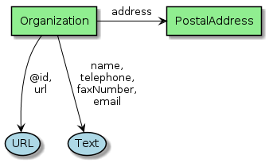

[[Chapter-3]]

== Table of contents

* <<2-eo-collections,2. EO Collections>>
** <<21-metadata-information,2.1 Metadata Information>>
** <<22-data-identification,2.2 Data Identification>>
*** <<221-datadates,2.2.1 DataDates>>
*** <<222-propertyvalue,2.2.2 PropertyValue>>
*** <<223-propertyvalue,2.2.3 Contact>>
*** <<224-organization,2.2.4 Organization>>
*** <<225-role,2.2.5 Role>>
** <<23-descriptive-keywords,2.3 Descriptive Keywords>>
*** <<231-definedterm,2.3.1 DefinedTerm>>
* <<b-property-mapping,B. Property Mapping>>
* <<c-references,C. References>>
** <<c1-normative-references,C.1 Normative References>>
** <<c2-other-references,C.2 Other References>>

== 2. EO Collections

This section defines the encoding of Earth Observation collection metadata.  We use a presentation similar to the GeoJSON Encoding Specifications in https://docs.ogc.org/is/17-003r2/17-003r2.html[OGC17-003r2], https://docs.ogc.org/per/19-020r1.html[OGC19-020r1] and <<OGC17-084r1>>.  The graphical notation is borrowed from <<ESIPFed>>. The diagrams are prepared with PlantUML.

=== 2.1 Metadata information

[#img_object_listitem,reftext='{figure-caption} {counter:figure-num}']
.Metadata Information Schema
image::diagrams/ListItem.png[align="center"]

The complete list of metadata information properties is given in <<table_object_listitem>>.
The properties are grouped in a `Listitem` as proposed by <<DCAT-AP-SDO>>.  <<ESIPFed>> proposes an alternative presentation using a `DataDownload`.

[#table_object_listitem,reftext='{table-caption} {counter:table-num}']
.ListItem object properties
[cols="<20m,<50,<15,<15",width="100%",options="header",align="center"]
|===
|JSON Property | Definition | Data type and values | Multiplicity and use

a| @type +
~$.@type~
| Type of the object. This property has the fixed value "ListItem".
| Range: String +
Fixed value: "ListItem"
| One (mandatory)

a| dateCreated +
~$.dateCreated~
| Date of creation of the metadata document.
| Domain: CreativeWork +
Range: Date or Datetime
| Zero or one (optional)

a| dateModified +
~$.dateModified~
| Date of last update of the metadata document.
| Domain: CreativeWork +
Range: Date or Datetime
| One (Mandatory)

a| datePublished +
~$.datePublished~
| Date of first availability of the metadata document.
| Domain: CreativeWork +
Range: Date or Datetime
| Zero or one (optional)

a| encodingFormat +
~$.encodingFormat~
| An established standard to which the metadata conforms. Encoded with `encodingFormat` (e.g. media type such as "application/vnd.iso.19139-2+xml") as proposed by <<ESIPFed>>.
| Domain: CreativeWork or MediaObject +
Range: Text or URL
| Zero or one (optional)

a| inLanguage +
~$.inLanguage~
| Resource language code, not empty, e.g. "en" (English).
| Domain: CreativeWork +
Range: Language or Text
| Zero or one (optional)

|===

.ListItem encoding example
[source,json]
----
{
	"@context": "http://schema.org",
	"@type": "Dataset",
	"name": "LANDSAT 7 ETM+ (Enhanced Thematic Mapper Plus) Geolocated Terrain Corrected Systematic processing (LANDSAT.ETM.GTC)",
	"description": "This dataset contains all the Landsat 7 Enhanced Thematic Mapper high-quality ortho-rectified L1T dataset over Kiruna, Maspalomas and Matera visibility masks.",
	"subjectOf": {
		"@type": "ListItem",
		"temporal": "1999-07-01T00:00:00Z/2003-12-31T00:00:00Z",
		"dateCreated": "1999-07-01T00:00:00Z",
		"datePublished": "1999-07-01T00:00:00Z",
		"dateModified": "2019-07-17T00:00:00Z",
		"inLanguage": "en",
		"encodingFormat": "application/vnd.iso.19139-2+xml"
	}
}
----

=== 2.2 Data Identification

[#img_object_dataset,reftext='{figure-caption} {counter:figure-num}']
.Data Identification Schema
image::diagrams/Dataset.png[align="center"]

The complete list of Data identification properties is given in <<table_object_dataset>>.  

[#table_object_dataset,reftext='{table-caption} {counter:table-num}']
.Data Identification properties
[cols="<20m,<50,<15,<15",width="100%",options="header",align="center"]
|===
|JSON Property | Definition | Data type and values | Multiplicity and use

a| @context +
~$.@context~
| Optional context property.
| Range: String +
Fixed value: "https://schema.org"
| Zero or one (optional)

a| @type +
~$.@type~
| Type of the object. This property has the fixed value "Dataset".
| Range: String +
Fixed value: "Dataset"
| One (mandatory)

a| additionalType +
~$.additionaltype~
| Unique identifiers (URI) for the type of the resource.  +
E.g. http://purl.org/dc/dcmitype/Collection, +
https://inspire.ec.europa.eu/metadata-codelist/ResourceType/series
| Domain: Thing +
Range: URL
| Zero or more (optional)

a| @id +
~$.@id~
| Unique identifier for the collection (IRI).
| Range: URL
| Zero or one (optional)

a| citation +
~$.citation~
| A bibliographic reference for the resource.
| Domain: CreativeWork +
Range: Text
| Zero or one (optional)

a| description +
~$.description~
| A description of the collection.
| Domain: Thing +
Range: Text
| One (mandatory)

a| identifier +
~$.identifier~
| Identifier given to the collection.
| Domain: Thing +
Range: Text or Url or PropertyValue +
See also <<table_object_propertyvalue>>.
| Zero or one (optional)

a| inLanguage +
~$.inLanguage~
| Resource language code, not empty, e.g. "en" (English)..
| Domain: CreativeWork +
Range: Language or Text
| Zero or one (optional)

a| name +
~$.name~
| The name of the collection.
| Domain: Thing +
Range: Text
| One (mandatory)

a| subjectOf +
~$.subjectOf~
| Version number or other version designation of the resource.
| Domain: Thing +
Range: ListItem (<<table_object_listitem>>)
| Zero or one (optional)

a| version +
~$.version~
| Version number or other version designation of the resource.
| Domain: CreativeWork +
Range: Number or Text
| Zero or one (optional)
|===

.Data Identification encoding example
[source,json]
----
{
	"@context": "http://schema.org",
	"@type": "Dataset",
	"name": "PROBA-V S1 TOA 1KM: product resolution data, best-quality daily synthesis. Maximum Value Compositing (MVC)is applied.",
	"alternateName": "urn:ogc:def:EOP:VITO:PROBAV_S1-TOA_1KM_V001",
	"description": "Level 3 data products are variables mapped on uniform space-time grid scales and are the result of combiningmultiple scenes (e.g. S1/S10) to cover the user’s region of interest.",
	"provider": {
		"@type": "Organization",
		"name": "VITO (Flemish Institute for Technological Research)",
		"address": {
			"@type": "PostalAddress",
			"addressCountry": "Belgium",
			"addressLocality": "Mol",
			"postalCode": "B-2400",
			"streetAddress": "Boeretang 200"
		},
		"telephone": "+32 14 33 68 14",
		"faxNumber": "+32 14 32 27 95",
		"email": "helpdeskticket@vgt.vito.be",
		"url": "http://proba-v.vgt.vito.be/"
	},
	"dateModified": "2018-10-23T15:52:07Z",
	"keywords": "EARTH SCIENCE>LAND SURFACE>LAND USE/LAND COVER, EARTH SCIENCE>CLIMATEINDICATORS>CRYOSPHERIC INDICATORS>SNOW COVER, Land cover, Cloud, Radiometric quality, Shadow, Snow, landuse, proba, environmental monitoring facilities, land cover, Proba-V",
	"temporal": "2013-10-16T00:00:00Z/2018-12-31T00:00:00Z",
	"spatial": {
		"@type": "Place",
		"geo": {
			"@type": "GeoShape",
			"polygon": "-56.0 -180.0 -56.0 180.0 75.0 180.0 75.0 -180.0 -56.0 -180.0"
		}
	},
	"image": "http://geo.spacebel.be/opensearch/images/vito.png",
	"thumbnailUrl": "http://geo.spacebel.be/opensearch/images/vito.png"
}
----

==== 2.2.1 DataDates

[#img_object_dates,reftext='{figure-caption} {counter:figure-num}']
.DataDates Schema

The complete overview of date related properties for data is given in <<table_object_dates>>.  

[#table_object_dates,reftext='{table-caption} {counter:table-num}']
.Dates object properties
[cols="<20m,<50,<15,<15",width="100%",options="header",align="center"]
|===
|JSON Property | Definition | Data type and values | Multiplicity and use

a| temporal +
~$.temporal~
| Date or range of dates relevant for the resource.  For example: "1999-07-01T00:00:00Z/2003-12-31T00:00:00Z"
| Domain: Dataset +
Range: DateTime or Text
| One (Mandatory)

a| dateCreated +
~$.dateCreated~
| Date of creation of the resource.
| Domain: CreativeWork +
Range: Date or Datetime
| Zero or one (optional)

a| dateModified +
~$.dateModified~
| Date of last update of the resource.
| Domain: CreativeWork +
Range: Date or Datetime
| One (Mandatory)

a| datePublished +
~$.datePublished~
| Date of publication of the resource.
| Domain: CreativeWork +
Range: Date or Datetime
| Zero or one (optional)
|===

.DataDates encoding example
[source,json]
----
{
	"@context": "http://schema.org",
	"@type": "Dataset",
	"name": "LANDSAT 7 ETM+ (Enhanced Thematic Mapper Plus) Geolocated Terrain Corrected Systematic processing (LANDSAT.ETM.GTC)",
	"description": "This dataset contains all the Landsat 7 Enhanced Thematic Mapper high-quality ortho-rectified L1T dataset over Kiruna, Maspalomas and Matera visibility masks. The Landsat 7 ETM+ scenes typically covers 185 x 170 km. A standard full scene is nominally centred on the intersection between a Path and Row (the actual image centre can vary by up to 100m). Each band requires 50MB (uncompressed), and Band 8 requires 200MB (panchromatic band with resolution of 15m opposed to 30m).",
	"temporal": "1999-07-01T00:00:00Z/2003-12-31T00:00:00Z",
	"dateCreated": "1999-07-01T23:59:00Z",
	"datePublished": "1999-07-02T08:00:00Z",
	"dateModified": "2004-01-01T08:00:00Z"
}
----

==== 2.2.2 PropertyValue

[#img_object_propertyvalue,reftext='{figure-caption} {counter:figure-num}']
.PropertyValue Schema
image::diagrams/PropertyValue.png[align="center"]

The complete decription of PropertyValue is given in <<table_object_propertyvalue>>. 
The encoding of `identifier` with a `PropertyValue` corresponds to the encoding proposed by <<ESIPFed>>.  The `propertyID` should use an URL from the registry at https://registry.identifiers.org/registry.

[#table_object_propertyvalue,reftext='{table-caption} {counter:table-num}']
.PropertyValue object properties
[cols="<20m,<50,<15,<15",width="100%",options="header",align="center"]
|===
|JSON Property | Definition | Data type and values | Multiplicity and use

a| @type +
~$.identifier[*].@type~
| Type of the object. This property has the fixed value "PropertyValue".
| Range: String +
Fixed value: "PropertyValue"
| Zero or one (optional)

a| @id +
~$.identifier[*].@id~
| ID of the identifier.  E.g. `https://doi.org/10.5285/7BAF7407-2F15-406C-8F09-CB9DC10392AA`.
| Range: URL 
| Zero or one (optional)

a| value +
~$.identifier[*].value~
| Value of the identifier, including the prefix (e.g. `doi:`) identifying the type of identifier. E.g. `doi:10.5285/7BAF7407-2F15-406C-8F09-CB9DC10392AA`. +
The prefix is included as recommended by <<ESIPFed>>.
| Range: Text 
| One (mandatory)

a| propertyID +
~$.identifier[*].propertyID~
| A commonly used identifier for the characteristic represented by the property. +
<<ESIPFed>> recommends using the registry.identifiers.org URI for the identifier scheme, e.g. `https://registry.identifiers.org/registry/doi`.
| Range: URL 
| One (mandatory)

a| url +
~$.identifier[*].url~
| Resolvable URL of the item  where the resource being identified can be found.  E.g. `https://doi.org/10.5285/7BAF7407-2F15-406C-8F09-CB9DC10392AA`.
| Range: URL 
| Zero or one (optional)

|===

In the example below, PropertyValue is used to associate a DOI identifier to a Dataset.

.PropertyValue encoding example (DOI)
[source,json]
----
{
	"@context": {
		"@vocab": "https://schema.org/"
	},
	"@type": "Dataset",
	"name": "ESA Sea Surface Temperature Climate Change Initiative (ESA SST CCI): GHRSST Multi-Product ensemble (GMPE)",
	"identifier": {
		"@id": "https://doi.org/10.5285/7BAF7407-2F15-406C-8F09-CB9DC10392AA",
		"@type": "PropertyValue",
		"propertyID": "https://registry.identifiers.org/registry/doi",
		"value": "doi:10.5285/7BAF7407-2F15-406C-8F09-CB9DC10392AA",
		"url": "https://doi.org/10.5285/7BAF7407-2F15-406C-8F09-CB9DC10392AA"
	}
}
----

In the example below, PropertyValue is used to associate an https://orcid.org/[ORCID] identifier to a Person.

.PropertyValue encoding example (ORCID)
[source,json]
----
{
	"@context": "https://schema.org/",
	
	"@type": "Person",
	"name": "Christopher J. Merchant",
	"url": "https://publons.com/researcher/2543185/christopher-j-merchant/",
	"identifier": {
		"@id": "https://orcid.org/0000-0003-4687-9850",
		"@type": "PropertyValue",
		"propertyID": "https://registry.identifiers.org/registry/orcid",
		"url": "https://orcid.org/0000-0003-4687-9850",
		"value": "orcid:0000-0003-4687-9850"
	}
}
----

==== 2.2.3 Contact

[#img_object_contact,reftext='{figure-caption} {counter:figure-num}']
.Contact Schema
image::diagrams/Contact.png[align="center"]

The complete overview of date contact related properties for data is given in <<table_object_contact>>.  

[#table_object_dates,reftext='{table-caption} {counter:table-num}']
.Contact object properties
[cols="<20m,<50,<15,<15",width="100%",options="header",align="center"]
|===
|JSON Property | Definition | Data type and values | Multiplicity and use

a| author +
~$.author~
| An entity or agent primarily responsible for authoring the document (role is "Author").
| Domain: CreativeWork +
Range: Organization, Person, Role
| Zero or more (optional)

a| creator +
~$.creator~
| TBD.
| Domain: CreativeWork +
Range: Organization, Person, Role
| Zero or more (optional)

a| contactPoint +
~$.contactPoint~
| Contact point for the collection (role is "Point of Contact"). TO BE CHECKED (TBD)  Maybe vai "related" -> Organization -> contactPoint
| Domain: ?? +
Range: ContactPoint
| Zero or more (optional)

a| contributor +
~$.contributor~
| A secondary contributor to the collection (role is "????").
| Domain: CreativeWork +
Range: Organization, Person, Role
| Zero or more (optional)

a| provider +
~$.provider~
| An entity or agent responsible for providing the collection (role is "Resource Provider").
| Domain: CreativeWork  +
Range: Organization or Person
| Zero or more (optional)

a| publisher +
~$.publisher~
| An entity or agent responsible for publishing the collection (role is "Publisher").
| Domain: CreativeWork +
Range: Organization or Person
| Zero or more (optional)

|===

.Contact encoding example
[source,json]
----
{
- provider
- publisher

}
----

==== 2.2.4 Organization

[#img_object_organization,reftext='{figure-caption} {counter:figure-num}']
.Organization Schema

TBD: add missing properties: address, etc. used below on diagram above.

.Organization encoding example
[source,json]
----
{
	"@type": "Organization",
	"name": "ESA/ESRIN",
	"address": {
		"@type": "PostalAddress",
		"addressCountry": "Italy",
		"addressLocality": "Frascati (Roma)",
		"postalCode": "00044",
		"streetAddress": "Largo Galileo Galilei 1"
	},
	"telephone": "+3906941801",
	"faxNumber": "+390694180280",
	"email": "eohelp@esa.int",
	"url": "https://esa.int"
}
----

==== 2.2.5 Role

[#img_object_role,reftext='{figure-caption} {counter:figure-num}']
.Role Schema
image::diagrams/Role.png[align="center"]

.Role encoding example
[source,json]
----
{

}
----

=== 2.3 Descriptive Keywords

[#img_object_descriptivekeywords,reftext='{figure-caption} {counter:figure-num}']
.Metadata Descriptive Keywords
image::diagrams/DescriptiveKeywords.png[align="center"]

The complete list of descriptive keyword properties is given in <<table_object_descriptivekeywords>>.

[#table_object_descriptivekeywords,reftext='{table-caption} {counter:table-num}']
.Descriptive keyword object properties
[cols="<20m,<50,<15,<15",width="100%",options="header",align="center"]
|===
|JSON Property | Definition | Data type and values | Multiplicity and use

a| keywords +
~$.keywords~
| Free keywords not belonging to a controlled vocabulary, or keywords from a controlled vocabulary related to the resource.  
| Domain: CreativeWork
| Range: Text, URL, DefinedTerm +
See <<table_object_definedterm>>
| Zero or more (optional)

|===

.Descriptive keywords encoding example
[source,json]
----
{
	"@context": "http://schema.org",
	"@type": "Dataset",
	"keywords": [
		{
			"@type": "DefinedTerm",
			"@id": "http://www.eionet.europa.eu/gemet/concept/3650",
			"inDefinedTermSet": "http://www.eionet.europa.eu/gemet/",
			"name": "Geology"
		},
		{
			"@type": "DefinedTerm",
			"@id": "https://gcmdservices.gsfc.nasa.gov/kms/concept/03f0c0a3-04a7-4ef8-8ec0-3c2266510815",
			"inDefinedTermSet": " https://gcmdservices.gsfc.nasa.gov/kms/concepts/concept_scheme/sciencekeyword",
			"name": "VISIBLE IMAGERY"
		},
		{
			"@type": "DefinedTerm",
			"@id": "https://gcmdservices.gsfc.nasa.gov/kms/concept/98dc8278-fe0a-4e36-a638-9d7a5b0ed826",
			"inDefinedTermSet": "https://gcmdservices.gsfc.nasa.gov/kms/concepts/concept_scheme/projects",
			"name": "FedEO"
		},
		{
			"@type": "DefinedTerm",
			"@id": "https://gcmdservices.gsfc.nasa.gov/kms/concept/ad598334-f541-4be4-888c-c2dc7eb54194",
			"inDefinedTermSet": "https://gcmdservices.gsfc.nasa.gov/kms/concepts/concept_scheme/CollectionDataType",
			"name": "NEAR_REAL_TIME"
		},
		"FedEO",
		"ESA LDS",
		{
			"@type": "DefinedTerm",
			"@id": "http://inspire.ec.europa.eu/metadata-codelist/TopicCategory/geoscientificInformation",
			"name": "Geoscientific Information"
		},
		{
			"@type": "DefinedTerm",
			"@id": "https://gcmdservices.gsfc.nasa.gov/kms/concept/d9cd5b7e-e9e7-4746-bbc8-bc69f7b606c7",
			"name": "GEOSCIENTIFIC INFORMATION",
			"inDefinedTermSet": "https://gcmdservices.gsfc.nasa.gov/kms/concepts/concept_scheme/isotopiccategory"
		}
	]
}
----

==== 2.3.1 DefinedTerm

[#img_object_definedterm,reftext='{figure-caption} {counter:figure-num}']
.DefinedTerm schema
image::diagrams/DefinedTerm.png[align="center"]

The complete list of DefinedTerm properties is given in <<table_object_definedterm>>.

[#table_object_definedterm,reftext='{table-caption} {counter:table-num}']
.DefinedTerm object properties
[cols="<20m,<50,<15,<15",width="100%",options="header",align="center"]
|===
|JSON Property | Definition | Data type and values | Multiplicity and use

a| @type +
~$.keywords[*].@type~
| Type of the object. This property has the fixed value "DefinedTerm".
| Range: String +
Fixed value: "DefinedTerm"
| One (mandatory)

a| @id +
~$.keywords[*].@id~
| Identification of the keyword (URI).
| Range: URL
| Zero or one (optional)

a| name +
~$.keywords[*].name~
| Human readable representation of the keyword.
| Domain: DefinedTerm +
Range: Text 
| Zero or one (optional)

a| inDefinedTermSet +
~$.keywords[*].inDefinedTermSet~
| Identification of the code list or scheme defining the keyword.
| Domain: DefinedTerm +
Range: URL 
| Zero or one (optional)

|===

.DefinedTerm encoding example
[source,json]
----
{
	"@context": "http://schema.org",
	"@type": "DefinedTerm",
	"@id": "http://www.eionet.europa.eu/gemet/concept/4612",
	"name": "Land cover",
	"inDefinedTermSet": "http://www.eionet.europa.eu/gemet/"
}
----

== B. Property Mapping

=== B.1 OGC17-084r1 Metadata

|===
| GeoJSON Property | JSON-LD Property |   schema.org  | Reference

a| abstract +
~$.properties.abstract~     | dct:description |         https://schema.org/description[$.description]        |    <<table_object_dataset>>

a| bibliographicCitation +
~$.properties.bibliographicCitation~   | dct:bibliographicCitation | https://schema.org/citation[$.citation]  |    <<table_object_dataset>>

a| categories +
~$.properties.categories~   | dcat:theme  | https://schema.org/keywords[$.keywords]  |    <<table_object_descriptivekeywords>>

a| Category +
                       | skos:Concept |                https://schema.org/DefinedTerm[DefinedTerm] |    <<table_object_definedterm>>

a| conformsTo +
~$.properties.isPrimaryTopicOf.conformsTo~   | dct:conformsTo |     https://schema.org/encodingFormat[$.subjectOf.encodingFormat]   |    <<table_object_listitem>>.  See also <<ESIPFed>>.

a| created +
~$.properties.created~                   | dct:created      |  https://schema.org/dateCreated[$.dateCreated] |   <<table_object_dates>>.  See also <<DCAT-AP-SDO>>.

a| created +
~$.properties.isPrimaryTopicOf.created~    | dct:created |      https://schema.org/dateCreated[$.subjectOf.dateCreated]   |   <<table_object_listitem>>

a| date +
~$.properties.date~       | dct:date |              https://schema.org/temporal[$.temporal ]   |  <<table_object_dates>>

a| doi +
~$.properties.doi~        | adms:identifier  |      https://schema.org/value[$.identifier.value]   |  <<table_object_propertyvalue>>

a| id +
~$.id~                     | @id           |   $.@id                                           |  <<table_object_dataset>>

a| identifier +
~$.properties.identifier~   | dct:identifier |          https://schema.org/identifier[$.identifier] |  <<table_object_dataset>>

a| keyword +
~$.properties.keyword~   | dcat:keyword  | https://schema.org/keywords[$.keywords]  |    <<table_object_descriptivekeywords>>

a| kind +
~$.properties.kind~        | dct:type |                https://schema.org/additionalType[$.additionalType] |    <<table_object_dataset>>. See also <<DCAT-AP-SDO>>.

a| label +
~$.properties.categories[*].label~       | skos:prefLabel |        https://schema.org/name[$.keywords.name]  |    <<table_object_definedterm>>

a| lang +
~$.properties.lang~        | dct:language |                https://schema.org/inLanguage[$.inLanguage] |    <<table_object_dataset>>

a| lang +
~$.properties.isPrimaryTopicOf.lang~        | dct:language |      https://schema.org/inLanguage[$.subjectOf.inLanguage]   |    <<table_object_listitem>>

a| published +
~$.properties.published~     | dct:issued |   	     https://schema.org/datePublished[$.datePublished]	 |   <<table_object_dates>>.  See also <<DCAT-AP-SDO>>. 

a| published +
~$.properties.isPrimaryTopicOf.published~     | dct:issued |   	   https://schema.org/datePublished[$.subjectOf.datePublished]	 |    <<table_object_listitem>>.  See also <<DCAT-AP-SDO>>.

a| scheme +
~$.properties.categories[*].scheme~       | skos:inScheme |               https://schema.org/inDefinedTermSet[$.keywords.inDefinedTermSet]   |    <<table_object_definedterm>>

a| term +
~$.properties.categories[*].term~       |   @id    |     $.keywords.@id   |    <<table_object_definedterm>>

a| title +
~$.properties.title~        | dct:title   |             https://schema.org/name[$.name] |    <<table_object_dataset>>

a| updated +
~$.properties.updated~     | dct:modified  |       https://schema.org/dateModified[$.dateModified]     |    <<table_object_dates>>.  See also <<DCAT-AP-SDO>>.

a| updated +
~$.properties.isPrimaryTopicOf.updated~     | dct:modified  |     https://schema.org/dateModified[$.subjectOf.dateModified]     |     <<table_object_listitem>>.  See also <<DCAT-AP-SDO>>.

a| versionInfo +
~$.properties.versionInfo~        | owl:versionInfo |              https://schema.org/version[$.version] |    <<table_object_dataset>>

|===

=== B.2 STAC Collection Metadata

TBD.

== C. References

=== C.1 Normative references

[[DCAT]][DCAT]::
	Data Catalog Vocabulary (DCAT) - Version 2, W3C Recommendation 04 February 2020, https://www.w3.org/TR/vocab-dcat-2/
[[JSON]][JSON]::
	RFC 7159, The JavaScript Object Notation (JSON) Data Interchange Format, March 2014, http://www.ietf.org/rfc/rfc7159.txt
[[GeoJSON]][GeoJSON]::
	RFC 7946, The GeoJSON Format, https://www.w3.org/TR/json-ld11/
[[JSON-LD]][JSON-LD]::
	JSON-LD 1.1, A JSON-based Serialization for Linked Data, W3C Recommendation 16 July 2020, https://www.w3.org/TR/json-ld11/
[[LDP]][LDP]::
	Linked Data Platform 1.0, W3C Recommendation 26 February 2015, https://www.w3.org/TR/ldp/
[[OGC17-084r1]]::
	OGC17-084r1, EO Collection GeoJSON(-LD) Encoding, TBD.
[[SHACL]][SHACL]:: 
	Shapes Constraint Language (SHACL), W3C Recommendation, 20 July 2017, https://www.w3.org/TR/shacl/

=== C.2 Other references

[[JSONPath]][JSONPath]::
	JSONPath, http://goessner.net/articles/JsonPath/index.html
[[SHACL-UC]][SHACL-UC]::  
	SHACL Use Cases and Requirements, W3C Working Group Note, 20 July 2017, https://www.w3.org/TR/shacl-ucr/
[[ESIPFed]][ESIPFed]::
	"Schema.org Publishing Guidelines for the Geosciences", V1.1.0, https://doi.org/10.5281/zenodo.3736235, https://github.com/ESIPFed/science-onschema.org
[[DCAT-AP-SDO]][DCAT-AP-SDO]::
	DCAT-AP to Schema.org Mapping, Unofficial Draft 13 September 2019, https://ec-jrc.github.io/dcat-ap-to-schema-org/

