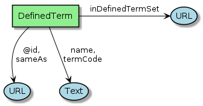
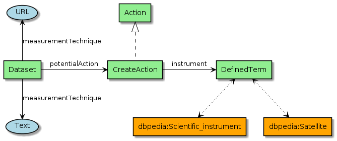

[[Chapter-3]]

ifdef::env-github[]
:tip-caption: :bulb:
:note-caption: :information_source:
:important-caption: :heavy_exclamation_mark:
:caution-caption: :fire:
:warning-caption: :warning:
endif::[]

ifdef::env-github[]
== Table of contents

* <<2-eo-collections,2. EO Collections>>
** <<21-metadata-information,2.1 Metadata Information>>
** <<22-data-identification,2.2 Data Identification>>
*** <<221-resource-dates,2.2.1 Resource Dates>>
*** <<222-propertyvalue,2.2.2 PropertyValue>>
*** <<223-contact,2.2.3 Contact>>
*** <<224-organization,2.2.4 Organization>>
*** <<225-person,2.2.5 Person>>
*** <<226-role,2.2.6 Role>>
** <<23-resource-constraints,2.3 Resource Constraints>>
** <<24-descriptive-keywords,2.4 Descriptive Keywords>>
*** <<241-definedterm,2.4.1 DefinedTerm>>
** <<25-spatial-information,2.5 Spatial Information>>
*** <<251-geoshape,2.5.1 GeoShape>>
*** <<252-geocoordinates,2.5.2 GeoCoordinates>>
** <<26-related-url,2.6 Related URL>>
*** <<261-mediaobject,2.6.1 MediaObject>>
*** <<262-action,2.6.2 Action>>
** <<27-acquisition-information,2.7 Acquisition Information>>
* <<3-eo-services-and-applications,3. EO Services and Applications>>
** <<31-service-identification,3.1 Service Identification>>
* <<4-eo-granules,4. EO Granules>>

* <<a-media-types-for-data-encoding,A. Media Types for Data Encoding>>
* <<b-property-mapping,B. Property Mapping>>
* <<c-references,C. References>>
** <<c1-normative-references,C.1 Normative References>>
** <<c2-other-references,C.2 Other References>>

endif::[]

== 2. EO Collections

This section defines the encoding of Earth Observation collection metadata.  We use a presentation similar to the GeoJSON Encoding Specifications in https://docs.ogc.org/is/17-003r2/17-003r2.html[OGC17-003r2], https://docs.ogc.org/per/19-020r1.html[OGC19-020r1] and OGC17-084r1.  The graphical notation is borrowed from <<ESIPFed>>. The diagrams are prepared with PlantUML.

=== 2.1 Metadata Information

[#img_object_listitem,reftext='{figure-caption} {counter:figure-num}']
.Metadata Information Schema
image::diagrams/ListItem.png[align="center"]

The complete list of metadata information properties is given in <<table_object_listitem>>.
The properties are grouped in a `Listitem` as proposed by <<DCAT-AP-SDO>>.  <<ESIPFed>> proposes an alternative presentation using a `DataDownload`.

[#table_object_listitem,reftext='{table-caption} {counter:table-num}']
.ListItem object properties
[cols="<20m,<50,<15,<15",width="100%",options="header",align="center"]
|===
|JSON Property | Definition | Data type and values | Multiplicity and use

a| @type +
~$.@type~
| Type of the object. This property has the fixed value "ListItem".
| Range: String +
Fixed value: "ListItem"
| One (mandatory)

a| dateCreated +
~$.dateCreated~
| Date of creation of the metadata document.
| Domain: CreativeWork +
Range: Date or Datetime
| Zero or one (optional)

a| dateModified +
~$.dateModified~
| Date of last update of the metadata document.
| Domain: CreativeWork +
Range: Date or Datetime
| One (Mandatory)

a| datePublished +
~$.datePublished~
| Date of first availability of the metadata document.
| Domain: CreativeWork +
Range: Date or Datetime
| Zero or one (optional)

a| encodingFormat +
~$.encodingFormat~
| An established standard to which the metadata conforms. Encoded with `encodingFormat` (e.g. media type such as "application/vnd.iso.19139-2+xml") as proposed by <<ESIPFed>>.
| Domain: CreativeWork or MediaObject +
Range: Text or URL
| Zero or one (optional)

a| inLanguage +
~$.inLanguage~
| Resource language code, not empty, e.g. "en" (English).
| Domain: CreativeWork +
Range: Language or Text
| Zero or one (optional)

|===

.ListItem encoding example
[source,json]
----
{
	"@context": "http://schema.org",
	"@type": "Dataset",
	"name": "LANDSAT 7 ETM+ (Enhanced Thematic Mapper Plus) Geolocated Terrain Corrected Systematic processing (LANDSAT.ETM.GTC)",
	"description": "This dataset contains all the Landsat 7 Enhanced Thematic Mapper high-quality ortho-rectified L1T dataset over Kiruna, Maspalomas and Matera visibility masks.",
	"subjectOf": {
		"@type": "ListItem",
		"temporal": "1999-07-01T00:00:00Z/2003-12-31T00:00:00Z",
		"dateCreated": "1999-07-01T00:00:00Z",
		"datePublished": "1999-07-01T00:00:00Z",
		"dateModified": "2019-07-17T00:00:00Z",
		"inLanguage": "en",
		"encodingFormat": "application/vnd.iso.19139-2+xml"
	}
}
----

=== 2.2 Data Identification

[#img_object_dataset,reftext='{figure-caption} {counter:figure-num}']
.Data Identification Schema
image::diagrams/DataIdentification.png[align="center"]

The complete list of Data identification properties is given in <<table_object_dataset>>.  

[#table_object_dataset,reftext='{table-caption} {counter:table-num}']
.Data Identification properties
[cols="<20m,<50,<15,<15",width="100%",options="header",align="center"]
|===
|JSON Property | Definition | Data type and values | Multiplicity and use

a| @context +
~$.@context~
| Optional context property.
| Range: String +
Fixed value: "https://schema.org"
| Zero or one (optional)

a| @type +
~$.@type~
| Type of the object. This property has the fixed value "Dataset".
| Range: String +
Fixed value: "Dataset"
| One (mandatory)

a| description +
~$.description~
| A description of the collection.
| Domain: Thing +
Range: Text
| One (mandatory)

a| name +
~$.name~
| The name of the collection.
| Domain: Thing +
Range: Text
| One (mandatory)

a| identifier +
~$.identifier~
| Identifier given to the collection. `Text` is used for simple identifiers such as ´TropForest´.  `PropertyValue` can be used to include `DOI` information.
| Domain: Thing +
Range: Text or Url or PropertyValue +
See also <<table_object_propertyvalue>>.
| One or more (mandatory)

a| additionalType +
~$.additionaltype~
| Unique identifiers (URI) for the type of the resource.  +
E.g. http://purl.org/dc/dcmitype/Collection, +
https://inspire.ec.europa.eu/metadata-codelist/ResourceType/series
| Domain: Thing +
Range: URL
| Zero or more (optional)

a| @id +
~$.@id~
| Unique identifier for the collection (IRI).
| Range: URL
| Zero or one (optional)

a| alternateName +
~$.alternateName~
| Alternate name of the collection. Maybe used to refer to the https://idn.ceos.org/[CEOS IDN] shortname of the collection: e.g. `C1532648157-ESA` is the IDN shortname used for the collection with `identifier TropForest`.
| Domain: Thing +
Range: Text
| Zero or more (optional)

a| citation +
~$.citation~
| A bibliographic reference for the resource.
| Domain: CreativeWork +
Range: Text
| Zero or one (optional)

a| inLanguage +
~$.inLanguage~
| Resource language code, not empty, e.g. "en" (English)..
| Domain: CreativeWork +
Range: Language or Text
| Zero or one (optional)

a| subjectOf +
~$.subjectOf~
| Refers to metadata information about the collection.
| Domain: Thing +
Range: ListItem (<<table_object_listitem>>)
| Zero or one (optional)

a| version +
~$.version~
| Version number or other version designation of the resource.
| Domain: CreativeWork +
Range: Number or Text
| Zero or one (optional)
|===

.Data Identification encoding example
[source,json]
----
{
	"@context": {
		"@vocab": "https://schema.org/"
	},
	"@type": "Dataset",
	"additionalType": [
		"http://purl.org/dc/dcmitype/Collection",
		"https://inspire.ec.europa.eu/metadata-codelist/ResourceType/series"
	],
	"@id": "https://fedeo.esa.int/collections/series/items/LANDSAT.ETM.GTC",
	"name": "Landsat 7 ETM+ (Enhanced Thematic Mapper Plus) Geolocated Terrain Corrected Systematic processing",
	"alternateName": "LANDSAT.ETM.GTC",
	"url": [
		"https://earth.esa.int/eogateway/catalog/landsat-7-etm-enhanced-thematic-mapper-plus-geolocated-terrain-corrected-systematic-processing",
		"https://search.earthdata.nasa.gov/portal/idn/search?q=C1532648148-ESA"
	],
	"identifier": [
		"LANDSAT.ETM.GTC",
		{
			"@type": "PropertyValue",
			"propertyID": "https://idn.ceos.org/",
			"value": "C1532648148-ESA",
			"url": "https://search.earthdata.nasa.gov/portal/idn/search?q=C1532648148-ESA"
		}
	],
	"description": "This dataset contains all the Landsat 7 Enhanced Thematic Mapper high-quality ortho-rectified L1T dataset over Kiruna, Maspalomas and Matera visibility masks.",
	"temporalCoverage": "1999-07-01T00:00:00Z/2003-12-31T00:00:00Z",
	"inLanguage": {
		"@type": "Language",
		"@id": "http://id.loc.gov/vocabulary/iso639-1/en",
		"name": "en"
	},
	"subjectOf": [
		{
			"@type": "ListItem",
			"dateCreated": "1999-07-01T00:00:00Z",
			"datePublished": "1999-07-01T00:00:00Z",
			"dateModified": "2019-07-17T00:00:00Z",
			"inLanguage": {
				"@type": "Language",
				"@id": "http://id.loc.gov/vocabulary/iso639-1/en",
				"name": "en"
			},
			"encodingFormat": "application/vnd.iso.19139-2+xml"
		},
		{
			"@type": "MediaObject",
			"contentUrl": "https://fedeo.esa.int/collections/series/items/LANDSAT.ETM.GTC?httpAccept=application/dif10%2Bxml",
			"encodingFormat": "application/dif10+xml",
			"name": "DIF-10 metadata",
			"additionalType": "http://www.iana.org/assignments/relation/alternate"
		}
	]
}
----

==== 2.2.1 Resource Dates

[#img_object_dates,reftext='{figure-caption} {counter:figure-num}']
.DataDates Schema
image::diagrams/DataDates.png[align="center"]

The complete overview of date related properties for data is given in <<table_object_dates>>.  

[#table_object_dates,reftext='{table-caption} {counter:table-num}']
.Dates object properties
[cols="<20m,<50,<15,<15",width="100%",options="header",align="center"]
|===
|JSON Property | Definition | Data type and values | Multiplicity and use

a| temporalCoverage +
~$.temporalCoverage~
| Date or range of dates relevant for the resource.  For example: "1999-07-01T00:00:00Z/2003-12-31T00:00:00Z"
| Domain: Dataset +
Range: DateTime or Text
| One (Mandatory)

a| dateCreated +
~$.dateCreated~
| Date of creation of the resource.
| Domain: CreativeWork +
Range: Date or Datetime
| Zero or one (optional)

a| dateModified +
~$.dateModified~
| Date of last update of the resource.
| Domain: CreativeWork +
Range: Date or Datetime
| One (Mandatory)

a| datePublished +
~$.datePublished~
| Date of publication of the resource.
| Domain: CreativeWork +
Range: Date or Datetime
| Zero or one (optional)
|===

.DataDates encoding example
[source,json]
----
{
	"@context": "http://schema.org",
	"@type": "Dataset",
	"name": "LANDSAT 7 ETM+ (Enhanced Thematic Mapper Plus) Geolocated Terrain Corrected Systematic processing (LANDSAT.ETM.GTC)",
	"description": "This dataset contains all the Landsat 7 Enhanced Thematic Mapper high-quality ortho-rectified L1T dataset over Kiruna, Maspalomas and Matera visibility masks. The Landsat 7 ETM+ scenes typically covers 185 x 170 km. A standard full scene is nominally centred on the intersection between a Path and Row (the actual image centre can vary by up to 100m). Each band requires 50MB (uncompressed), and Band 8 requires 200MB (panchromatic band with resolution of 15m opposed to 30m).",
	"temporalCoverage": "1999-07-01T00:00:00Z/2003-12-31T00:00:00Z",
	"dateCreated": "1999-07-01T23:59:00Z",
	"datePublished": "1999-07-02T08:00:00Z",
	"dateModified": "2004-01-01T08:00:00Z"
}
----

==== 2.2.2 PropertyValue

[#img_object_propertyvalue,reftext='{figure-caption} {counter:figure-num}']
.PropertyValue Schema

The complete decription of PropertyValue is given in <<table_object_propertyvalue>>. 
The encoding of `identifier` with a `PropertyValue` corresponds to the encoding proposed by <<ESIPFed>>.  The `propertyID` should use an URL from the registry at https://registry.identifiers.org/registry.

[#table_object_propertyvalue,reftext='{table-caption} {counter:table-num}']
.PropertyValue object properties
[cols="<20m,<50,<15,<15",width="100%",options="header",align="center"]
|===
|JSON Property | Definition | Data type and values | Multiplicity and use

a| @type +
~$.identifier[*].@type~
| Type of the object. This property has the fixed value "PropertyValue".
| Range: String +
Fixed value: "PropertyValue"
| Zero or one (optional)

a| @id +
~$.identifier[*].@id~
| ID of the identifier.  E.g. `https://doi.org/10.5285/7BAF7407-2F15-406C-8F09-CB9DC10392AA`.
| Range: URL 
| Zero or one (optional)

a| value +
~$.identifier[*].value~
| Value of the identifier, including the prefix (e.g. `doi:`) identifying the type of identifier. E.g. `doi:10.5285/7BAF7407-2F15-406C-8F09-CB9DC10392AA`. +
The prefix is included as recommended by <<ESIPFed>>.
| Range: Text 
| One (mandatory)

a| propertyID +
~$.identifier[*].propertyID~
| A commonly used identifier for the characteristic represented by the property. +
<<ESIPFed>> recommends using the registry.identifiers.org URI for the identifier scheme, e.g. `https://registry.identifiers.org/registry/doi`.
| Range: URL 
| One (mandatory)

a| url +
~$.identifier[*].url~
| Resolvable URL of the item  where the resource being identified can be found.  E.g. `https://doi.org/10.5285/7BAF7407-2F15-406C-8F09-CB9DC10392AA`.
| Range: URL 
| Zero or one (optional)

|===

In the example below, PropertyValue is used to associate a https://doi.org[DOI] identifier to a Dataset.

.PropertyValue encoding example (DOI)
[source,json]
----
{
	"@context": {
		"@vocab": "https://schema.org/"
	},
	"@type": "Dataset",
	"name": "ESA Sea Surface Temperature Climate Change Initiative (ESA SST CCI): GHRSST Multi-Product ensemble (GMPE)",
	"identifier": {
		"@id": "https://doi.org/10.5285/7BAF7407-2F15-406C-8F09-CB9DC10392AA",
		"@type": "PropertyValue",
		"propertyID": "https://registry.identifiers.org/registry/doi",
		"value": "doi:10.5285/7BAF7407-2F15-406C-8F09-CB9DC10392AA",
		"url": "https://doi.org/10.5285/7BAF7407-2F15-406C-8F09-CB9DC10392AA"
	}
}
----

[NOTE] 
https://idn.ceos.org/[CEOS IDN] collection identifiers are currently not registered at https://registry.identifiers.org. 

.PropertyValue encoding example (IDN)
[source,json]
----
{
	"@context": "https://schema.org/",
	"@type": "Dataset",
	"name": "Landsat 7 ETM+ (Enhanced Thematic Mapper Plus) Geolocated Terrain Corrected Systematic processing",
	"url": "https://earth.esa.int/eogateway/catalog/landsat-7-etm-enhanced-thematic-mapper-plus-geolocated-terrain-corrected-systematic-processing",
	"identifier": {
		"@type": "PropertyValue",
		"propertyID": "https://idn.ceos.org/",
		"value": "C1532648148-ESA",
		"url": "https://search.earthdata.nasa.gov/portal/idn/search?q=C1532648148-ESA"
	}
}
----

In the example below, PropertyValue is used to associate an https://orcid.org/[ORCID] identifier to a Person.

.PropertyValue encoding example (ORCID)
[source,json]
----
{
	"@context": "https://schema.org/",	
	"@type": "Person",
	"name": "Christopher J. Merchant",
	"url": "https://publons.com/researcher/2543185/christopher-j-merchant/",
	"identifier": {
		"@id": "https://orcid.org/0000-0003-4687-9850",
		"@type": "PropertyValue",
		"propertyID": "https://registry.identifiers.org/registry/orcid",
		"url": "https://orcid.org/0000-0003-4687-9850",
		"value": "orcid:0000-0003-4687-9850"
	}
}
----

==== 2.2.3 Contact

[#img_object_contact,reftext='{figure-caption} {counter:figure-num}']
.Contact Schema
image::diagrams/Contact.png[align="center"]

The list of contact related properties is given in <<table_object_contact>>.  

[#table_object_contact,reftext='{table-caption} {counter:table-num}']
.Contact object properties
[cols="<20m,<50,<15,<15",width="100%",options="header",align="center"]
|===
|JSON Property | Definition | Data type and values | Multiplicity and use

a| author +
~$.author~
| Responsible party primarily responsible for authoring the collection (role is "Author").  <<ESIPFed>> recommends using `creator` instead.
| Range: Organization \| Person \| Role
| Zero or more (optional)

a| creator +
~$.creator~
| Responsible party responsible for creating the collection.  Is synonym of `author`.
| Range: Organization \| Person \| Role
| Zero or more (optional)

a| contributor +
~$.contributor~
| A secondary contributor to the collection.
| Range: Organization \| Person \| Role
| Zero or more (optional)

a| provider +
~$.provider~
| Responsible party responsible for providing the collection.
| Range: Organization (Preferred) \| Person
| Zero or more (optional)

a| publisher +
~$.publisher~
| Responsible party responsible for publishing the collection.
| Range: Organization (Preferred) \| Person
| Zero or more (optional)

|===

[WARNING]
https://github.com/ESIPFed/science-on-schema.org/blob/master/guides/Dataset.md#roles-of-people[ESIPFed] uses `Role` as object type for `creator` or `contributor` to be able to associate additional https://schema.org/roleName[roleName]s.  This approach is documented http://blog.schema.org/2014/06/introducing-role.html[here].  However, this does not validate with the Google Rich Results Test tool.

.Contact encoding example
[source,json]
----
{
	"@context": "https://schema.org",
	"@type": "Dataset",
	"name": "LANDSAT 7 ETM+ (Enhanced Thematic Mapper Plus) Geolocated Terrain Corrected Systematic processing (LANDSAT.ETM.GTC)",
	"description": "This dataset contains all the Landsat 7 Enhanced Thematic Mapper high-quality ortho-rectified L1T dataset over Kiruna, Maspalomas and Matera visibility masks. The Landsat 7 ETM+ scenes typically covers 185 x 170 km.",
	"author": [
		{
			"@type": "Organization",
			"@id": "https://www.linkedin.com/company/european-space-agency",
			"email": "eohelp@eo.esa.int",
			"name": "ESA/ESRIN",
			"telephone": "+39 06 94180777",
			"url": "https://earth.esa.int",
			"address": {
				"addressCountry": "Italy",
				"postalCode": "00044",
				"addressLocality": "Frascati",
				"streetAddress": "Via Galileo Galilei CP. 64"
			}
		}
	],
	"creator": {
		"@type": "Role",
		"creator": {
			"@type": "Organization",
			"@id": "https://www.linkedin.com/company/european-space-agency/"
		},
		"roleName": "originator"
	}
}
----

==== 2.2.4 Organization

[#img_object_organization,reftext='{figure-caption} {counter:figure-num}']
.Organization Schema
image::diagrams/Organization.png[align="center"]

The list of Organization properties is fully defined in https://schema.org/Organization[schema:Organization] and not repeated here.  

.Organization encoding example
[source,json]
----
{
	"@type": "Organization",
	"name": "ESA/ESRIN",
	"address": {
		"@type": "PostalAddress",
		"addressCountry": "Italy",
		"addressLocality": "Frascati (Roma)",
		"postalCode": "00044",
		"streetAddress": "Largo Galileo Galilei 1"
	},
	"telephone": "+3906941801",
	"faxNumber": "+390694180280",
	"email": "eohelp@esa.int",
	"url": "https://esa.int"
}
----

==== 2.2.5 Person

[#img_object_person,reftext='{figure-caption} {counter:figure-num}']
.Person Schema
image::diagrams/Person.png[align="center"]

The list of Person properties is fully defined in https://schema.org/Person[schema:Person] and not repeated here.  

.Person encoding example
[source,json]
----
{
	"@context": "https://schema.org/",
	"@type": "Person",
	"name": "Christopher J. Merchant",
	"url": "https://publons.com/researcher/2543185/christopher-j-merchant/",
	"identifier": {
		"@id": "https://orcid.org/0000-0003-4687-9850",
		"@type": "PropertyValue",
		"propertyID": "https://registry.identifiers.org/registry/orcid",
		"url": "https://orcid.org/0000-0003-4687-9850",
		"value": "orcid:0000-0003-4687-9850"
	}
}
----

==== 2.2.6 Role

[#img_object_role,reftext='{figure-caption} {counter:figure-num}']
.Role Schema
image::diagrams/Role.png[align="center"]

The list of Role properties is defined in https://schema.org/Role[schema:Role] and not repeated here. 

`Role` can be used in combination with a `Person` or `Organization`.
The https://schema.org/roleName[schema:roleName] property can be used to encode [`CI_RoleCode`] values from https://www.isotc211.org/2005/resources/Codelist/gmxCodelists.xml[ISO19115:2003] or https://wiki.esipfed.org/ISO_19115-3_Codelists#CI_RoleCode[ISO19115-3] (*) for which https://schema.org/roleName[schema:Dataset] does not have a corresponding property.  

The following roles are directly supported as property of https://schema.org/Dataset[schema:Dataset] and do not require an intermediate https://schema.org/Role[schema:Role] object:

*  author   
*  contributor
*  editor (*)
*  funder (*)
*  publisher           
*  resourceProvider (encode as provider)  

Other roles can be used as values for https://schema.org/roleName[schema:roleName].  It is recommended to reuse `CI_RoleCode` values from https://wiki.esipfed.org/ISO_19115-3_Codelists#CI_RoleCode[ISO19115-3] where possible, e.g.

*  coAuthor (*)
*  collaborator (*)
*  custodian  
*  distributor 
*  mediator (*)
*  originator
*  owner                                
*  pointOfContact       
*  principleInvestigator  
*  processor
* rightsholder (*)
* sponsor (*)
* stakeholder (*)
* user

.Role encoding example
[source,json]
----
{
	"@context": "https://schema.org/",
	"@type": "Dataset",
	"contributor": {
		"@type": "Role",
		"roleName": "principalInvestigator",
		"contributor": {
			"@type": "Person",
			"name": "Christopher J. Merchant",
			"url": "https://publons.com/researcher/2543185/christopher-j-merchant/",
			"identifier": {
				"@id": "https://orcid.org/0000-0003-4687-9850",
				"@type": "PropertyValue",
				"propertyID": "https://registry.identifiers.org/registry/orcid",
				"url": "https://orcid.org/0000-0003-4687-9850",
				"value": "orcid:0000-0003-4687-9850"
			}
		}
	}
}
----

=== 2.3 Resource Constraints

[#img_object_resourceconstraints,reftext='{figure-caption} {counter:figure-num}']
.Resource Constraints Schema

The list of Resource Constraints properties is given in <<table_object_resourceconstraints>>.  

[#table_object_resourceconstraints,reftext='{table-caption} {counter:table-num}']
.Resource Constraints properties
[cols="<20m,<50,<15,<15",width="100%",options="header",align="center"]
|===
|JSON Property | Definition | Data type and values | Multiplicity and use

a| license +
~$.license~
| A license document that applies to the content, typically indicated by URL.  Links the collection to its license to document legal constraints.   https://spdx.org/licenses[SPDX license list] provides a list of URi for most commonly used licenses. See https://github.com/ESIPFed/science-on-schema.org/blob/master/guides/Dataset.md#license[ESIPFed] for additional guidance.
| Domain: CreativeWork +
Range: CreativeWork \| URL
| Zero or more (optional)

a| conditionsOfAccess +
~$.conditionsOfAccess~
| Conditions that affect the availability of, or method(s) of access to, the collection. 
| Domain: CreativeWork +
Range: Text
| Zero or more (optional)

|===

.Resource Constraints encoding example
[source,json]
----
{
	"@context": "http://schema.org",
	"@type": "Dataset",
	"name": "Alos African Coverage ESA archive",
	"identifier": "ALOS",
	"description": "ALOS Africa is a collection of the best available (cloud minimal) African coverage acquired by AVNIR-2 and PRISM.",
	"license": {
		"@type": "CreativeWork",
		"description": "Utilisation of this data is subject to ESA's Earth Observation Terms and Conditions",
		"url": "https://earth.esa.int/eogateway/documents/20142/1614553/Terms-and-Conditions-for-the-utilization-of-Data-provided-by-ESA.pdf"
	},
	"conditionsOfAccess": "Fast Registration with immediate access Immediate Access to data upon fast registration. TPM online access list ALOS Africa Online catalogue"
}
----

=== 2.4 Descriptive Keywords

[#img_object_descriptivekeywords,reftext='{figure-caption} {counter:figure-num}']
.Metadata Descriptive Keywords
image::diagrams/DescriptiveKeywords.png[align="center"]

The complete list of descriptive keyword properties is given in <<table_object_descriptivekeywords>>.

[#table_object_descriptivekeywords,reftext='{table-caption} {counter:table-num}']
.Descriptive keyword object properties
[cols="<20m,<50,<15,<15",width="100%",options="header",align="center"]
|===
|JSON Property | Definition | Data type and values | Multiplicity and use

a| keywords +
~$.keywords~
| Free keywords not belonging to a controlled vocabulary, or keywords from a controlled vocabulary related to the resource.  
| Range: Text \| URL \| DefinedTerm +
See <<table_object_definedterm>>
| Zero or more (optional)

a| about +
~$.about~
| The subject matter of the content;  Can be free keywords not belonging to a controlled vocabulary.  
| Range: Thing
| Zero or more (optional)

a| variableMeasured +
~$.variableMeasured~
| The variableMeasured property (pending) can indicate a variables that is measured in the dataset, either described as text or as pairs of identifier and description using PropertyValue.  See https://github.com/ESIPFed/science-on-schema.org/blob/master/guides/Dataset.md#variables[ESIPFed] for a detailed explanation. 
| Range: Text \| PropertyValue
| Zero or more (optional)

|===

.Descriptive keywords encoding example
[source,json]
----
{
	"@context": "http://schema.org",
	"@type": "Dataset",
	"keywords": [
		{
			"@type": "DefinedTerm",
			"@id": "http://www.eionet.europa.eu/gemet/concept/3650",
			"inDefinedTermSet": "http://www.eionet.europa.eu/gemet/",
			"name": "Geology"
		},
		{
			"@type": "DefinedTerm",
			"@id": "https://gcmdservices.gsfc.nasa.gov/kms/concept/03f0c0a3-04a7-4ef8-8ec0-3c2266510815",
			"inDefinedTermSet": "https://gcmdservices.gsfc.nasa.gov/kms/concepts/concept_scheme/sciencekeywords",
			"name": "VISIBLE IMAGERY"
		},
		{
			"@type": "DefinedTerm",
			"@id": "https://gcmdservices.gsfc.nasa.gov/kms/concept/98dc8278-fe0a-4e36-a638-9d7a5b0ed826",
			"inDefinedTermSet": "https://gcmdservices.gsfc.nasa.gov/kms/concepts/concept_scheme/projects",
			"name": "FedEO"
		},
		{
			"@type": "DefinedTerm",
			"@id": "https://gcmdservices.gsfc.nasa.gov/kms/concept/ad598334-f541-4be4-888c-c2dc7eb54194",
			"inDefinedTermSet": "https://gcmdservices.gsfc.nasa.gov/kms/concepts/concept_scheme/CollectionDataType",
			"name": "NEAR_REAL_TIME"
		},
		"FedEO",
		"ESA LDS",
		{
			"@type": "DefinedTerm",
			"@id": "http://inspire.ec.europa.eu/metadata-codelist/TopicCategory/geoscientificInformation",
			"name": "Geoscientific Information"
		},
		{
			"@type": "DefinedTerm",
			"@id": "https://gcmdservices.gsfc.nasa.gov/kms/concept/d9cd5b7e-e9e7-4746-bbc8-bc69f7b606c7",
			"name": "GEOSCIENTIFIC INFORMATION",
			"inDefinedTermSet": "https://gcmdservices.gsfc.nasa.gov/kms/concepts/concept_scheme/isotopiccategory"
		}
	]
}
----

.Descriptive keywords encoding example
[source,json]
{
	"@context": "https://schema.org/",
	"@type": "Dataset",
	"@id": "https://fedeo.esa.int/collections/series/items/e0659b01259145c8bfb0de6eb12c2690",
	"name": "ESA Sea Surface Temperature Climate Change Initiative (ESA SST CCI): GHRSST Multi-Product ensemble (GMPE)",
	"url": "https://catalogue.ceda.ac.uk/uuid/e0659b01259145c8bfb0de6eb12c2690",
	"about": "Sea Surface Temperature",
	"keywords": [
		{
			"@type": "DefinedTerm",
			"@id": "https://earth.esa.int/concept/ocean-temperature",
			"inDefinedTermSet": "https://earth.esa.int/concepts/concept_scheme/earth-topics",
			"name": "Ocean Temperature"
		}
	],
	"variableMeasured": {
		"@type": "PropertyValue",
		"propertyID": "gradient_fields",
		"name": "Horizontal SST gradients of input analyses",
		"unitText": "kelvin m-1",
		"description": "Horizontal SST gradients of input analyses"
	}
}
----

==== 2.4.1 DefinedTerm

[#img_object_definedterm,reftext='{figure-caption} {counter:figure-num}']
.DefinedTerm schema

A https://schema.org/DefinedTerm[DefinedTerm] represents a word, name, acronym, phrase, etc. with a formal definition.  It is similar to a <<SKOS>> concept.

The complete list of DefinedTerm properties is given in <<table_object_definedterm>>.

[#table_object_definedterm,reftext='{table-caption} {counter:table-num}']
.DefinedTerm object properties
[cols="<20m,<50,<15,<15",width="100%",options="header",align="center"]
|===
|JSON Property | Definition | Data type and values | Multiplicity and use

a| @type +
~$.keywords[*].@type~
| Type of the object. This property has the fixed value "DefinedTerm".
| Range: String +
Fixed value: "DefinedTerm"
| One (mandatory)

a| @id +
~$.keywords[*].@id~
| Identification of the keyword (URI).  E.g. the URI of a `skos:Concept`.
| Range: URL
| Zero or one (optional)

a| sameAs +
~$.keywords[*].sameAs~
| URL unambiguously indicating the item's identity.  Similar to `skos:exactMatch`.
| Range: URL
| Zero or more (optional)

a| name +
~$.keywords[*].name~
| Human readable representation of the keyword.  For a `skos:Concept`, this may correspond to the `skos:prefLabel` or `skos:altLabel` properties.
| Domain: DefinedTerm +
Range: Text 
| Zero or one (optional)

a| inDefinedTermSet +
~$.keywords[*].inDefinedTermSet~
| Identification of the code list or scheme defining the keyword.  For a `skos:Concept`, this corresponds to the `skos:inScheme` property.
| Domain: DefinedTerm +
Range: URL 
| Zero or one (optional)

a| additionalType +
~$.keywords[*].additionalType~
| Identification of the code list or scheme defining the keyword.  For a `skos:Concept`, the URI of a `skos:broader` concept can be used as well.  In the instrument example below, this property is used to represent the instrument type.
| Domain: DefinedTerm +
Range: URL 
| Zero or one (optional)

|===

.DefinedTerm encoding example (Science keyword)
[source,json]
----
{
	"@context": "http://schema.org",
	"@type": "DefinedTerm",
	"@id": "http://www.eionet.europa.eu/gemet/concept/4612",
	"name": "Land cover",
	"inDefinedTermSet": "http://www.eionet.europa.eu/gemet/"
}
----

.DefinedTerm encoding example (Instrument)
[source,json]
----
{
	"@type": "DefinedTerm",
	"@id": "https://earth.esa.int/concept/etm",
	"sameAs": "http://gcmdservices.gsfc.nasa.gov/kms/concept/4dbe7764-a2ea-4a19-b754-696c35ac3205",
	"termCode": "4dbe7764-a2ea-4a19-b754-696c35ac3205",
	"name": "ETM+",
	"additionalType": "https://earth.esa.int/concept/p-imaging-spectrometers-radiometers",
	"inDefinedTermSet": "https://earth.esa.int/concepts/concept_scheme/instruments"
}
----

=== 2.5 Spatial Information

[#img_object_spatialinformation,reftext='{figure-caption} {counter:figure-num}']
.Spatial information schema

The encoding proposed by https://github.com/ESIPFed/science-on-schema.org/blob/master/guides/Dataset.md#spatial-coverage[ESIPFed] is applicable.

A list of spatial information properties is given in <<table_object_spatialinformation>>.

[#table_object_spatialinformation,reftext='{table-caption} {counter:table-num}']
.Spatial information object properties
[cols="<20m,<50,<15,<15",width="100%",options="header",align="center"]
|===
|JSON Property | Definition | Data type and values | Multiplicity and use

a| spatialCoverage +
~$.spatialCoverage~
| Indicates the geographical areas that the dataset describes.
| Domain: Dataset +
Range: Place
| Zero or more (optional)

a| geo +
~$.spatialCoverage.geo~
| The geo coordinates of the place.
| Domain: Place +
Range: GeoShape (<<table_object_geoshape>>) \| GeoCoordinates (<<table_object_geocoordinates>>)
| Zero or one (optional)

a| additionalProperty +
~$.spatialCoverage.additionalProperty~
| This property can be used to encode the coordinate reference system as proposed by <<ESIPFed>>, if it differs from `WGS 84`. 
| Domain: Place +
Range: PropertyValue  (<<table_object_propertyvalue>>)
| Zero or one (optional)

|===

.Spatial information encoding example
[source,json]
----
{
	"@context": "http://schema.org",
	"@type": "Dataset",
	"name": "OceanSat-2 NRT data",
	"description": "ESA, in collaboration with GAF AG, acquires and process every day OceanSat-2 passes over Neutrelitz reception station from 1 January 2016.All passes are systematically processed to levels 1B, 2B and 2C, and available for users in NRT (< 3 hours).",
	"spatialCoverage": {
		"@type": "Place",
		"geo": {
			"@type": "GeoShape",
			"polygon": "-30 -20 -30 41 70 41 70 -20 -30 -20"
		}
	}
}
----

==== 2.5.1 GeoShape

A GeoShape is described using several properties whose values are based on latitude/longitude pairs. Either whitespace or commas can be used to separate latitude and longitude; whitespace should be used when writing a list of several such points.  The main https://schema.org/GeoShape[GeoShape] properties are given in <<table_object_geoshape>>.

[#table_object_geoshape,reftext='{table-caption} {counter:table-num}']
.GeoShape object properties
[cols="<20m,<50,<15,<15",width="100%",options="header",align="center"]
|===
|JSON Property | Definition | Data type and values | Multiplicity and use

a| @type +
~$.spatialCoverage.geo.@type~
| Type of the object. This property has the fixed value "GeoShape".
| Range: String +
Fixed value: "GeoShape"
| One (mandatory)

a| box +
~$.spatialCoverage.geo.box~
| A box is the area enclosed by the rectangle formed by two points. The first point is the lower corner, the second point is the upper corner. A box is expressed as two points separated by a space character.  `box` can be used to encode the minimum bounding rectangle defined in `CEOS-BP-014E` <<CEOS-OS-BP>>.
| Range: Text
| Zero or one (optional)

a| polygon +
~$.spatialCoverage.geo.polygon~
| A polygon is the area enclosed by a point-to-point path for which the starting and ending points are the same. A polygon is expressed as a series of four or more space delimited points where the first and final points are identical.
| Range: Text
| Zero or one (optional)

a| line +
~$.spatialCoverage.geo.box~
| A line is a point-to-point path consisting of two or more points. A line is expressed as a series of two or more point objects separated by space.
| Range: Text
| Zero or one (optional)

|===

.GeoShape encoding example
[source,json]
----
{
	"@context": "http://schema.org",			
	"@type": "GeoShape",
	"polygon": "63.261372 -2.682513 61.997604 -2.695740 61.965195 0.005087 63.227173 0.135472 63.261372 -2.682513"
}
----

==== 2.5.2 GeoCoordinates

The main https://schema.org/GeoCoordinates[GeoCoordinates] properties are given in <<table_object_geocoordinates>>.

[#table_object_geocoordinates,reftext='{table-caption} {counter:table-num}']
.GeoCoordinates object properties
[cols="<20m,<50,<15,<15",width="100%",options="header",align="center"]
|===
|JSON Property | Definition | Data type and values | Multiplicity and use

a| @type +
~$.spatialCoverage.geo.@type~
| Type of the object. This property has the fixed value "GeoCoordinates".
| Range: String +
Fixed value: "GeoCoordinates"
| One (mandatory)

a| latitude +
~$.spatialCoverage.geo.latitude~
| The latitude of a location. For example 37.42242 (WGS 84).
| Range: Text
| Zero or one (optional)

a| longitude +
~$.spatialCoverage.geo.longitude~
| The longitude of a location. For example -122.08585 (WGS 84).
| Range: Text
| Zero or one (optional)

|===

.GeoCoordinates encoding example
[source,json]
----
{
	"@context": "http://schema.org",		
	"@type": "GeoCoordinates",
	"latitude": "50.83159",
   	"longitude": "4.72988"
}

----

=== 2.6 Related URL

[#img_object_relatedurl,reftext='{figure-caption} {counter:figure-num}']
.Related URL schema
image::diagrams/RelatedUrl.png[align="center"]

Related URL cover both HATEOAS hypermedia links and OGC14-055r2 style `offerings`.

A `MediaObject` is used to represent most hypermedia links.  If the link represents a data download link (`rel="enclosure"`) then also `DataDownload` objects can be used as recommended by <<ESIPFed>>.

[NOTE] 
The (pending) https://schema.org/LinkRole[LinkRole] class can represent URL with an IANA link registry relation via https://schema.org/linkRelationship[linkRelationship].  This class does not have a `contentType` property however, therefore `MediaObject` and `DataDownload` are used instead.

|===
| IANA Relation |  schema.org property | schema.org class | Purpose

|  alternate     |  subjectOf  |  MediaObject  |  metadata
|  via           |  subjectOf  |  MediaObject  |  original metadata
|  canonical     |  subjectOf  |  MediaObject  |  original metadata
|  describedby   |  url        |  URL  |  documentation (landing page)
|  describedby   |  mentions  |  MediaObject  |  documentation
|  enclosure     |  distribution  |  DataDownload  |  data download
|  icon          |  thumbnailUrl  |  URL  |  data preview (quicklook)
|  search        |  potentialAction    |  Action     |  search

|===

A list of Related URL properties is given in <<table_object_relatedurl>>.

[#table_object_relatedurl,reftext='{table-caption} {counter:table-num}']
.RelatedUrl object properties
[cols="<20m,<50,<15,<15",width="100%",options="header",align="center"]
|===
|JSON Property | Definition | Data type and values | Multiplicity and use

a| url +
~$.url~
| URL or the resource, e.g. landing page for the collection.
| Range: URL
| Zero or more (optional)

a| subjectOf +
~$.subjectOf~
| Reference to metadata representations of the collection.
| Range: MediaObject (<<table_object_mediaobject>>)
| Zero or more (optional)

a| distribution +
~$.distribution~
| A downloadable form of this dataset, at a specific location, in a specific format.
| Range: DataDownload (<<table_object_mediaobject>>)
| Zero or more (optional)

a| mentions +
~$.mentions~
| Reference to other media objects related to the collection.  For metadata representations and data downloads, the properties `subjectOf` and `distribution` are preferred instead.
| Range: MediaObject (<<table_object_mediaobject>>)
| Zero or more (optional)

a| potentialAction +
~$.potentialAction~
| Offering (See <<OGC14-055r2>>) available for this collection.  Also used with `SearchAction` to provide the url template to be used for product search in this collection.
| Range: Action (<<table_object_action>>)
| Zero or more (optional)

a| thumbnailUrl +
~$.thumbnailUrl~
| Thumbnail or quicklook image representing the collection.
| Range: URL
| Zero or more (optional)

|===

.Related URL encoding example
[source,json]
----
{
	"@context": "https://schema.org",
	"@type": "Dataset",
	"name": "LANDSAT 7 ETM+ (Enhanced Thematic Mapper Plus) Geolocated Terrain Corrected Systematic processing (LANDSAT.ETM.GTC)",
	"description": "This dataset contains all the Landsat 7 Enhanced Thematic Mapper high-quality ortho-rectified L1T dataset over Kiruna, Maspalomas and Matera visibility masks. The Landsat 7 ETM+ scenes typically covers 185 x 170 km. A standard full scene is nominally centred on the intersection between a Path and Row (the actual image centre can vary by up to 100m). Each band requires 50MB (uncompressed), and Band 8 requires 200MB (panchromatic band with resolution of 15m opposed to 30m).",
	"url": "https://earth.esa.int/eogateway/catalog/landsat-7-etm-enhanced-thematic-mapper-plus-geolocated-terrain-corrected-systematic-processing?text=landsat+tm+etm",
	"subjectOf": [
		{
			"@type": "DataDownload",
			"contentUrl": "http://fedeo.esa.int/collections/series/items/LANDSAT.ETM.GTC?httpAccept=application/vnd.iso.19139-2%2Bxml",
			"encodingFormat": "application/vnd.iso.19139-2+xml",
			"name": "ISO 19139-2 metadata",
			"additionalType": "http://www.iana.org/assignments/relation/alternate"
		}
	],
	"potentialAction": {
		"@type": "Action",
		"identifier": "http://www.opengis.net/spec/owc-geojson/1.0/req/wcs",
		"target": [
			{
				"@type": "EntryPoint",
				"identifier": "GetCapabilities",
				"contentType": [
					"application/xml"
				],
				"urlTemplate": "http://131.176.196.55/wcs?service=WCS&Request=GetCapabilities",
				"httpMethod": "GET"
			},
			{
				"@type": "EntryPoint",
				"identifier": "DescribeCoverage",
				"contentType": [
					"application/xml"
				],
				"urlTemplate": "http://131.176.196.55/wcs?service=WCS&Request=DescribeCoverage&version=2.0.0&CoverageId=LE7_RGB",
				"httpMethod": "GET"
			}
		]
	}
}
----

==== 2.6.1 MediaObject

[#img_object_mediaobject,reftext='{figure-caption} {counter:figure-num}']
.MediaObject schema
image::diagrams/MediaObject.png[align="center"]

A list of MediaObject properties is given in <<table_object_mediaobject>>.

[#table_object_mediaobject,reftext='{table-caption} {counter:table-num}']
.MediaObject object properties
[cols="<20m,<50,<15,<15",width="100%",options="header",align="center"]
|===
|JSON Property | Definition | Data type and values | Multiplicity and use

a| @type +
~$.mentions.@type~
| Type of the object. This property has the fixed value "MediaObject".
| Range: String +
Fixed value: "MediaObject"
| One (mandatory)

a| contentUrl +
~$.mentions.contentUrl~
| URI describing the related resource.
| Range: URL
| One (mandatory)

a| encodingFormat +
~$.mentions.encodingFormat~
| Hint about the type of the representation that is expected to be returned when the value of contentUrl is dereferenced.  Should be the value of a media type.
| Range: URL \| Text
| Zero or one (optional)

a| name +
~$.mentions.name~
| Human readable information about the link.
| Range: Text
| Zero or one (optional)

a| description +
~$.mentions.description~
| description of the link.
| Range: Text
| Zero or one (optional)

a| contentSize +
~$.mentions.contentSize~
| File size in bytes.
| Range: Text
| Zero or one (optional)

a| inLanguage +
~$.mentions.inLanguage~
| The language of the content.
| Range: Text \| Language
| Zero or one (optional)

|===

.MediaObject encoding example
[source,json]
----
{
	"@context": "http://schema.org",
	"@type": "MediaObject",
	"contentUrl": "https://sentinel.esa.int/web/sentinel/missions/sentinel-2",
	"encodingFormat": "text/html",
	"name": "ESA Sentinel Online",
	"inLanguage": "en",
	"additionalType": "http://www.iana.org/assignments/relation/describedby"
}
----

==== 2.6.2 Action

[#img_object_action,reftext='{figure-caption} {counter:figure-num}']
.Action schema
image::diagrams/Action.png[align="center"]

A list of Action properties is given in <<table_object_action>>.

[#table_object_action,reftext='{table-caption} {counter:table-num}']
.Action object properties
[cols="<20m,<50,<15,<15",width="100%",options="header",align="center"]
|===
|JSON Property | Definition | Data type and values | Multiplicity and use

a| @type +
~$.potentialAction.@type~
| Type of the object. This property has the fixed value of "Action" or one of its subclasses e.g. "SearchAction".
| Range: String +
Fixed value: "Action" or one of its subclasses
| One (mandatory)

a| identifier +
~$.potentialAction.identifier~
| Provides an identifier for the Action.  In case of actions available through OGC Web services, the `offerings[*].code` identifier defined in <<OGC14-055r2>> can be used here.
| Range: URL 
| Zero or one (optional)

a| target +
~$.potentialAction.target~
| Indicates a target EntryPoint for an Action.  Instead of an EntryPoint, the `target.urlTemplate` property can be used directly as well (Text), as explained https://schema.org/docs/actions.html[here]. 
| Range: https://schema.org/EntryPoint[EntryPoint] \| Text
| Zero or one (optional)

a| query-input +
~$.potentialAction.query-input~
| https://schema.org/docs/actions.html[Property Annotation] allowing to specify the template parameters in the `target.urlTemplate` property.
| Domain: SearchAction +
Range: https://schema.org/PropertyValueSpecification[PropertyValueSpecification] 
| Zero or more (optional)

|===

.SearchAction encoding example (Long)
[source,json]
----
{
	"@context": "https://schema.org",
	"@type": "SearchAction",
	"target": {
		"@type": "EntryPoint",
		"contentType": [
			"application/atom+xml",
			"application/geo+json"
		],
		"urlTemplate": "https://fedeo.esa.int/collections/datasets/items?parentIdentifier=LANDSAT.ETM.GTC&bbox={bbox}&startRecord={startIndex}&limit={limit}",
		"description": "OpenSearch request template",
		"httpMethod": "GET"
	},
	"query-input": [
		{
			"@type": "PropertyValueSpecification",
			"valueName": "startIndex",
			"description": "Index of first result",
			"valueRequired": false,
			"valuePattern": "[0-9]+"
		},
		{
			"@type": "PropertyValueSpecification",
			"valueName": "limit",
			"description": "Number of results",
			"valueRequired": false,
			"valuePattern": "[0-9]+"
		},
		{
			"@type": "PropertyValueSpecification",
			"valueName": "bbox",
			"description": "Bounding box",
			"valueRequired": false,
			"valuePattern": "(-?[0-9]+(.[0-9]+)?),[ ]*(-?[0-9]+(.[0-9]+)?)[ ]*(-?[0-9]+(.[0-9]+)?),[ ]*(-?[0-9]+(.[0-9]+)?)"
		}
	]
}
----

.SearchAction encoding example (Short)
[source,json]
----
{
	"@context": "https://schema.org",
	"@type": "SearchAction",
	"target": "https://fedeo.esa.int/collections/series/items?startRecord={startIndex}&limit={limit}",
	"query-input": [
		{
			"@type": "PropertyValueSpecification",
			"valueName": "startIndex",
			"description": "Index of first result",
			"valueRequired": false,
			"valuePattern": "[0-9]+"
		},
		{
			"@type": "PropertyValueSpecification",
			"valueName": "limit",
			"description": "Number of results",
			"valueRequired": false,
			"valuePattern": "[0-9]+"
		}
	]
}
----

=== 2.7 Acquisition Information

[#img_object_acquisitioninformation,reftext='{figure-caption} {counter:figure-num}']
.Acquisition Information schema

The `potentialAction` property describes an idealized action in which the `Thing` (i.e. `schema:Dataset`) plays an 'object' role.  To express that the `Dataset` is created/produced by an Earth Observation instrument mounted on a platform, we can use the https://schema.org/CreateAction[CreateAction] which is defined as "The act of deliberately creating/producing/generating/building a result".  The `instrument` property, which refers to one or more objects that helped perform the action, can then be used to associate the Earth Observation instrument and platforms to the Dataset.  We represent both with a `schema:DefinedTerm` which is equivalent to a `skos:Concept`.  Therefore, both instrument and platform can be unambiguously identified using the corresponding `concept schemes` from NASA GCMD or the ESA Thesauri.

A list of Acquisition Information properties is given in <<table_object_acquisitioninformation>>.

[#table_object_acquisitioninformation,reftext='{table-caption} {counter:table-num}']
.Acquisition information properties
[cols="<20m,<50,<15,<15",width="100%",options="header",align="center"]
|===
|JSON Property | Definition | Data type and values | Multiplicity and use

a| @type +
~$.potentialAction.@type~
| Type of the object. This property has the fixed value of "https://schema.org/CreateAction[CreateAction]".
| Range: String +
Fixed value: "CreateAction" 
| One (mandatory)

a| instrument +
~$.potentialAction.instrument~
| An object that helped the agent perform the CreateAction.  Is used to link the EO collection to the corresponding EO platform(s) and instrument(s) the data of which was used to produce the collection. 
| Range: DefinedTerm (<<table_object_definedterm>>)
| Zero or more (optional)

|===

.Acquisition Information encoding example
[source,json]
----
{
	"@context": {
		"@vocab": "https://schema.org/",
		"dbpedia": "http://dbpedia.org/resource/"
	},
	"@type": "Dataset",
	"name": "LANDSAT 7 ETM+ (Enhanced Thematic Mapper Plus) Geolocated Terrain Corrected Systematic processing (LANDSAT.ETM.GTC)",
	"description": "This dataset contains all the Landsat 7 Enhanced Thematic Mapper high-quality ortho-rectified L1T dataset over Kiruna, Maspalomas and Matera visibility masks. The Landsat 7 ETM+ scenes typically covers 185 x 170 km. A standard full scene is nominally centred on the intersection between a Path and Row (the actual image centre can vary by up to 100m). Each band requires 50MB (uncompressed), and Band 8 requires 200MB (panchromatic band with resolution of 15m opposed to 30m).",
	"potentialAction": {
		"@type": "CreateAction",
		"instrument": [
			{
				"@type": [
					"DefinedTerm",
					"dbpedia:Scientific_instrument"
				],
				"@id": "https://earth.esa.int/concept/etm",
				"sameAs": "http://gcmdservices.gsfc.nasa.gov/kms/concept/4dbe7764-a2ea-4a19-b754-696c35ac3205",
				"name": "ETM+",
				"additionalType": "https://earth.esa.int/concept/p-imaging-spectrometers-radiometers",
				"inDefinedTermSet": "https://earth.esa.int/concepts/concept_scheme/instruments"
			},
			{
				"@type": [
					"DefinedTerm",
					"dbpedia:Satellite"
				],
				"@id": "https://earth.esa.int/concept/landsat-7",
				"sameAs": "http://gcmdservices.gsfc.nasa.gov/kms/concept/c7a09e9f-3c99-4b31-a521-313c379ba2b4",
				"name": "Landsat-7",
				"inDefinedTermSet": "https://earth.esa.int/concepts/concept_scheme/platforms"
			}
		]
	}
}
----

== 3. EO Services and Applications

This section defines the proposed encoding of Earth Observation service and application metadata.  

=== 3.1 Service Identification

[#img_object_service,reftext='{figure-caption} {counter:figure-num}']
.Service Identification Schema

The list of Service Identification properties is given in <<table_object_service>>.  The same properties as for Data Identification (<<table_object_dataset>>) can be used, but `@type` shall be `CreativeWork` and `additionalType` shall be set to `http://purl.org/dc/dcmitype/Service` or `http://purl.org/dc/dcmitype/Software`.

[#table_object_service,reftext='{table-caption} {counter:table-num}']
.Service Identification properties
[cols="<20m,<50,<15,<15",width="100%",options="header",align="center"]
|===
|JSON Property | Definition | Data type and values | Multiplicity and use

a| @context +
~$.@context~
| Optional context property.
| Range: String +
Fixed value: "https://schema.org"
| Zero or one (optional)

a| @type +
~$.@type~
| Type of the object. This property has the fixed value "CreativeWork".
| Range: String +
Fixed value: "CreativeWork"
| One (mandatory)

a| description +
~$.description~
| A description of the service or application.
| Domain: Thing +
Range: Text
| One (mandatory)

a| name +
~$.name~
| The human readable name or title of the service or application.
| Domain: Thing +
Range: Text
| One (mandatory)

a| identifier +
~$.identifier~
| Identifier given to the service or application. `Text` is used or simple identifiers such as ´goce-user-toolbox´, ´sentinel-2-toolbox´, ´icor´ or ´hdfclean´.  `PropertyValue` can be used to include `DOI` information.
| Domain: Thing +
Range: Text or Url or PropertyValue +
See also <<table_object_propertyvalue>>.
| One or more (mandatory)

a| additionalType +
~$.additionaltype~
| Unique identifiers (URI) for the type of the resource.  +
E.g. http://purl.org/dc/dcmitype/Service, +
http://purl.org/dc/dcmitype/Software, +
https://inspire.ec.europa.eu/metadata-codelist/ResourceType/service.
| Domain: Thing +
Range: URL
| Zero or more (optional)

a| @id +
~$.@id~
| Unique identifier for the service or application (IRI).
| Range: URL
| Zero or one (optional)

a| alternateName +
~$.alternateName~
| Alternate name of the service or application.
| Domain: Thing +
Range: Text
| Zero or more (optional)

a| citation +
~$.citation~
| A bibliographic reference for the resource.
| Domain: CreativeWork +
Range: Text
| Zero or one (optional)

a| inLanguage +
~$.inLanguage~
| Resource language code, not empty, e.g. "en" (English).
| Domain: CreativeWork +
Range: Language or Text
| Zero or one (optional)

a| subjectOf +
~$.subjectOf~
| Refers to metadata information or other information about the service or application.
| Domain: Thing +
Range: ListItem (<<table_object_listitem>>)
| Zero or one (optional)

a| version +
~$.version~
| Version number or other version designation of the resource.
| Domain: CreativeWork +
Range: Number or Text
| Zero or one (optional)
|===

.Service Identification encoding example
[source,json]
----
{
	"@context": {
		"@vocab": "https://schema.org/"
	},
	"@type": "Dataset",
	"additionalType": [
		"http://purl.org/dc/dcmitype/Service",
		"https://inspire.ec.europa.eu/metadata-codelist/ResourceType/service"
	],
	"@id": "https://fedeo.esa.int/collections/services/items/goce-user-toolbox",
	"name": "GOCE User Toolbox",
	"alternateName": [
		"goce-user-toolbox",
		"GUT"
	],
	"url": [
		"https://earth.esa.int/eogateway/tools/goce-user-toolbox",
		"https://search.earthdata.nasa.gov/portal/idn/search?q=C1532648148-ESA"
	],
	"identifier": "goce-user-toolbox",
	"description": "The GOCE User Toolbox (GUT) is a compilation of tools for the utilisation and analysis of GOCE products. GUT supports applications in Geodesy, Oceanography and Solid Earth Physics.",
	"inLanguage": {
		"@type": "Language",
		"@id": "http://id.loc.gov/vocabulary/iso639-1/en",
		"name": "en"
	},
	"version": "3.2",
	"subjectOf": [
		{
			"@type": "ListItem",
			"dateCreated": "2009-04-15T00:00:00Z",
			"datePublished": "2014-04-28T00:00:00Z",
			"dateModified": "2014-04-28T00:00:00Z",
			"inLanguage": {
				"@type": "Language",
				"@id": "http://id.loc.gov/vocabulary/iso639-1/en",
				"name": "en"
			},
			"encodingFormat": "application/vnd.iso.19139-2+xml"
		},
		{
			"@type": "MediaObject",
			"contentUrl": "https://earth.esa.int/eogateway/gut-registration",
			"name": "GUT download",
			"additionalType": "http://www.iana.org/assignments/relation/enclosure"
		},
		{
			"@type": "MediaObject",
			"contentUrl": "https://earth.esa.int/c/document_library/get_file?folderId=15547&name=DLFE-205.pdf",
			"name": "GOCE User Toolbox and Tutorial",
			"additionalType": "http://www.iana.org/assignments/relation/describedby"
		}
	]
}
----

== 4. EO Granules

This section defines the proposed encoding of Earth Observation granule metadata. 

== A. Media Types for Data Encoding

When representations are delivered using HTTP, the following MIME media types shall be used:

|===
| Media type | Description

| application/ld+json;profile="http://schema.org"     |  JSON-LD representation with all context information within the body of the document.

| text/turtle;profile="http://schema.org"           |  Turtle representation with all context information within the body of the document.

| application/rdf+xml;profile="http://schema.org"   |  RDF/XML representation with all context information within the body of the document.

|===

== B. Property Mapping

=== B.1 OGC17-084r1 Metadata

|===
| GeoJSON Property | JSON-LD Property |   schema.org  | Reference

a| abstract +
~$.properties.abstract~     | dct:description |         https://schema.org/description[$.description]        |    <<table_object_dataset>>

a| accessRights +
~$.properties.accessRights~       | dct:accessRights |        https://schema.org/conditionsOfAccess[$.conditionsOfAccess]   |    <<table_object_resourceconstraints>>

a| bibliographicCitation +
~$.properties.bibliographicCitation~   | dct:bibliographicCitation | https://schema.org/citation[$.citation]  |    <<table_object_dataset>>

a| categories +
~$.properties.categories~   | dcat:theme  | https://schema.org/keywords[$.keywords]  |    <<table_object_descriptivekeywords>>

a| Category +
                       | skos:Concept |                https://schema.org/DefinedTerm[DefinedTerm] |    <<table_object_definedterm>>

a| conformsTo +
~$.properties.isPrimaryTopicOf.conformsTo~   | dct:conformsTo |     https://schema.org/encodingFormat[$.subjectOf.encodingFormat]   |    <<table_object_listitem>>.  See also <<ESIPFed>>.

a| created +
~$.properties.created~                   | dct:created      |  https://schema.org/dateCreated[$.dateCreated] |   <<table_object_dates>>.  See also <<DCAT-AP-SDO>>.

a| created +
~$.properties.isPrimaryTopicOf.created~    | dct:created |      https://schema.org/dateCreated[$.subjectOf.dateCreated]   |   <<table_object_listitem>>

a| date +
~$.properties.date~       | dct:date |              https://schema.org/temporal[$.temporal ]   |  <<table_object_dates>>

a| doi +
~$.properties.doi~        | adms:identifier  |      https://schema.org/value[$.identifier.value]   |  <<table_object_propertyvalue>>

a| id +
~$.id~                     | @id           |   $.@id                                           |  <<table_object_dataset>>

a| identifier +
~$.properties.identifier~   | dct:identifier |          https://schema.org/identifier[$.identifier] |  <<table_object_dataset>>

a| keyword +
~$.properties.keyword~   | dcat:keyword  | https://schema.org/keywords[$.keywords]  |    <<table_object_descriptivekeywords>>

a| kind +
~$.properties.kind~        | dct:type |                https://schema.org/additionalType[$.additionalType] |    <<table_object_dataset>>. See also <<DCAT-AP-SDO>>.

a| label +
~$.properties.categories[*].label~       | skos:prefLabel |        https://schema.org/name[$.keywords.name]  |    <<table_object_definedterm>>

a| lang +
~$.properties.lang~        | dct:language |                https://schema.org/inLanguage[$.inLanguage] |    <<table_object_dataset>>

a| lang +
~$.properties.isPrimaryTopicOf.lang~        | dct:language |      https://schema.org/inLanguage[$.subjectOf.inLanguage]   |    <<table_object_listitem>>

a| license +
~$.properties.license~       | dct:license |        https://schema.org/license[$.license]   |    <<table_object_resourceconstraints>>

a| published +
~$.properties.published~     | dct:issued |   	     https://schema.org/datePublished[$.datePublished]	 |   <<table_object_dates>>.  See also <<DCAT-AP-SDO>>. 

a| published +
~$.properties.isPrimaryTopicOf.published~     | dct:issued |   	   https://schema.org/datePublished[$.subjectOf.datePublished]	 |    <<table_object_listitem>>.  See also <<DCAT-AP-SDO>>.

a| rights +
~$.properties.rights~       | dct:rights |               https://schema.org/conditionsOfAccess[$.conditionsOfAccess]   |    <<table_object_resourceconstraints>>

a| scheme +
~$.properties.categories[*].scheme~       | skos:inScheme |               https://schema.org/inDefinedTermSet[$.keywords.inDefinedTermSet]   |    <<table_object_definedterm>>

a| term +
~$.properties.categories[*].term~       |   @id    |     $.keywords.@id   |    <<table_object_definedterm>>

a| title +
~$.properties.title~        | dct:title   |             https://schema.org/name[$.name] |    <<table_object_dataset>>

a| updated +
~$.properties.updated~     | dct:modified  |       https://schema.org/dateModified[$.dateModified]     |    <<table_object_dates>>.  See also <<DCAT-AP-SDO>>.

a| updated +
~$.properties.isPrimaryTopicOf.updated~     | dct:modified  |     https://schema.org/dateModified[$.subjectOf.dateModified]     |     <<table_object_listitem>>.  See also <<DCAT-AP-SDO>>.

a| versionInfo +
~$.properties.versionInfo~        | owl:versionInfo |              https://schema.org/version[$.version] |    <<table_object_dataset>>

|===

=== B.2 STAC Collection Metadata

TBD.

== C. References

=== C.1 Normative references

[[DCAT]][DCAT]::
	Data Catalog Vocabulary (DCAT) - Version 2, W3C Recommendation 04 February 2020, https://www.w3.org/TR/vocab-dcat-2/
[[JSON]][JSON]::
	RFC 7159, The JavaScript Object Notation (JSON) Data Interchange Format, March 2014, http://www.ietf.org/rfc/rfc7159.txt
[[GeoJSON]][GeoJSON]::
	RFC 7946, The GeoJSON Format, https://www.w3.org/TR/json-ld11/
[[JSON-LD]][JSON-LD]::
	JSON-LD 1.1, A JSON-based Serialization for Linked Data, W3C Recommendation 16 July 2020, https://www.w3.org/TR/json-ld11/
[[LDP]][LDP]::
	Linked Data Platform 1.0, W3C Recommendation 26 February 2015, https://www.w3.org/TR/ldp/
[[OGC14-055r2]][OGC14-055r2]::
	OGC14-055r2, OGC OWS Context GeoJSON Encoding Standard, Version 1.0, https://docs.opengeospatial.org/is/14-055r2/14-055r2.html.
[[OGC17-084r1]][OGC17-084r1]::
	OGC17-084r1, EO Collection GeoJSON(-LD) Encoding, TBD.
[[SHACL]][SHACL]:: 
	Shapes Constraint Language (SHACL), W3C Recommendation, 20 July 2017, https://www.w3.org/TR/shacl/
[[SKOS]][SKOS]:: 
	SKOS Simple Knowledge Organization System, Reference, W3C Recommendation 18 August 2009, https://www.w3.org/TR/skos-reference/

=== C.2 Other references

[[CEOS-OS-BP]][CEOS-OS-BP]::
	CEOS OpenSearch Best Practice Document, Version 1.2, http://ceos.org/document_management/Working_Groups/WGISS/Interest_Groups/OpenSearch/CEOS-OPENSEARCH-BP-V1.2.pdf
[[JSONPath]][JSONPath]::
	JSONPath, http://goessner.net/articles/JsonPath/index.html
[[SHACL-UC]][SHACL-UC]::  
	SHACL Use Cases and Requirements, W3C Working Group Note, 20 July 2017, https://www.w3.org/TR/shacl-ucr/
[[ESIPFed]][ESIPFed]::
	"Schema.org Publishing Guidelines for the Geosciences", V1.1.0, https://doi.org/10.5281/zenodo.3736235, https://github.com/ESIPFed/science-onschema.org
[[DCAT-AP-SDO]][DCAT-AP-SDO]::
	DCAT-AP to Schema.org Mapping, Unofficial Draft 13 September 2019, https://ec-jrc.github.io/dcat-ap-to-schema-org/

